# 华为 SUN2000-196KTL-H0 用户手册 RAG 版

> manufacturer: huawei
> product_series: SUN2000
> device_type: pv_inverter
> document_type: manual
> source: 华为逆变器SUN2000-196KTL-H0++用户手册.pdf
> 说明: 本文件由桌面 Markdown 资料整理为项目知识库可上传版本，保留正文、图片 OCR 和图片说明；图片本体不会被当前系统直接理解，但 OCR/说明文本可参与检索。

## 第 1 页

SUN2000 · ( 196KTL-H0, 200KTL-H2, 215KTL-H0) 系
用户手册
文档版本
发布日期
华为技术有限公司
08
2021-09-30
HUAWEI

> 图片 OCR：未识别到清晰文字。

> 图片说明：第 1 页第 1 张图片。相关页面上下文：SUN2000 · ( 196KTL-H0, 200KTL-H2, 215KTL-H0) 系

## 第 2 页

版权所有 @ 华为技术有限公司 2021 。保留一切权利。
非经本公司书面许可,任何单位和个人不得擅自摘抄、复制本文档内容的部分或全部,并不得以任何形式传
播。
商标声明
闩和其他华为商标均为华为技术有限公司的商标。
本文档提及的其他所有商标或注册商标,由各自的所有人拥有。
注意
您购买的产品、服务或特性等应受华为公司商业合同和条款的约束,本文档中描述的全部或部分产品、服务或
特性可能不在您的购买或使用范围之内。除非合同另有约定,华为公司对本文档内容不做任何明示或暗示的声
明或保证。
由于产品版本升级或其他原因,本文档内容会不定期进行更新。除非另有约定,本文档仅作为使用指导,本文
档中的所有陈述、信息和建议不构成任何明示或暗示的担保。
华为技术有限公司
地址:
网址:
深圳市龙岗区坂田华为总部办公楼邮编:
https://e.huawei.com
518129
文档版本 08 ( 2021-09-30 )
版权所有 @ 华为技术有限公司

## 第 3 页

SUN2000- ( 196KTL-H0 , 200KTL-H2, 215KTL-H0) 系列
用户手册
概述
本手册适用于光伏电站操作人员及具备相应资质的电气技术人员
前言
前言
读者对象
符号约定
本文档主要介绍了 SUN2000- 196KTL-H0 、 SUN2000- 200KTL-H2 和 SUN2000- 215KTL-
HO ( 后文简称 SUN2000 ) 的安装、电气连接、调试、维护和故障处理的方法。请在安
装、使用逆变器之前,认真阅读本手册,了解安全信息并熟悉逆变器的功能和特点。
在本文中可能出现下列标志,它们所代表的含义如下。
众危险
注意
须矩
圉说明
文档版本 08 ( 2021-09-30 )
说明
表示如不避免则将会导致死亡或严重伤害的具有高等级风险的危
害。
表示如不避免则可能导致死亡或严重伤害的具有中等级风险的危
害。
表示如不避免贝刂可能导致轻微或中度伤害的具有低等级风险的危
害。
用于传递设备或环境安全警示信息。如不避免则可能会导致设备
损坏、数据丢失、设备性能降低或其它不可预知的结果。
“ 须知 ” 不涉及人身伤害。
对正文中重点信息的补充说明。
“ 说明 ” 不是安全警示信息,不涉及人身、设备及环境伤害信
版权所有 @ 华为技术有限公司

> 图片 OCR：未识别到清晰文字。

> 图片说明：第 3 页第 1 张图片。相关页面上下文：SUN2000- ( 196KTL-H0 , 200KTL-H2, 215KTL-H0) 系列；本文档主要介绍了 SUN2000- 196KTL-H0 、 SUN2000- 200KTL-H2 和 SUN2000- 215KTL-H0 ( 后文简称 SUN2000 ) 的安装、电气连接、调试、维护和故障处理的方法。请在安

> 图片 OCR：未识别到清晰文字。

> 图片说明：第 3 页第 2 张图片。相关页面上下文：SUN2000- ( 196KTL-H0 , 200KTL-H2, 215KTL-H0) 系列；本文档主要介绍了 SUN2000- 196KTL-H0 、 SUN2000- 200KTL-H2 和 SUN2000- 215KTL-H0 ( 后文简称 SUN2000 ) 的安装、电气连接、调试、维护和故障处理的方法。请在安

> 图片 OCR：未识别到清晰文字。

> 图片说明：第 3 页第 3 张图片。相关页面上下文：SUN2000- ( 196KTL-H0 , 200KTL-H2, 215KTL-H0) 系列；本文档主要介绍了 SUN2000- 196KTL-H0 、 SUN2000- 200KTL-H2 和 SUN2000- 215KTL-H0 ( 后文简称 SUN2000 ) 的安装、电气连接、调试、维护和故障处理的方法。请在安

> 图片 OCR：未识别到清晰文字。

> 图片说明：第 3 页第 4 张图片。相关页面上下文：SUN2000- ( 196KTL-H0 , 200KTL-H2, 215KTL-H0) 系列；本文档主要介绍了 SUN2000- 196KTL-H0 、 SUN2000- 200KTL-H2 和 SUN2000- 215KTL-H0 ( 后文简称 SUN2000 ) 的安装、电气连接、调试、维护和故障处理的方法。请在安

> 图片 OCR：未识别到清晰文字。

> 图片说明：第 3 页第 5 张图片。相关页面上下文：SUN2000- ( 196KTL-H0 , 200KTL-H2, 215KTL-H0) 系列；本文档主要介绍了 SUN2000- 196KTL-H0 、 SUN2000- 200KTL-H2 和 SUN2000- 215KTL-H0 ( 后文简称 SUN2000 ) 的安装、电气连接、调试、维护和故障处理的方法。请在安

## 第 4 页

SUN2000- ( 196KTL-H0 , 200KTL-H2, 215KTL-H0) 系列
用户手册
前言
修改记录
修改记录累积了每次文档更新的说明。最新版本的文档包含以前所有文档版本的更新
内容。
文档版本 08 ( 2021 - 09 · 30 )
更新 2 · 2 外观说明。
更新 23 · 1 箱体标识。
更新 5 · 3 打开维护腔门。
更新 5 · 4 ( 可选 ) 更换压线模块。
更新 5 · 5 ( 可选 ) 连接跟踪系统电源线。
更新 5 · 6 连接交流输出线。
更新 5 · 9 关闭维护腔门。
更新 6 · 2 系统上电。
更新 8 · 2 检修下电。
新增 8 · 6 直流开关储能操作。
文档版本 07 ( 2021 - 07 · 08 )
更新 6 · 2 系统上电。
更新 7 · 13 登录 APPO
更新 8 · 5 故障处理。
文档版本 06 ( 2021 - 05 · 21 )
更新 5 · 7 连接直流输入线。
文档版本 05 ( 2021 - 04 · 26 )
更新 5 · 7 连接直流输入线。
更新 A 固定 Y 型光伏连接器
文档版本 04 ( 2021 - 03 · 15 )
更新 4 · 2 工具准备。
更新 5 · 7 连接直流输入线。
更新 8 · 5 故障处理。
文档版本 03 ( 2020 - 12 · 21 )
更新 5 · 6 连接交流输出线。
文档版本 08 ( 2021-09-30 )
版权所有 @ 华为技术有限公司

## 第 5 页

SUN2000- ( 196KTL-H0 , 200KTL-H2, 215KTL-H0) 系列
用户手册
文档版本 02 ( 2020 - 10 · 30 )
新增 SUN2000- 200KTL-H2 和 SUN2000- 215KTL-H0 的相关描述。
文档版本 01 ( 2020-05-15 )
前言
试验局版本。
文档版本 08 ( 2021-09-30 )
版权所有 @ 华为技术有限公司

## 第 6 页

SUN2000- ( 196KTL-H0, 200KTL-H2, 215KTL-H0)
系列
用户手册
目录
目录
刖占 “
1 安全注意事项
1 - 1 通用安全 “
1 - 2 人员要求 -
1 - 3 电气安全 “
1 - 4 安装环境要求 -
1 - 5 机械安全 “
1 - 6 调测 “
1 - 7 维护和更换 “
2 产品介绍
2 - 1 产品简介 “
2 - 2 外观说明 “
2 - 3 标签说明 “
2 - 3 - 1 箱体标识 “
2 - 3 - 2 产品铭牌 “
2 - 4 工作原理 “
2 - 4 - 1 电路框图 “
2 - 4 - 2 工作模式 “
3 逆变器存储 -
4 系统安装
4 - 1 安装前检查 “
4 - 2 工具准备 “
4 - 3 选择安装位置 “
4 - 3 - 1 环境要求 “
4 - 3 - 2 空间要求 “
4 - 4 安装工程安装件 “
4 - 4 - 1 支架安装 “
4 - 4 - 2 挂墙安装 “
4 - 5 安装逆变器 “
5 电气连接
5 - 1 注意事项 “
文档版本 08 ( 2021-09-30 )
1
6
灬 13
灬 13
… 16
灬 16
- “ 18
灬 18
灬 19
… 22
… 23
27
灬 27
版权所有 @ 华为技术有限公司

## 第 7 页

SUN2000- ( 196KTL-H0, 200KTL-H2,
用户手册
5 - 2 压接 OT/DT 端子 “
5 - 3 打开维护腔门 -
5 - 4 ( 可选 ) 更换压线模块 “
5 - 5 ( 可选 ) 连接跟踪系统电源线 “
5 - 6 连接交流输出线 “
5 - 7 连接直流输入线 “
5 - 8 连接通信线 “
5 - 9 关闭维护腔门 -
6 系统调测
6 - 1 上电前检查 “
6 - 2 系统上电 “
7 人机交互
7 - 1 APP 相关操作 “
7 - 1 - 1 APP 简介 “
7 - 1 - 2 下载并安装 APP..
7 - 1 - 3 登录 APP..
7 - 1 - 4 高级用户相关操作 “
7 - 1 - 4 - 1 设置电网参数 “
7 - 1 - 4 - 2 设置保护参数 “
7 - 1 - 4 - 3 设置特性参数 “
7 - 1 - 5 特殊用户相关操作 “
7 - 1 - 5 - 1 设置电网参数 “
7 - 1 - 5 - 2 设置保护参数 “
7 - 1 - 5 - 3 设置特性参数 “
7 - 1 - 5 - 4 设置功率调节参数 “
7 - 2 U 盘相关操作 “
7 - 2 - 1 配置导出 “
7 - 2 - 2 配置导入 “
7 - 2 - 3 数据导出 “ -
7 - 2 - 4 升级 “
8 系统维护
8 - 1 停运下电 “
8 - 2 检修下电 “
8 - 3 例行维护 -
8 - 4 风扇更换 “
8 - 5 故障处理 -
8 - 6 直流开关储能操作 “
9 逆变器处置 “ ·
9 - 1 拆卸逆变器 “
9 - 2 包装逆变器 “
9 - 3 报废逆变器 “
文档版本 08 ( 2021-09-30 )
215KTL-H0) 系列
版权所有 @ 华为技术有限公司
目录
灬 27
- “ 30
… 32
… 32
… 38
灬 43
“ 45
灬 47
灬 47
49
- 49
“ 49
“ - 50
“ “ 51
… 55
… 55
… 56
… 56
… 59
… 59
灬 60
灬 61
… 64
… 67
… 67
… 68
… 69
灬 70
… 72
… 72
… 74
… 75
… 79
灬 85
“ · 86
灬 86
灬 86
灬 86

## 第 8 页

(O) 系列
SUN2000- ( 196KTL-H0, 200KTL-H2, 215KTL-
用户手册
1 0 技术数据
A 固定 Y 型光伏连接器 “ “
B 组串接入检测
目录
… 90
C 管理系统域名列表
D 电网标准码
96
E 缩略语
文档版本
08 ( 2021-09-30 )
版权所有 @ 华为技术有限公司
100
VII

## 第 9 页

SUN2000- ( 196KTL-H0 , 200KTL-H2, 215KTL-H0) 系列
用户手册
1 · 1 通用安全
声明
1 安全注意事项
安全注意事项
常规要求
在安装、操作和维护设备时,请先阅读本手册,并遵循设备上标识及手册中所有安全
注意事项。
手册中的 “ 须知 ” 、 “ 注意 ”
“ 告 ” 和 “ 危险 ” 事项,并不代表所应遵守的所有
安全事项,只作为所有安全注意事项的补充。华为公司不承担任何因违反通用安全操
作要求或违反设计、生产和使用设备安全标准而造成的责任。
本设备应在符合设计规格要求的环境下使用,否则可能造成设备故障,由此引发的设
备功能异常或部件损坏、人身安全事故、财产损失等不在设备质量保证范围之内。
安装、操作、维护设备时应遵守当地法律法规和规范。手册中的安全注意事项仅作为
当地法律法规和规范的补充。
发生以下任一情况时,华为公司不承担责任。
不在本手册说明的使用条件中运行。
安装和使用环境超出相关国际或国家标准中的规定。
未经授权擅自拆卸、更改产品或者修改软件代码。
未按产品及文档中的操作说明及安全警告操作。
非正常自然环境 ( 不可抗力,如地震、火灾、暴风等 ) 引起的设备损坏。
客户自行运输导致的运输损坏。
存储条件不满足产品文档要求引起的损坏。
众危险
安装过程严禁带电操作。
文档版本 08 ( 2021-09-30 )
版权所有 @ 华为技术有限公司
1

## 第 10 页

SUN2000- ( 196KTL-H0 , 200KTL-H2, 215KTL-H0) 系列
用户手册
人身安全
1 · 2 人员要求
1 安全注意事项
严禁在雷电、雨、雪、六级以上大风等恶劣天气下安装、使用和操作室夕卜设备、
线缆 ( 包括但不限于搬运设备、操作设备和线缆、插拔连接到户外的信号接囗、
高空作业、室夕卜安装等 ) 。
安装完设备,应清除设备区域的空包装材料,如纸箱、泡沫、塑料、扎线带等。
如发生火灾,应撤离建筑物或设备区域并按下火警警铃,或者拨打火警电话。任
何情况下,严禁再次进入燃烧的建筑物。
严禁人为涂改、损坏或遮挡设备上的标识和铭牌。
安装设备时,需使用工具将螺钉按规范力矩拧紧。
充分熟悉整个光伏并网发电系统的构成、工作原理,及项目所在国家 / 地区的相关
标准。
设备运输、安装过程中出现的油漆划伤,必须及时进行修衤卜,严禁划伤部分长期
暴露于室外环境。
请勿打开设备的主机面板。
不可对设备软件进行逆向工程、反编译、反汇编、拆解、改编、植入或其他派生
操作,不可以任何方式研究设备内部实现、获取设备软件源代码、窃取知识产权
等,也不得披露任何设备软件性能测试的结果。
在设备操作过程中,如发现可能导致人身伤害或设备损坏的故障时,应立即终止
操作,向负责人进行报告,并采取行之有效的保护措施。
使用工具前,请掌握工具的正确使用方法,避免伤人和损坏设备。
在设备运行时,外壳温度较高,存在灼伤危险,请勿触碰。
负责安装维护华为设备的人员,必须先经严格培训,了解各种安全注意事项,
握正确的操作方法。
只允许有资格的专业人员或已培训人员安装、操作和维护设备。
只允许有资格的专业人员拆除安全设施和检修设备。
对设备进行操作的人员,包括操作人员、已培训人员、专业人员应该有当地国家
要求的特种操作资质,如高压操作、登高、特种设备操作资质等。
更换设备或部件 ( 包括软件 ) 必须由专业人员或授权的人员完成。
凵说明
· 专业人员:拥有培训或操作设备经验,能清楚设备安装、操作、维护过程中潜在的各种
危险来源和危险量级的人。
· 已培训人员 - 经过相应的技术培训而且具有必要经验的人员,能意识到在进行某项操作
时可能给他带来的危险,并能采取措施将对他自身或其他人员的危险减至最低限度。
文档版本 08 ( 2021-09-30 )
操作人员:除已培训人员、专业人员以外的可能接触到设备的操作人员
版权所有 @ 华为技术有限公司
2

## 第 11 页

SUN2000- ( 196KTL-H0 , 200KTL-H2, 215KTL-H0) 系列
用户手册
1 · 3 电气安全
1 安全注意事项
接地要求
常规要求
交直流操作
布线要求
需接地的设备,安装时,必须首先安装保护地线；拆除设备时,必须最后拆除保
护地线。
禁止破坏接地导体。
禁止在未安装接地导体时操作设备。
设备应永久性的接到保护地。操作设备前,应检查设备的电气连接,确保设备已
可靠接地。
众危险
在进行电气连接前,请确保设备无损坏,否则可能造成电击或起火。
所有的电气连接必须满足所在国家 / 地区电气标准。
必须获得所在国家 / 地区电力部门许可,才能并网发电。
用户自备线缆应符合当地法律法规要求。
进行高压操作时,请使用专用绝缘工具。
众危险
禁止带电安装、拆除电源线。电源线芯在接触导体的瞬间,会产生电弧或电火花,可
导致火灾或人身伤害。
设备电气连接之前,如可能碰到带电部件,必须断开设备前级对应的分断装置。
连接电源线之前,必须先确认电源线标签标识正确再进行连接。
若设备有多路输入,应断开设备所有输入,待设备完全下电后方可对设备进行操
线缆在高温环境下使用可能造成绝缘层老化、破损,线缆与发热器件或热源区域
外围之间的距离至少为 30mm 。
同类线缆应绑扎在一起,不同类线缆至少分开 30mm 布放,禁止相互缠绕或交叉
布放。
光伏并网发电系统中使用的线缆必须连接牢固、绝缘良好,且规格合适。
文档版本 08 ( 2021-09-30 )
版权所有 @ 华为技术有限公司
3

## 第 12 页

SUN2000- ( 196KTL-H0 , 200KTL-H2, 215KTL-H0) 系列
用户手册
1 · 4 安装环境要求
请确保设备的安装环境通风良好。
1 安全注意事项
1 · 5 机械安全
梯子使用安全
钻孔安全
在设备运行时,请勿遮挡通风囗或散热系统,以防止高温起火。
禁止将设备置于易燃、易爆气体或烟雾的环境中,禁止在该环境下进行任何操
当可能涉电登高操作时,应使用木梯或玻璃钢梯。
使用人字梯时拉绳必须牢固,作业时必须有人扶住梯子。
使用梯子前,请确认梯子完好无损,梯子承载重量符合要求,严禁超重使用。
使用梯子时应将宽的梯脚朝下或在梯子的底部采用保护措施,以防滑倒。
梯子应放在稳固的地方。梯子的倾斜度以 75 。为宜,可使用角尺测量,如下图所
75 。
爬梯时,请注意如下动作,以减少危险并确保安全。
保持身体平稳。
作业人员脚站立的最高高度不应超过梯子从上向下数的第 4 个台阶。
确保身体重心不偏离梯架的边沿
在墙面、地上钻孔时需要考虑如下安全注意事项:
- 钻孔时应佩戴护目镜和保护手套。
- 钻孔过程中应对设备进行遮挡,严防碎屑掉入设备内部,钻孔后应及时打扫、清
理碎屑。
文档版本 08 ( 2021-09-30 )
版权所有 @ 华为技术有限公司
4

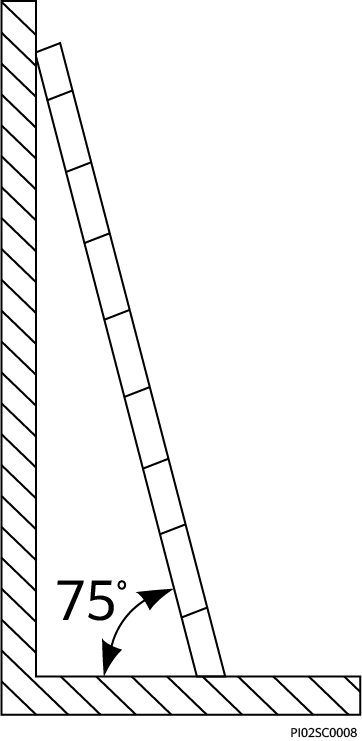

> 图片 OCR：75

> 图片说明：第 12 页第 1 张图片。图片内可识别文字包括：75。相关页面上下文：SUN2000- ( 196KTL-H0 , 200KTL-H2, 215KTL-H0) 系列；1 · 4 安装环境要求；请确保设备的安装环境通风良好。

## 第 13 页

SUN2000- ( 196KTL-H0 , 200KTL-H2, 215KTL-H0) 系列
1 8 干克、 32 干克
( 40 磅、 70 磅 〕
用户手册
搬运重物安全
1 · 6 调测
1 安全注意事项
搬运重物时,应做好承重的准备,避免被重物压伤或扭伤。
< 18 干克
〔 < 40 磅 )
32 干克、 55 干克
( 70 磅、 121 磅 )
0
或
> 55 干克
( > 1 21 磅 )
NHOIH 開 144
用手搬运设备时,应佩戴保护手套,以免受伤。
设备首次上电时,需由专业人员正确设置参数。错误的设置可能导致设备与所在国家 /
地区的认证不符,影响设备的正常工作。
1 · 7 维护和更换
众危险
设备在运行过程中,存在高电压,可能产生电击,导致人员死亡、严重的人身伤害或
严重的财产损失。所以在进行任何维护工作之前,必须先将设备下电,并且严格按照
本手册及其他相关文件中列出的安全注意事项进行操作。
请在熟悉理解本手册内容且有合适的工具及测试装置条件下,维护设备。
在进行维护工作之前,请先将设备下电,然后遵照延时放电标签的指示,等待相
应的时间,确保设备已下电,才能对设备进行操作。
在维护过程中,请尽量避免不相关的人员进入维护现场,必须竖立临时警示标志
或栅栏进行隔离。
当维护逆变器后级的用电设备或者配电设备时,需要断开逆变器的交直流开关。
如果设备出现故障,请联系您的经诮商处理。
故障必须处理完毕后,设备方可重新上电,否则可能引起故障扩大或设备损坏。
文档版本 08 ( 2021-09-30 )
版权所有 @ 华为技术有限公司
5

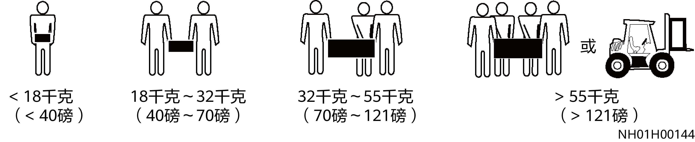

> 图片 OCR：開 UU
< 1 8 干克
1 8 干克一 32 干克
32 干克一 55 干克
( < 40 磅 )
( 40 磅一 70 磅 )
( 70 磅一 1 21 磅 )
> 55 干克
( > 1 21 磅 )
NH01H00144

> 图片说明：第 13 页第 1 张图片。图片内可识别文字包括：開 UU。相关页面上下文：SUN2000- ( 196KTL-H0 , 200KTL-H2, 215KTL-H0) 系列；1 · 7 维护和更换；严重的财产损失。所以在进行任何维护工作之前,必须先将设备下电,并且严格按照

## 第 14 页

SUN2000- ( 196KTL-H0 , 200KTL-H2, 215KTL-H0) 系列
用户手册
2 产品介绍
产品介绍
2 · 1 产品简介
功能
SUN2000 产品是三相组串型光伏并网逆变器,主要功能是将光伏组串产生的直流电转
换成交流电并馈入电网。
本文主要涉及以下产品型号:
SUN2000- 196KTL-H0
SUN2000- 200KTL-H2
SUN2000- 215KTL-H0
图 2 · 1 型号说明 ( 以 SUN2000- 196KTL-H0 为例 )
SUN2000- 196KTL - HO
1
表 2 · 1 型号说明
1
2
文档版本 08 ( 2021-09-30 )
2
3
4
含义
系列名称
功率等级
版权所有 @ 华为技术有限公司
SUN2000 :
三相组串型光伏并网逆
变器
196K :
200K :
215K :
功率等级为 196kW
功率等级为 200kW
功率等级为 215kW
6

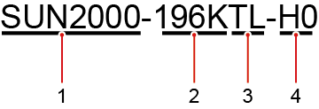

> 图片 OCR：SUN2000- 196KTL-H0

> 图片说明：第 14 页第 1 张图片。图片内可识别文字包括：SUN2000- 196KTL-H0。相关页面上下文：SUN2000- ( 196KTL-H0 , 200KTL-H2, 215KTL-H0) 系列；SUN2000 产品是三相组串型光伏并网逆变器,主要功能是将光伏组串产生的直流电转；SUN2000- 196KTL-H0

## 第 15 页

SUN2000- ( 196KTL-H0 , 200KTL-H2, 215KTL-H0) 系列
用户手册
3
4
凵说明
含义
拓扑标识
产品编码
2 产品介绍
TL:无变压器隔离
H0/H2:直流输入电压等级为 1500V
的产品系列
SUN2000- 196KTL-H0 仅限中国大陆使用,否则华为公司将不进行质量保证。
组网应用
SUN2000 适用于商用屋顶并网系统和大型电站并网系统。系统一般由光伏组串、
SUN2000 、交流配电单元和升压变压器组成。
图 2 · 2 组网应用
( A ) 光伏组串
( D ) 升压变压器
凵说明
( B ) SUN2000
( E ) 电网
( c ) 交流配电单元
SUN2000 是由专用电力变压器供电,而非连接到低压架空电线。
支持的电网形式
SUN2000 支持的电网形式为丨 T 。
图 2 · 3 电网形式
文档版本 08 ( 2021-09-30 )
IT
L2
一 PE
SUN2000
版权所有 @ 华为技术有限公司
7

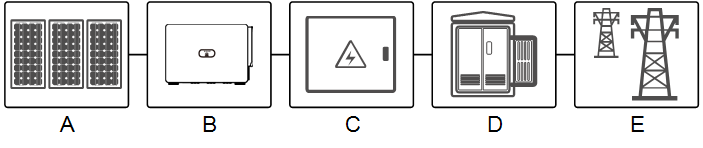

> 图片 OCR：0 到到画

> 图片说明：第 15 页第 1 张图片。图片内可识别文字包括：0 到到画。相关页面上下文：SUN2000- ( 196KTL-H0 , 200KTL-H2, 215KTL-H0) 系列；SUN2000- 196KTL-H0 仅限中国大陆使用,否则华为公司将不进行质量保证。；SUN2000 适用于商用屋顶并网系统和大型电站并网系统。系统一般由光伏组串、

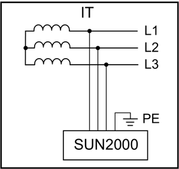

> 图片 OCR：PE
SUN2000

> 图片说明：第 15 页第 2 张图片。图片内可识别文字包括：PE。相关页面上下文：SUN2000- ( 196KTL-H0 , 200KTL-H2, 215KTL-H0) 系列；SUN2000- 196KTL-H0 仅限中国大陆使用,否则华为公司将不进行质量保证。；SUN2000 适用于商用屋顶并网系统和大型电站并网系统。系统一般由光伏组串、

## 第 16 页

SUN2000- ( 196KTL-H0 , 200KTL-H2, 215KTL-H0) 系列
用户手册
2 · 2 夕卜观说明
机箱尺寸
0
机箱正面
2 产品介绍
365 m m
700 mm 《
1035 mm
1 2 3 4
5
0
( 2 ) 并网指示灯
( 5 ) 主机面板
含义
0
巧 06W00037
6
0
5 〔 W 〔 旧 59
( 3 ) 通信指示灯
( 6 ) 维护腔
( 1 ) PV 连接指示灯
( 4 ) 告警 / 维护指示灯
表 2 · 2 LED 指示灯描述
显示分类
PV 扌旨示
指示灯状态
LEDI
绿色常亮
- 09 一 30 )
LED4
LEDI
LED4
文档版本 08 ( 2021
光伏组串中至少一路连接正常,并且对应 M PPT 电路
的直流输入电压大于等于 500V 。
版权所有 @ 华为技术有限公司
8

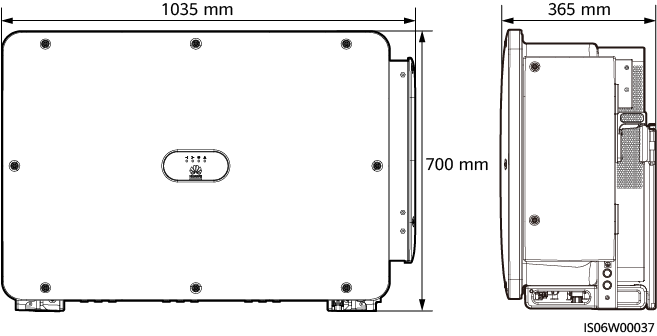

> 图片 OCR：0
0
0
1035 mm
0
0
0
0
0
7 闐 mm
％ 5 mm
0
0
《 W 37

> 图片说明：第 16 页第 1 张图片。图片内可识别文字包括：0。相关页面上下文：SUN2000- ( 196KTL-H0 , 200KTL-H2, 215KTL-H0) 系列；( 6 ) 维护腔；( 4 ) 告警 / 维护指示灯

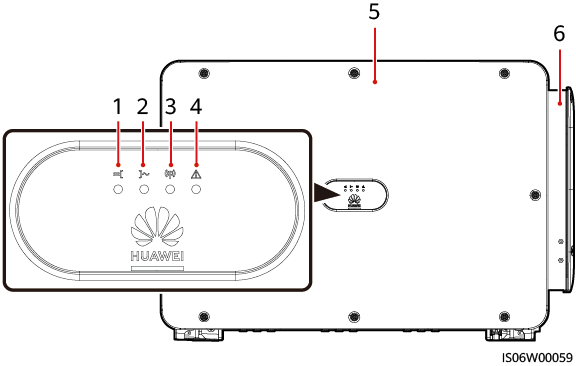

> 图片 OCR：1 2 3 4
网 u 黽 [

> 图片说明：第 16 页第 2 张图片。图片内可识别文字包括：1 2 3 4。相关页面上下文：SUN2000- ( 196KTL-H0 , 200KTL-H2, 215KTL-H0) 系列；( 6 ) 维护腔；( 4 ) 告警 / 维护指示灯

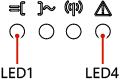

> 图片 OCR：未识别到清晰文字。

> 图片说明：第 16 页第 3 张图片。相关页面上下文：SUN2000- ( 196KTL-H0 , 200KTL-H2, 215KTL-H0) 系列；( 6 ) 维护腔；( 4 ) 告警 / 维护指示灯

## 第 17 页

SUN2000- ( 196KTL-H0 , 200KTL-H2, 215KTL-H0) 系列
用户手册
显示分类
并网指示
LED2 LED4
通信指示
LED3
告警 / 运维指示
LED4
机箱底部
指示灯状态
绿色快闪
LED2
绿色常亮
绿色快闪
LED3
绿色快闪
LED4
红色常亮
红色快闪
红色慢闪
绿色常亮
绿色慢闪
绿色快闪
凵说明
红色
LED4
红色
2 产品介绍
含义
直流侧环境类故障。
逆变器与所有光伏组串均断连,或所有 MPPT 电路的
直流输入电压均小于 500V 。
NA
逆变器处于并网状态。
交流侧环境类故障。
逆变器未并网。
逆变器通过 RS485 / MBUS 通信接收到数据。
逆变器持续 1 0s 未通过 RS485 / MBUS 通信接收到数
据。
逆变器出现重要告警。
如果 PV 连接指示灯和并网指示灯均不为绿灯快闪,请
按照 SUN2000 A PP 指示进行部件更换或整机更换操
逆变器出现次要告警。
逆变器出现提示告警。
近端维护成功。
近端维护中或指令关机。
近端维护失败。
无告警同时无近端维护操作。
· 近端维护指的是在逆变器 USB 口插入 U 盘、蓝牙模块、 WLANtü 块或 U s B 数据线的相关操作。
如通过 U 盘进行配置导入、导出；通过蓝牙模块、 WLAN 模块或 USB 数据线连接 SU N 2000
APPO
告警和近端维护同时发生时,告警 / 维护指示灯优先指示近端维护状态,待 U 盘、蓝牙模块、
0
WLAN 模块或 USB 数据线拔出时,才能正常进行告警指示。
凵说明
文档版本 08 ( 2021-09-30 )
版权所有 @ 华为技术有限公司
9

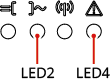

> 图片 OCR：未识别到清晰文字。

> 图片说明：第 17 页第 1 张图片。相关页面上下文：SUN2000- ( 196KTL-H0 , 200KTL-H2, 215KTL-H0) 系列；告警 / 运维指示；逆变器与所有光伏组串均断连,或所有 MPPT 电路的

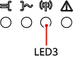

> 图片 OCR：未识别到清晰文字。

> 图片说明：第 17 页第 2 张图片。相关页面上下文：SUN2000- ( 196KTL-H0 , 200KTL-H2, 215KTL-H0) 系列；告警 / 运维指示；逆变器与所有光伏组串均断连,或所有 MPPT 电路的

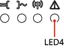

> 图片 OCR：未识别到清晰文字。

> 图片说明：第 17 页第 3 张图片。相关页面上下文：SUN2000- ( 196KTL-H0 , 200KTL-H2, 215KTL-H0) 系列；告警 / 运维指示；逆变器与所有光伏组串均断连,或所有 MPPT 电路的

## 第 18 页

SUN2000- ( 196KTL-H0 , 200KTL-H2, 215KTL-H0) 系列
用户手册
图 2 · 4 端口说明 ( 手动分断直流开关 )
5 6 78 9
2 产品介绍
“ 丿 0 。 0 。 0 。
0 · 0 · 0 ·
0 “ 0 。 0 。
丷 0。@
0
0 ) 直流输入端子 ( 由 DC SWITCH 1 控制 )
( 3 ) 直流输入端子 ( 由 DC SWITCH 2 控制 )
( 5 ) 直流输入端子 ( 由 DC SWITCH 3 控制 )
( 7 ) 透气阀
( 9 ) 通信接囗 ( COM )
( 1 1 ) 跟踪系统电源线过线孔
图 2 · 5 端口说明 ( 自动分断直流开关 )
1 0 1 1
( 2 ) 直流开关 1 ( DC SWITCH 1 )
( 4 ) 直流开关 2 ( DC SWITCH 2 )
( 6 ) 直流开关 3 ( DC SWITCH 3 )
( 8 ) USB 接囗 ( USB )
( 1 0 ) 交流输出线过线孔
1 23 4 56
7 89101112 13 14
00L 一
0
0 ) 直流输入端子 ( 由 DC SWITCH 1 控制 )
( 3 ) 复位按钮 1 ( RESET 1 )
( 5 ) 直流开关 2 [ 1 ] ( DC SWITCH 2 )
( 7 ) 直流输入端子 ( 由 DC SWITCH 3 控制 )
( 9 ) 复位按钮 3 ( RESET 3 )
01 ) USB 接囗 ( USB )
( 13 ) 交流输出线过线孔
文档版本 08 ( 2021-09-30 )
版权所有 @ 华为技术有限公司
《 S06W00077
( 2 ) 直流开关 1 [ 1 ] ( DC SWITCH
( 4 ) 直流输入端子 ( 由 DC SWITCH
2 控制 )
( 6 ) 复位按钮 2 ( RESET 2 )
( 8 ) 直流开关 3 [ 1 ] ( DC SWITCH
( 1 0 ) 透气阀
( 1 2 ) 通信接口 ( COM )
( 14 ) 跟踪系统电源线过线孔
10

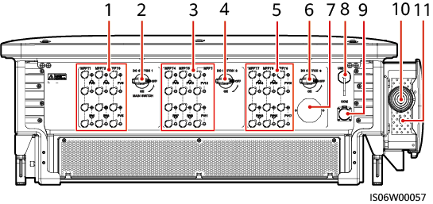

> 图片 OCR：5
丷 000
6 78 9
“ 丿
0 · 0 ,
“ 丿 0 。 0 。 0
0 · 0 · 0 ·
1 0 1 1
《 SO v00057

> 图片说明：第 18 页第 1 张图片。图片内可识别文字包括：5。相关页面上下文：SUN2000- ( 196KTL-H0 , 200KTL-H2, 215KTL-H0) 系列；图 2 · 4 端口说明 ( 手动分断直流开关 )；0 ) 直流输入端子 ( 由 DC SWITCH 1 控制 )

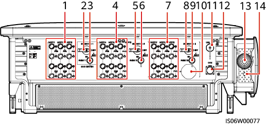

> 图片 OCR：23
0 · 0 …
4
00L0
0 ℃ ℃ 。
0 ℃ ℃ 。
56
7 891011 1 2
1 3 14
0
《 s06 v00077

> 图片说明：第 18 页第 2 张图片。图片内可识别文字包括：23。相关页面上下文：SUN2000- ( 196KTL-H0 , 200KTL-H2, 215KTL-H0) 系列；图 2 · 4 端口说明 ( 手动分断直流开关 )；0 ) 直流输入端子 ( 由 DC SWITCH 1 控制 )

## 第 19 页

SUN2000- ( 196KTL-H0 , 200KTL-H2, 215KTL-H0) 系列
用户手册
注 [ 1 ] :直流开关旋转把手置于标讠只 0 处
断。
2 · 3 标签说明
2 · 3 · 1 箱体标识
符号
15 mins
DO not disconnect
under load ！
禁止带负荷断开连接！
Discharged
未儲能
Charg
储能
AA
文档版本 08 ( 2021-09-30 )
符号名称
运行警示标识
防烫警示标识
大电流警示标签
延时放电标识
查看说明书标识
接地标识
操作警示标识
开关操作警示标识
风扇操作警示标识
2 产品介绍
,表示直流开关未储能,无法自动分
符号含义
逆变器上电后存在潜在危险。操作逆变
器时,请做好对应防护。
逆变器在工作时外壳温度较高,有烫伤
危险,严禁触碰。
逆变器上电后存在大接触电流,上电前
必须保证逆变器已接地。
· 逆变器上电后存在高电压。所有针
对逆变器的操作必须由训练有素的
专业电气技术人员进行。
- 逆变器下电后依然存在残余电压,
需要 1 5 分钟才能放电至安全电压。
提醒操作者注意查看逆变器随箱的说明
书。
保护地线连接位置。
逆变器工作时,不要直接拔下直流输入
连接器。
直流开关未储能时,存在无法自动分闸
的风险。
逆变器上电后存在高电压,请勿在逆变
器工作时触碰风扇。
版权所有 @ 华为技术有限公司

> 图片 OCR：未识别到清晰文字。

> 图片说明：第 19 页第 1 张图片。相关页面上下文：SUN2000- ( 196KTL-H0 , 200KTL-H2, 215KTL-H0) 系列；逆变器上电后存在潜在危险。操作逆变；逆变器在工作时外壳温度较高,有烫伤

> 图片 OCR：未识别到清晰文字。

> 图片说明：第 19 页第 2 张图片。相关页面上下文：SUN2000- ( 196KTL-H0 , 200KTL-H2, 215KTL-H0) 系列；逆变器上电后存在潜在危险。操作逆变；逆变器在工作时外壳温度较高,有烫伤

> 图片 OCR：未识别到清晰文字。

> 图片说明：第 19 页第 3 张图片。相关页面上下文：SUN2000- ( 196KTL-H0 , 200KTL-H2, 215KTL-H0) 系列；逆变器上电后存在潜在危险。操作逆变；逆变器在工作时外壳温度较高,有烫伤

> 图片 OCR：未识别到清晰文字。

> 图片说明：第 19 页第 4 张图片。相关页面上下文：SUN2000- ( 196KTL-H0 , 200KTL-H2, 215KTL-H0) 系列；逆变器上电后存在潜在危险。操作逆变；逆变器在工作时外壳温度较高,有烫伤

> 图片 OCR：未识别到清晰文字。

> 图片说明：第 19 页第 5 张图片。相关页面上下文：SUN2000- ( 196KTL-H0 , 200KTL-H2, 215KTL-H0) 系列；逆变器上电后存在潜在危险。操作逆变；逆变器在工作时外壳温度较高,有烫伤

> 图片 OCR：未识别到清晰文字。

> 图片说明：第 19 页第 6 张图片。相关页面上下文：SUN2000- ( 196KTL-H0 , 200KTL-H2, 215KTL-H0) 系列；逆变器上电后存在潜在危险。操作逆变；逆变器在工作时外壳温度较高,有烫伤

> 图片 OCR：未识别到清晰文字。

> 图片说明：第 19 页第 7 张图片。相关页面上下文：SUN2000- ( 196KTL-H0 , 200KTL-H2, 215KTL-H0) 系列；逆变器上电后存在潜在危险。操作逆变；逆变器在工作时外壳温度较高,有烫伤

> 图片 OCR：DO not disconnect
under load ！
禁止带负荷断开连接！

> 图片说明：第 19 页第 8 张图片。图片内可识别文字包括：DO not disconnect。相关页面上下文：SUN2000- ( 196KTL-H0 , 200KTL-H2, 215KTL-H0) 系列；逆变器上电后存在潜在危险。操作逆变；逆变器在工作时外壳温度较高,有烫伤

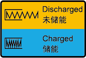

> 图片 OCR：未识别到清晰文字。

> 图片说明：第 19 页第 9 张图片。相关页面上下文：SUN2000- ( 196KTL-H0 , 200KTL-H2, 215KTL-H0) 系列；逆变器上电后存在潜在危险。操作逆变；逆变器在工作时外壳温度较高,有烫伤

> 图片 OCR：未识别到清晰文字。

> 图片说明：第 19 页第 10 张图片。相关页面上下文：SUN2000- ( 196KTL-H0 , 200KTL-H2, 215KTL-H0) 系列；逆变器上电后存在潜在危险。操作逆变；逆变器在工作时外壳温度较高,有烫伤

## 第 20 页

SUN2000- ( 196KTL-H0 , 200KTL-H2, 215KTL-H0) 系列
用户手册
铭牌仅供参考,请以实物力准。
-0 ℃ AUTION
Before replacing the fan
disconnect the FAN-POWER
cableand then the fan cable,
更换风 0 前必顷先风 0 电源线,
(IPPWITEMXXXXXXXX
( 32P , № d : suN2000 一 KTL X
(S)SN:XXXXXXXXXXXX Y 以 ' 0 “ 以
符号名称
风扇更换警示标示
逆变器序列号手撕标签
重量标签
2 · 3 · 2 产
> 55 kg ( 121 lbs)
口铭牌
图 2 · 6 铭牌 ( 以 SUN2000- 196KTL-H0 为例 )
型号 MOdel: sUN2000-196KTL-H0
名称 Name:太阳能光伏逆变器
HUAWEI
SOLAR INVERTER
最大入电压 d.c. Max. lnputVoltage: 15 闐 Vd
最大入电流 d.c. Max. lnputCurrønt: 9X26A
入知路电流: 9 × 40A
,驴 P 电压范 d.c. MPP Range: 5 -1 OVd ,
轤出电压 a.C. Output NO n ge : 800Va.c.; 3N*O
出率乱 0 Nominal 0 № g Fr•qu•ncy: 50
藪定满出功率 a.c. OutputRated Power : 196kw
最大在功率 a.c. Output Max.Apparent P “ 0 鍆 6 kVA
最大出电流 a.C. Output Max. Current : 157 - 4A
功率因 Power F 以 to 仁 0 - ging ) -0 、 B00 《 》
过度 Operating Temperature Ra 0 : - 25 - ·
逆变 0 柘扑 Inv•rterTopology: № 酮地 n
防护等緞 E 《 osure : 68
保护等 0 Prot•ction Class. 》
过电压类别 0 “ “ 0 《 tage Cat•gory• II(DCYIII(AC)
污等緞 P 酬 0 吨艹: lll
淄拔 ARitude: 4000 m
谧讯方式 Communication. MBUS/RS48S
华为术公司 M 旧 TEC - OG CO 凵 LTD 中的造从。 0
《 HQ - 以 Ban 凵 - 0 · 51B1 , P.R ℃
( 1 ) 商标和产品型号
( 3 ) 符合的认证体系标识
凵说明
2 产品介绍
符号含义
更换风扇,必须先断开风扇的电源连接
器。
逆变器序列号信息。
逆变器较重,需要四人搬运或借助叉车
等工具。
1
2
4
( 2 ) 重要的技术参数
( 4 ) 公司名称及产地
文档版本 08 ( 2021-09-30 )
版权所有 @ 华为技术有限公司

> 图片 OCR：ACAUTION
Before replacing the fan
山 SC 0 n FAN POWER
cable a n 0 then the fan cable,
更换风 0 前必须先菝除风 0 电源线。
冉满隊风扇 -

> 图片说明：第 20 页第 1 张图片。图片内可识别文字包括：ACAUTION。相关页面上下文：SUN2000- ( 196KTL-H0 , 200KTL-H2, 215KTL-H0) 系列；( 32P , № d : suN2000 一 KTL X；逆变器序列号手撕标签

> 图片 OCR：未识别到清晰文字。

> 图片说明：第 20 页第 2 张图片。相关页面上下文：SUN2000- ( 196KTL-H0 , 200KTL-H2, 215KTL-H0) 系列；( 32P , № d : suN2000 一 KTL X；逆变器序列号手撕标签

> 图片 OCR：> 55 kg ( 121 lbs)

> 图片说明：第 20 页第 3 张图片。图片内可识别文字包括：> 55 kg ( 121 lbs)。相关页面上下文：SUN2000- ( 196KTL-H0 , 200KTL-H2, 215KTL-H0) 系列；( 32P , № d : suN2000 一 KTL X；逆变器序列号手撕标签

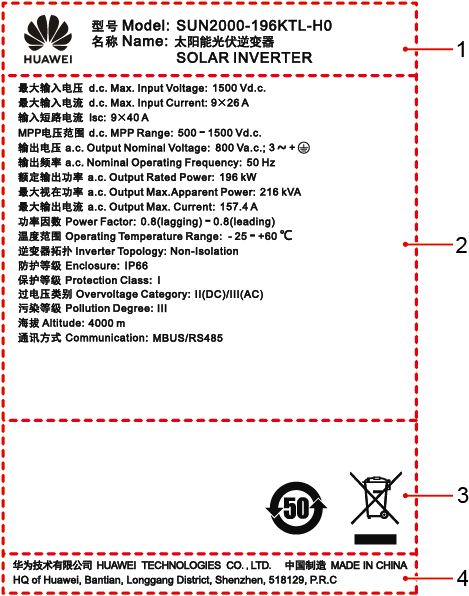

> 图片 OCR：HUAWEI
型号 Model: SUN2 0 - 196KTL-H0
名称 Name :太阳能光伏逆变器
SOLAR INVERTER
最大輪入电压 d.c. Max. InputVoltage. 15 闐 Vd.c.
能大輪入电流 d.c. Max. 《 nputCurrent: 9X26A
输入短电流: 9 × 40 A
伊 P 电压范苤 d.c. MPP Range: 500 - , 500vd - c -
輸出电压 a.C. Output Nominal VoItage: B00 Ve.c.; 3 ～
输出频率 & 戗 NorninaI Operating Frequency• 50 Hz
藪定输出功率 a.c. Output Rat•d Pow•r: 196 kW
最大視在功率 a.c. Output Max.Apparent Power: 215 kVA
能大輪出电流 a.c. Output Max. Current: 157 - 4A
功率烈数 Pow “ Fa010 仁 O.8(lagging) - 0 00 n
湖度 OperatingTemperature Rang• : - 25 - · 60 。 (
逆变器柘扑 lnverter Topology: Non-IsoIation
防护等級 Enclosure: 《 P66
保护等級 Protectlon Class. 》
过电压类别 OvervoItage Category: II(DC)/III(AC)
染等級 Pollution D•gr••: lll
淄报 ARitude: 4000m
通讯方式 Communication: MBUS/RS485
华为技术公 1E0 - OGES CO 凵 LTD.中 0 制造 UOE IN CHNA
0 》 a Bantm LOr-tg Dis 》 StWIZh•m, 51812 P.R.C
1
2
4

> 图片说明：第 20 页第 4 张图片。图片内可识别文字包括：HUAWEI。相关页面上下文：SUN2000- ( 196KTL-H0 , 200KTL-H2, 215KTL-H0) 系列；( 32P , № d : suN2000 一 KTL X；逆变器序列号手撕标签

## 第 21 页

SUN2000- ( 196KTL-H0 , 200KTL-H2, 215KTL-H0) 系列
用户手册
2 · 4 工作原理
2 · 4 · 1 电路框图
2 产品介绍
1 8 路 PVÉA 串输入接入逆变器,在逆变器内部组合为 9 路 MPPT 电路对组串进行最大功率
点跟踪,再通过逆变电路实现直流电到三相交流电的转换,并且在直流、交流侧支持
浪涌保护功能。
图 2 · 7 SUN2000 原理图
输入
EMI
滤波器
2 · 4 · 2 工作模式
输入
电流
检测
直流开关 1
直流开关 2
直流开关 3
MPPT 1
MPPT 2
MPPT 3
直流浪涌
保护器
MPPT 4
MPPT 5
MPPT6
直流浪涌
保护器
MPPT7
MPPT 8
MPPT9
直流浪涌
保护器
AC
逆变电路
输出
滤波器
输出
EMI
滤波器
L2
L3
PE
输出
继电器
SUN2000 共有
文档版本 08 ( 2021-09-30 )
三种工作模式,分别为:待机模式、运行模式和关机模式。
版权所有 @ 华为技术有限公司
交流浪涌
保护器
巧 〔 乇 PO 〔 ( 01
13

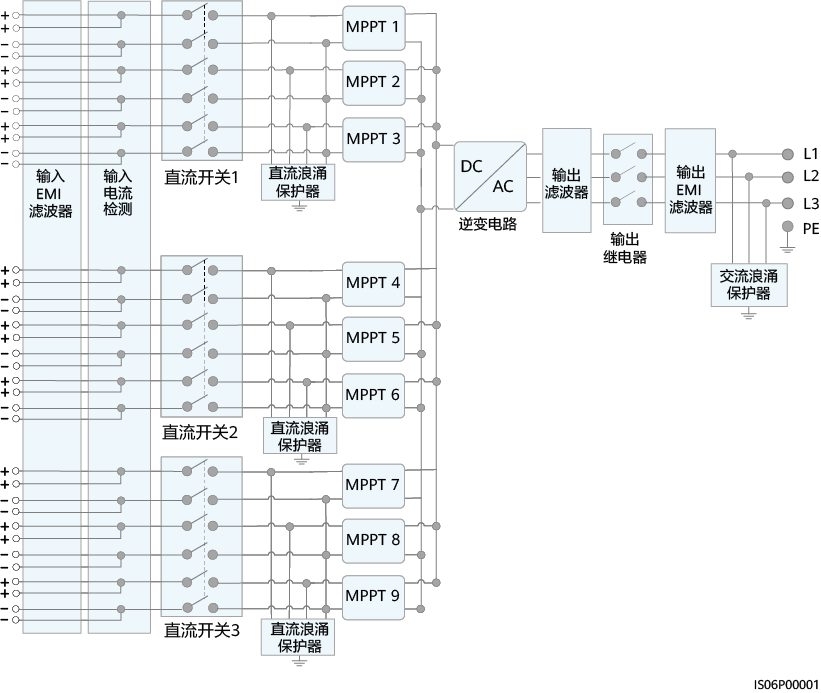

> 图片 OCR：输入
EMI
滤波器
输入
电流
直流开关 1
直流开关 2
直流开关 3
MPPT 1
MPPT 2
MPPT 3
直流涌
保护器
MPPT 4
MPPT 5
MPPT 6
直流浪涌
MPPT 7
MPPT 8
MPPT 9
直流浪涌
保护器
输出
滤波器
逆变电路
LI
输出
EMI
滤波器
PE
继电器
交流浪涌
保护器

> 图片说明：第 21 页第 1 张图片。图片内可识别文字包括：输入。相关页面上下文：SUN2000- ( 196KTL-H0 , 200KTL-H2, 215KTL-H0) 系列；1 8 路 PVÉA 串输入接入逆变器,在逆变器内部组合为 9 路 MPPT 电路对组串进行最大功率；图 2 · 7 SUN2000 原理图

## 第 22 页

SUN2000- ( 196KTL-H0 , 200KTL-H2, 215KTL-H0) 系列
用户手册
图 2 · 8 工作模式
2 产品介绍
启动:光伏组
串能量充足
且无故障
还亻了
模式
检测到光照
不足或直流
开关断开
待机
模式
检测到故障或
关机指令
检测到故障或
关机指令
关机
模式
检测到故障已清除
或开机指令
巧 07S 〔 跹 { 1
表 2 · 3 工作模式说明
工作模式
待机
〕 亻了
关机
文档版本 08 ( 2021-09-30 )
说明
待机模式主要指夕卜部环境不满足逆变器运行条件。在待机模式中:
- 逆变器持续进行状态检测,一旦满足运行条件,则进入运行模式。
- 逆变器若检测到关机指令或开机检测发现故障,则进入关机模式。
在运行模式中:
变器将光伏组串的直流电转换为交流电后,馈入电网中。
变器进行最大功率点跟踪,使光伏组串输出能量达到最大。
变器若检测到故障或关机指令,则进入关机模式。
变器若检测到光伏组串的输出功率达不到并网发电的条件,则进
入待机模式。
- 在待机或运行模式中,逆变器若检测到故障或关机指令,则进入关
机模式。
- 在关机模式中,逆变器若检测到故障已清除或开机指令,则进入待
机模式。
版权所有 @ 华为技术有限公司

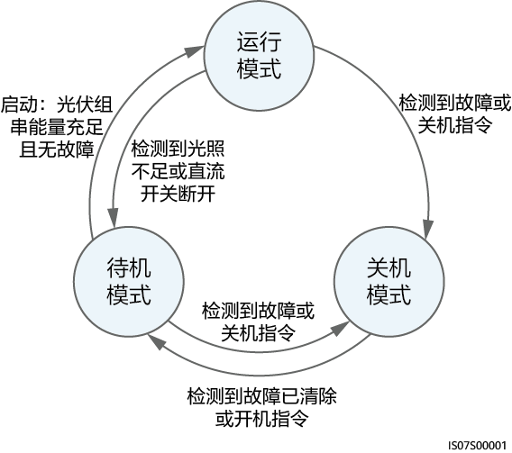

> 图片 OCR：〕 彳亍
模式
启动:光伏组
串能量充足
且无故障检测到光照
不足直流
开关断开
待机
模式
检测到故障或
关机指令
检测到故障已清除
或开机指令
能测到故障
关机指令
关机
模式

> 图片说明：第 22 页第 1 张图片。图片内可识别文字包括：〕 彳亍。相关页面上下文：SUN2000- ( 196KTL-H0 , 200KTL-H2, 215KTL-H0) 系列；图 2 · 8 工作模式；表 2 · 3 工作模式说明

## 第 23 页

SUN2000- ( 196KTL-H0 , 200KTL-H2, 215KTL-H0) 系列
用户手册
如果逆变器不立即投入使用,则存储逆变器时需满足:
3 逆变器存储
逆变器存储
请勿拆除夕卜包装,并且定期检查 ( 推荐三个月检查一次 ) 。如发现有虫蛀鼠咬,
包装损坏,请及时更换包装。如果逆变器已拆开外包装且不立即投入使用,将逆
变器装入其原始包装内,保留干燥剂,并且用胶带进行密封。
存储环境的温度和湿度适宜。环境空气中不可含有腐蚀性或易燃性气体。
图 3 · 1 存储温度和湿度
丶
30
+ 70 。 C
· 40 。 C
+ 158 。 F
· 40 。 F
40
50
60
70 一
80
0
％ RH
5 ％ 一 95 ％ RH
巧 0 八 v00011
存放在清洁干燥的地方,并防止灰尘及水汽的侵蚀。禁止遭受雨水或地面积水侵
不可倾斜或倒置包装箱。
堆码时,请小心放置逆变器,避免设备倾倒造成人身伤害或设备损坏。
图 3 · 2 最大堆码层数
《 SI 2W00007
存储时间在两年及以上时,逆变器需经过专业人员的检查和测试才能投入使用。
文档版本 08 ( 2021-09-30 )
版权所有 @ 华为技术有限公司
15

> 图片 OCR：未识别到清晰文字。

> 图片说明：第 23 页第 1 张图片。相关页面上下文：SUN2000- ( 196KTL-H0 , 200KTL-H2, 215KTL-H0) 系列；如果逆变器不立即投入使用,则存储逆变器时需满足:；3 逆变器存储

> 图片 OCR：未识别到清晰文字。

> 图片说明：第 23 页第 2 张图片。相关页面上下文：SUN2000- ( 196KTL-H0 , 200KTL-H2, 215KTL-H0) 系列；如果逆变器不立即投入使用,则存储逆变器时需满足:；3 逆变器存储

## 第 24 页

SUN2000- ( 196KTL-H0 , 200KTL-H2, 215KTL-H0) 系列
用户手册
4 · 1 安装前检查
检查夕卜包装
4 系统安装
系统安装
在拆开逆变器外包装之前,请检查夕卜包装是否有可见的损坏,如孔、裂纹或者其他内
部可能损坏的迹象,并且核对逆变器型号。如果有任何包装异常的情况或逆变器型号
不符,请勿拆开,并尽快联系您的经销商。
凵说明
推荐在准备安装 SU N 2000 的前 24 小时内,拆除其外包装。
检奄交付件
在拆开逆变器外包装之后,请检查交付件是否完整齐备,有无任何明显的外部损坏。
如果缺少任何物件或存在任何损坏,请联系您的经销商。
凵说明
随箱配发的交付件数量,请参见包装箱内的 《 装箱清单 》 。
4 · 2 工具准备
文档版本 08 ( 2021-09-30 )
版权所有 @ 华为技术有限公司
16

## 第 25 页

SUN2000- ( 196KTL-H0 , 200KTL-H2, 215KTL-H0) 系列
用户手册
种类
工具
冲击钻
钻头 014mm 、
@16mm
剥线钳
安装工具
剪线钳
0
00 。 00
万用表
直流电压量程
1 500V DC
文档版本 08 ( 2021-09-30 )
0 口 0 口过
成套套筒扳手
一字螺丝刀
刀头: O.6mmx
3.5mm
压线钳
型 - 号: PV-
CZM 一 41100 ；生产
商: STAUBLI
记号笔
力矩扳手
橡胶锤
拆卸扳手
型号: 13001462 ；
生产商: STAUBLI
钢卷尺
4 系统安装
斜囗钳
工具刀
吸尘器
数字或气泡水平尺
版权所有 @ 华为技术有限公司

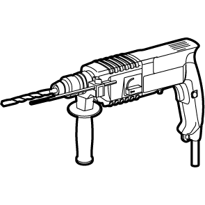

> 图片 OCR：未识别到清晰文字。

> 图片说明：第 25 页第 1 张图片。相关页面上下文：SUN2000- ( 196KTL-H0 , 200KTL-H2, 215KTL-H0) 系列；安装工具；4 系统安装

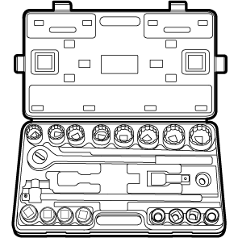

> 图片 OCR：未识别到清晰文字。

> 图片说明：第 25 页第 2 张图片。相关页面上下文：SUN2000- ( 196KTL-H0 , 200KTL-H2, 215KTL-H0) 系列；安装工具；4 系统安装

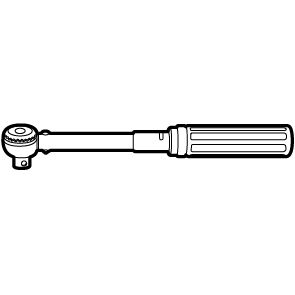

> 图片 OCR：未识别到清晰文字。

> 图片说明：第 25 页第 3 张图片。相关页面上下文：SUN2000- ( 196KTL-H0 , 200KTL-H2, 215KTL-H0) 系列；安装工具；4 系统安装

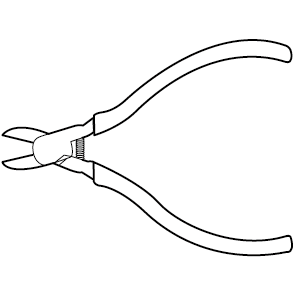

> 图片 OCR：未识别到清晰文字。

> 图片说明：第 25 页第 4 张图片。相关页面上下文：SUN2000- ( 196KTL-H0 , 200KTL-H2, 215KTL-H0) 系列；安装工具；4 系统安装

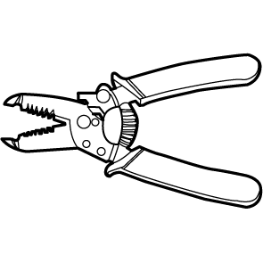

> 图片 OCR：未识别到清晰文字。

> 图片说明：第 25 页第 5 张图片。相关页面上下文：SUN2000- ( 196KTL-H0 , 200KTL-H2, 215KTL-H0) 系列；安装工具；4 系统安装

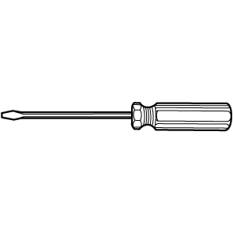

> 图片 OCR：未识别到清晰文字。

> 图片说明：第 25 页第 6 张图片。相关页面上下文：SUN2000- ( 196KTL-H0 , 200KTL-H2, 215KTL-H0) 系列；安装工具；4 系统安装

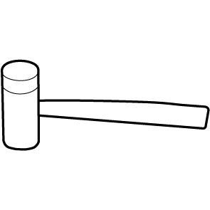

> 图片 OCR：未识别到清晰文字。

> 图片说明：第 25 页第 7 张图片。相关页面上下文：SUN2000- ( 196KTL-H0 , 200KTL-H2, 215KTL-H0) 系列；安装工具；4 系统安装

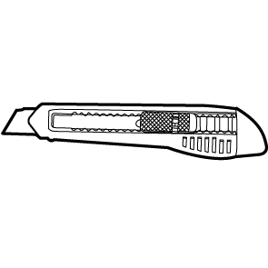

> 图片 OCR：未识别到清晰文字。

> 图片说明：第 25 页第 8 张图片。相关页面上下文：SUN2000- ( 196KTL-H0 , 200KTL-H2, 215KTL-H0) 系列；安装工具；4 系统安装

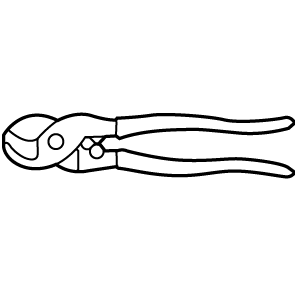

> 图片 OCR：未识别到清晰文字。

> 图片说明：第 25 页第 9 张图片。相关页面上下文：SUN2000- ( 196KTL-H0 , 200KTL-H2, 215KTL-H0) 系列；安装工具；4 系统安装

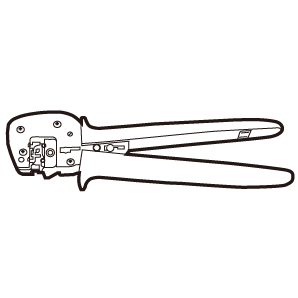

> 图片 OCR：未识别到清晰文字。

> 图片说明：第 25 页第 10 张图片。相关页面上下文：SUN2000- ( 196KTL-H0 , 200KTL-H2, 215KTL-H0) 系列；安装工具；4 系统安装

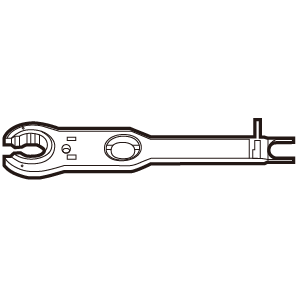

> 图片 OCR：未识别到清晰文字。

> 图片说明：第 25 页第 11 张图片。相关页面上下文：SUN2000- ( 196KTL-H0 , 200KTL-H2, 215KTL-H0) 系列；安装工具；4 系统安装

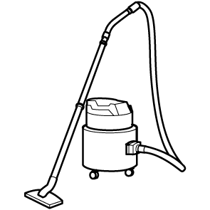

> 图片 OCR：未识别到清晰文字。

> 图片说明：第 25 页第 12 张图片。相关页面上下文：SUN2000- ( 196KTL-H0 , 200KTL-H2, 215KTL-H0) 系列；安装工具；4 系统安装

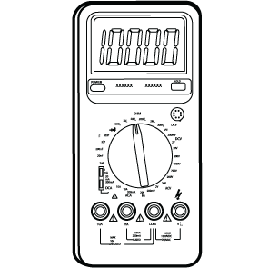

> 图片 OCR：LE- 坚旦 」

> 图片说明：第 25 页第 13 张图片。图片内可识别文字包括：LE- 坚旦 」。相关页面上下文：SUN2000- ( 196KTL-H0 , 200KTL-H2, 215KTL-H0) 系列；安装工具；4 系统安装

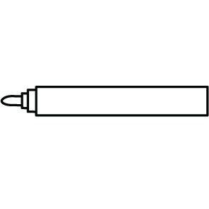

> 图片 OCR：未识别到清晰文字。

> 图片说明：第 25 页第 14 张图片。相关页面上下文：SUN2000- ( 196KTL-H0 , 200KTL-H2, 215KTL-H0) 系列；安装工具；4 系统安装

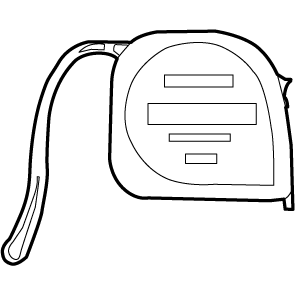

> 图片 OCR：未识别到清晰文字。

> 图片说明：第 25 页第 15 张图片。相关页面上下文：SUN2000- ( 196KTL-H0 , 200KTL-H2, 215KTL-H0) 系列；安装工具；4 系统安装

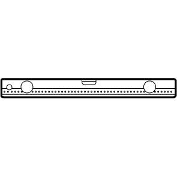

> 图片 OCR：未识别到清晰文字。

> 图片说明：第 25 页第 16 张图片。相关页面上下文：SUN2000- ( 196KTL-H0 , 200KTL-H2, 215KTL-H0) 系列；安装工具；4 系统安装

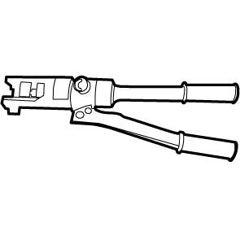

> 图片 OCR：未识别到清晰文字。

> 图片说明：第 25 页第 17 张图片。相关页面上下文：SUN2000- ( 196KTL-H0 , 200KTL-H2, 215KTL-H0) 系列；安装工具；4 系统安装

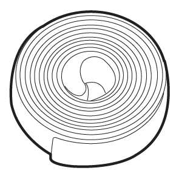

> 图片 OCR：未识别到清晰文字。

> 图片说明：第 25 页第 18 张图片。相关页面上下文：SUN2000- ( 196KTL-H0 , 200KTL-H2, 215KTL-H0) 系列；安装工具；4 系统安装

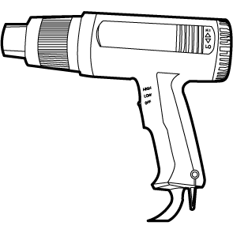

> 图片 OCR：未识别到清晰文字。

> 图片说明：第 25 页第 19 张图片。相关页面上下文：SUN2000- ( 196KTL-H0 , 200KTL-H2, 215KTL-H0) 系列；安装工具；4 系统安装

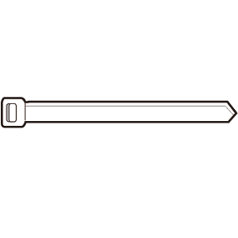

> 图片 OCR：未识别到清晰文字。

> 图片说明：第 25 页第 20 张图片。相关页面上下文：SUN2000- ( 196KTL-H0 , 200KTL-H2, 215KTL-H0) 系列；安装工具；4 系统安装

## 第 26 页

SUN2000- ( 196KTL-H0 , 200KTL-H2, 215KTL-H0) 系列
用户手册
种类
4 系统安装
工具
4 · 3 选择安装位置
4 · 3 · 1 环境要求
基本要求
安装载体要求
请勿将逆变器安装在工作和生活区域。
如果设备安装在除工作和生活区域以外的公共场合 ( 如停车场、车站、厂房
等 ) ,请在设备外部安装防护网并竖立安全警示标志进行隔离,禁止不相关人员
靠近逆变器,避免设备运行过程中由于非专业的人员意外接触或其他原因导致的
人身伤害或财产损失。
请勿在含有易燃物的区域中安装逆变器。
请勿在含有易爆物的区域中安装逆变器。
请勿在含有易腐蚀物的区域中安装逆变器。
逆变器运行过程中,存在高电压,且机箱和散热片温度高,请勿将逆变器安装在
易触碰的位置。
逆变器应安装在通风良好的环境下,以保证良好的散热。
如果将逆变器安装在密闭环境,需要加装散热装置或通风装置,工作时室内环境
温度不高于夕卜部环境广
建议选择带遮挡的安装地点,或者搭建遮阳棚。
逆变器在盐害地区安装会受到腐蚀,盐害地区户外安装逆变器之前,请咨询华为
公司。盐害地区指离海岸 500m 以内或受到海风影响的区域。海风影响的区域根据
气象条件 ( 例如台风、季节风 ) 或地形 ( 有堤坝、山丘 ) 情况的不同而不同。
逆变器安装载体必须具备防火性能。
请勿在易燃的建筑材料上安装逆变器。
逆变器较重,请保证安装表面坚固,达到安装逆变器的承重要求。
在居住区域中,请勿将逆变器安装在石膏板墙壁或类似隔音不良的墙壁上,以免
其工作时发出的噪音对生活区域中的居民产生干扰。
文档版本 08 ( 2021-09-30 )
版权所有 @ 华为技术有限公司
18

> 图片 OCR：未识别到清晰文字。

> 图片说明：第 26 页第 1 张图片。相关页面上下文：SUN2000- ( 196KTL-H0 , 200KTL-H2, 215KTL-H0) 系列；4 系统安装；4 · 3 选择安装位置

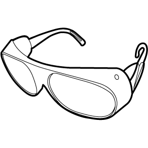

> 图片 OCR：未识别到清晰文字。

> 图片说明：第 26 页第 2 张图片。相关页面上下文：SUN2000- ( 196KTL-H0 , 200KTL-H2, 215KTL-H0) 系列；4 系统安装；4 · 3 选择安装位置

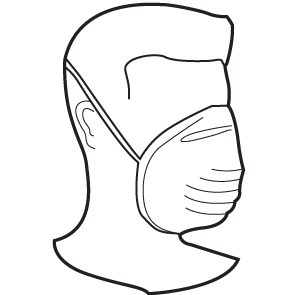

> 图片 OCR：未识别到清晰文字。

> 图片说明：第 26 页第 3 张图片。相关页面上下文：SUN2000- ( 196KTL-H0 , 200KTL-H2, 215KTL-H0) 系列；4 系统安装；4 · 3 选择安装位置

> 图片 OCR：未识别到清晰文字。

> 图片说明：第 26 页第 4 张图片。相关页面上下文：SUN2000- ( 196KTL-H0 , 200KTL-H2, 215KTL-H0) 系列；4 系统安装；4 · 3 选择安装位置

## 第 27 页

SUN2000- ( 196KTL-H0 , 200KTL-H2, 215KTL-H0) 系列
用户手册
图 4 · 1 安装载体
4 · 3 · 2 空间要求
4 系统安装
巧 06H 121
< 86 kg
逆变器周围应预留一定的空间并选择合适的安装角度,以保证有足够的安装及散
> 200 mm
> 600 mm
热空间。
图 4 · 2 安装空间
600 mm
0
凵说明
底部空间需同时满足交流输出线折弯半径的要求。
0
0
文档版本 08 ( 2021-09-30 )
版权所有 @ 华为技术有限公司
600 mm
《 S 〔 乇、 〔 跹 44
19

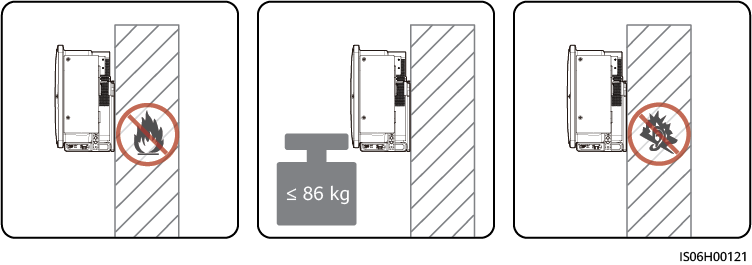

> 图片 OCR：孓 86 kg

> 图片说明：第 27 页第 1 张图片。图片内可识别文字包括：孓 86 kg。相关页面上下文：SUN2000- ( 196KTL-H0 , 200KTL-H2, 215KTL-H0) 系列；图 4 · 1 安装载体；4 系统安装

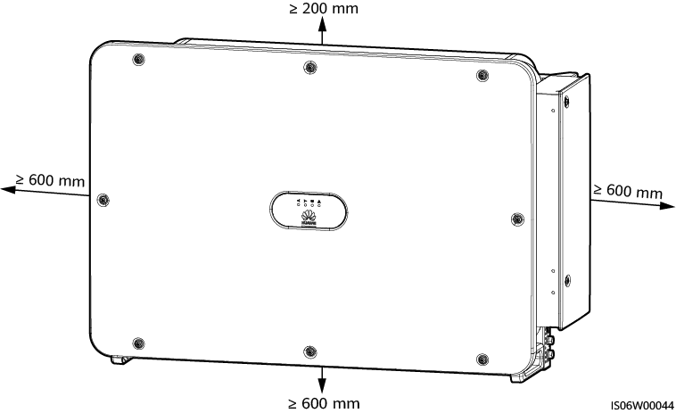

> 图片 OCR：》 600 mm
0
> 200 rnm
之 600 mm
冫 600 mm
0

> 图片说明：第 27 页第 2 张图片。图片内可识别文字包括：》 600 mm。相关页面上下文：SUN2000- ( 196KTL-H0 , 200KTL-H2, 215KTL-H0) 系列；图 4 · 1 安装载体；4 系统安装

## 第 28 页

SUN2000- ( 196KTL-H0 , 200KTL-H2, 215KTL-H0) 系列
用户手册
图 4 · 3 安装角度
4 系统安装
《 S06W00043
多台 SUN2000 安装场景下,空间充足时,推荐一字形安装方式；空间不足时,推
荐品字形安装方式。不推荐上下叠加式安装多台逆变器。
图 4 · 4 一字形安装 ( 推荐 )
文档版本 08 ( 2021-09-30 )
> 800 mm
版权所有 @ 华为技术有限公司
巧 06W ) 〕 46
20

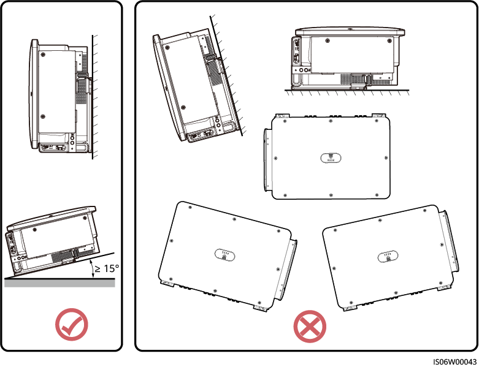

> 图片 OCR：未识别到清晰文字。

> 图片说明：第 28 页第 1 张图片。相关页面上下文：SUN2000- ( 196KTL-H0 , 200KTL-H2, 215KTL-H0) 系列；图 4 · 3 安装角度；4 系统安装

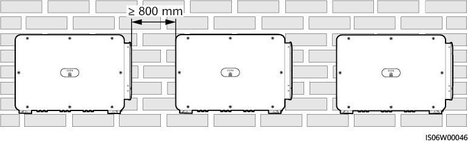

> 图片 OCR：800 mm

> 图片说明：第 28 页第 2 张图片。图片内可识别文字包括：800 mm。相关页面上下文：SUN2000- ( 196KTL-H0 , 200KTL-H2, 215KTL-H0) 系列；图 4 · 3 安装角度；4 系统安装

## 第 29 页

SUN2000- ( 196KTL-H0 , 200KTL-H2, 215KTL-H0) 系列
用户手册
图 4 · 5 品字形安装 ( 推荐 )
4 系统安装
囗匚二囗匚二二囗匚二二囗匚 〔 二 ] 匚 〔 二 ] 匚 〔 〔 二囗匚二二囗匚二囗匚二二囗囗
之 500 mm
图 4 · 6 上下叠加式安装 ( 不推荐 )
1000 mm
4 · 4 安装工程安装件
安装须知
逆变器的工程安装件尺寸,如图 4 - 7 所示。
匚口匚口 [ 二二二二彐
200 mm
巧 06 、 MO 《 刃 47
《 S05W00048
文档版本 08 ( 2021-09-30 )
版权所有 @ 华为技术有限公司

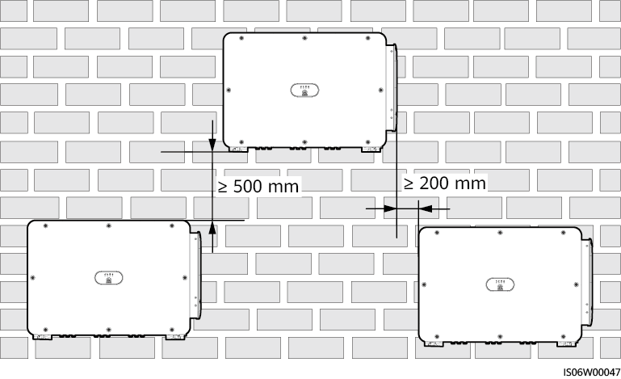

> 图片 OCR：500 mm
匚 0 匚口 [ 《 过口囗
匚口匚口 [ 《 《 《 口囗
200 m m
IS06W00047

> 图片说明：第 29 页第 1 张图片。图片内可识别文字包括：500 mm。相关页面上下文：SUN2000- ( 196KTL-H0 , 200KTL-H2, 215KTL-H0) 系列；图 4 · 5 品字形安装 ( 推荐 )；4 系统安装

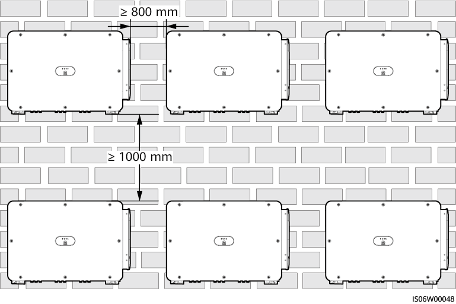

> 图片 OCR：> 800 m m
《 SO v00048

> 图片说明：第 29 页第 2 张图片。图片内可识别文字包括：> 800 m m。相关页面上下文：SUN2000- ( 196KTL-H0 , 200KTL-H2, 215KTL-H0) 系列；图 4 · 5 品字形安装 ( 推荐 )；4 系统安装

## 第 30 页

SUN2000- ( 196KTL-H0 , 200KTL-H2, 215KTL-H0) 系列
用户手册
图 4 · 7 工程安装件尺寸
895 mm
737 - 5 mm
34 mm
34 mm
0 0
凵说明
4 系统安装
014 mm
0
226 mm
0
0
《 S 〔 乇、 v00038
SUN2000 的工程安装件共有四组螺钉孔,每组四个孔位,可根据实际情况选择每组四个孔位中
的任意一个标记打孔位置,共标记四个。建议优先选择两个圆孔。
安装工程安装件之前,需先取下绑扎在工程安装件上的内梅花扳手,并妥善保存。
图 4 · 8 取下内梅花扳手
000 : 0
0
0
4 · 4 · 1 支架安装
支架安装
步骤 1 安装工程安装件。
文档版本 08 ( 2021-09-30 )
0 0
0
0
0 0
《 6H001 闐
版权所有 @ 华为技术有限公司
22

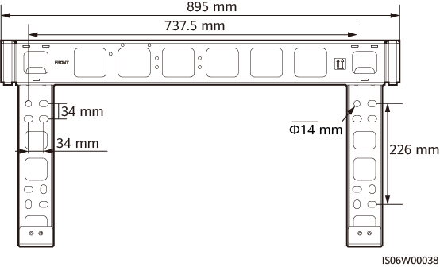

> 图片 OCR：895 m m
737 - 5 mm
34 mm
34 m m
014 m m
0
226 mm
0
S [ V 00038

> 图片说明：第 30 页第 1 张图片。图片内可识别文字包括：895 m m。相关页面上下文：SUN2000- ( 196KTL-H0 , 200KTL-H2, 215KTL-H0) 系列；图 4 · 7 工程安装件尺寸；4 系统安装

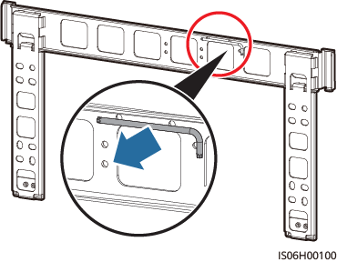

> 图片 OCR：《 s06H0010 〕

> 图片说明：第 30 页第 2 张图片。图片内可识别文字包括：《 s06H0010 〕。相关页面上下文：SUN2000- ( 196KTL-H0 , 200KTL-H2, 215KTL-H0) 系列；图 4 · 7 工程安装件尺寸；4 系统安装

## 第 31 页

SUN2000- ( 196KTL-H0 , 200KTL-H2, 215KTL-H0) 系列
用户手册
图 4 · 9 安装工程安装件
014 mm
凵说明
4 系统安装
45 N•m
％ 卜闐 101
逆变器随箱配发 MI 2 × 40 组合螺栓 ( 绑扎在工程安装件上 ) ,若组合螺栓长度无法满足安装需
求,请自备 MI 2 组合螺栓,配合随箱配发的 M 1 2 螺母进行安装。
一结束
4 · 4 · 2 挂墙安装
挂墙安装
步骤 1 安装工程安装件。
打孔前要确保避开墙内的水电走线,以免发生危险。
须知
- 为防止打孔时粉尘进入人体呼吸道或落入眼中,操作人员应佩戴防护镜和防尘口
罩。
- 使用吸尘器将所有孔位内部、夕卜部的灰尘清除干净,再对孔距进行测量,对于误差
较大的孔需重新定位、打孔。
- 拧下螺栓、弹垫和平垫后,膨胀管的上端面必须保证与水泥墙面相平,不凸出水泥
墙面,否则会使工程安装件在墙面上摆放不平。
文档版本 08 ( 2021-09-30 )
版权所有 @ 华为技术有限公司
23

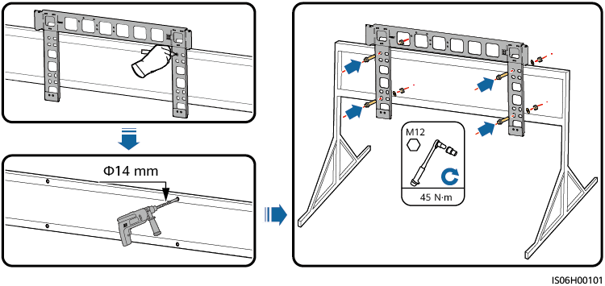

> 图片 OCR：爿到 0 的到也
M12
014 mm
《 s H 闐 1

> 图片说明：第 31 页第 1 张图片。图片内可识别文字包括：爿到 0 的到也。相关页面上下文：SUN2000- ( 196KTL-H0 , 200KTL-H2, 215KTL-H0) 系列；图 4 · 9 安装工程安装件；4 系统安装

## 第 32 页

SUN2000- ( 196KTL-H0 , 200KTL-H2, 215KTL-H0) 系列
用户手册
图 4 · 10 固定工程安装件
匚 0 匚 0 匚口 [ 二 0 「 二囗匚二工二 ] 囗
一: 0 :匚河 0
匚 0 匚 0 匚 0 匚
L 巳 [ 《 二 」 匚二 《 [ 二冂二二 ]
0 [ 二 ZC 二 ] 《 二囗匚二 ] 匚二 0 巴
匚二 〕 匚 0 匚匚二 0 囗匚灧
0 [ 二 “ 匚二二匚二冂匚二二 《 ]
匚二 ] 二彐匚 」 匚彐 1 二彐
M12
0 · 巳: 0 :匕 00 到 O
0
000 匚 0 匚 0
匚二 [ 二囗匚二 ] 匚二二 [ -
匚二就二 0 匚二囗 0 一
匚口匚 0 匚 《 二匚 《
匚二北二 《 二二 ]
匚二 《 匚口匚二匚 0 匚二匚囗匚 0 一
一结束
4 · 5 安装逆变器
安装前准备
016 mm
52 - 60 m
45 N•m
4 系统安装
《 S 〔 乇 M / 00050
安装逆变器之前,需要将逆变器从包装箱内取出,并移动至选定的安装地点。
凵说明
搬运抬手置于辅料包中,非随箱配发。
图 4 · 11 取出并搬运逆变器
须知
- 需要四名操作人员共同移动逆变器,或使用合适的移动工具。
- 逆变器底部接头和端子不能承重,请勿将接头和端子直接接触地面或其他支撑物。
- 逆变器放置于地面时,需在其下垫泡沫或纸皮,以免损伤夕卜壳。
- 严禁搬抬或吊装搬运抬手的底部孔位,避免造成抬手开裂。
文档版本 08 ( 2021-09-30 )
版权所有 @ 华为技术有限公司

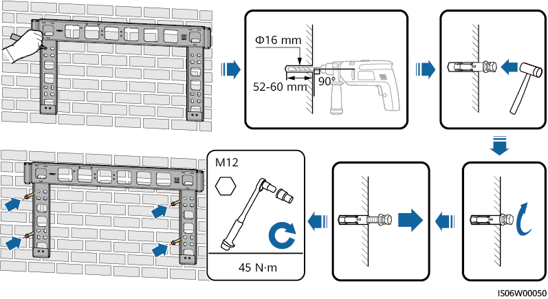

> 图片 OCR：一 」 L 一 0 二 0 匚 0 正过 0 [ 过 00
0 过 0 的生 0
彐二 00000 工 0 」 」
i 二 0000 二跹二 0
0
二二！ 00 匚二！ 0 二二 」 匚二 」 二囗
M 12
45 N•m
lS06W

> 图片说明：第 32 页第 1 张图片。图片内可识别文字包括：一 」 L 一 0 二 0 匚 0 正过 0 [ 过 00。相关页面上下文：SUN2000- ( 196KTL-H0 , 200KTL-H2, 215KTL-H0) 系列；图 4 · 10 固定工程安装件；4 · 5 安装逆变器

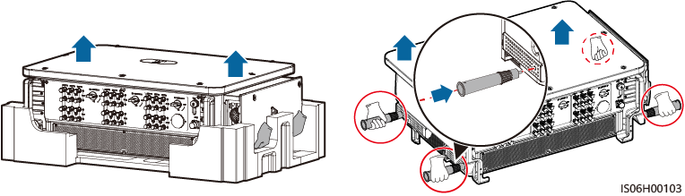

> 图片 OCR：IS06HOOI 03

> 图片说明：第 32 页第 2 张图片。图片内可识别文字包括：IS06HOOI 03。相关页面上下文：SUN2000- ( 196KTL-H0 , 200KTL-H2, 215KTL-H0) 系列；图 4 · 10 固定工程安装件；4 · 5 安装逆变器

## 第 33 页

SUN2000- ( 196KTL-H0 , 200KTL-H2, 215KTL-H0) 系列
用户手册
安装逆变器
步骤 1
图 4 · 12 搬抬位置示意
可选:安装直流开关锁定螺钉。
凵说明
澳洲地区使用的机型,根据当地标准,需要执行此步骤。
图 4 · 13 安装直流开关锁定螺钉
M4
巧 05H 119
步骤 2 将逆变器挂装到工程安装件上。
步骤 3 拧紧逆变器底部的两颗紧固螺钉。
文档版本 08 ( 2021-09-30 )
版权所有 @ 华为技术有限公司
4 系统安装
5 〔 卜 ℃ 0117
25

> 图片 OCR：S [ H00117

> 图片说明：第 33 页第 1 张图片。图片内可识别文字包括：S [ H00117。相关页面上下文：SUN2000- ( 196KTL-H0 , 200KTL-H2, 215KTL-H0) 系列；安装逆变器；步骤 1

> 图片 OCR：M4
1 - 2 N•m
\| S( H 闐 11 《

> 图片说明：第 33 页第 2 张图片。图片内可识别文字包括：M4。相关页面上下文：SUN2000- ( 196KTL-H0 , 200KTL-H2, 215KTL-H0) 系列；安装逆变器；步骤 1

## 第 34 页

SUN2000- ( 196KTL-H0 , 200KTL-H2, 215KTL-H0) 系列
用户手册
图 4 · 14 安装
M6
5 N•m
一结束
衤卜充说明
如果逆变器安装位置较高,可通过吊装的方式安装。
图 4 · 15 吊装
巧 〔 乇、 v00052
文档版本 08 ( 2021-09-30 )
版权所有 @ 华为技术有限公司
4 系统安装
巧 05H 102
26

> 图片 OCR：M6
《 S06 卜 〔 ℃ 102

> 图片说明：第 34 页第 1 张图片。图片内可识别文字包括：M6。相关页面上下文：SUN2000- ( 196KTL-H0 , 200KTL-H2, 215KTL-H0) 系列；图 4 · 14 安装；如果逆变器安装位置较高,可通过吊装的方式安装。

> 图片 OCR：未识别到清晰文字。

> 图片说明：第 34 页第 2 张图片。相关页面上下文：SUN2000- ( 196KTL-H0 , 200KTL-H2, 215KTL-H0) 系列；图 4 · 14 安装；如果逆变器安装位置较高,可通过吊装的方式安装。

## 第 35 页

SUN2000- ( 196KTL-H0 , 200KTL-H2, 215KTL-H0) 系列
用户手册
5 · 1 注意事项
众危险
在进行电气连接之前,请确保逆变器的所有
否则逆变器的高电压可能导致电击危险。
5 电气连接
电气连接
“ DC SWITCH
” 均置于 '
'OFF ”
的位置。
- 不正确的接线导致的设备损坏,不在设备质保范围内。
只有专业电气技术人员才可以进行电气连接的相关操作。
在进行电气连接时,操作人员必须配备个人防护用品。
凵说明
本章节中所有电气连接示意图中涉及的线缆颜色仅供参考,线缆的选取应符合当地线缆标准 ( 黄
绿双色线只可以用于保护接地 ) 。
5 · 2 压接 OT/ DT 端子
OT/ DT 端子要求
当采用钅同芯线缆时,请使用铜接线端子。
当采用洞包铝线缆时,请使用铜接线端子。
当采用铝合金线缆时,请使用铜铝过渡接线端子,或铝接线端子配合铜铝过渡垫
片。
文档版本 08 ( 2021-09-30 )
版权所有 @ 华为技术有限公司
27

## 第 36 页

SUN2000- ( 196KTL-H0 , 200KTL-H2, 215KTL-H0) 系列
用户手册
须知
5 电气连接
- 严禁将铝接线端子直接连接到交流端子排,否则会造成电化学腐蚀,影响线缆连接
的可靠性。
- 当使用铜铝过渡接线端子,或铝接线端子配合铜铝过渡垫片时,需符刽 EC61238 一 1
要求。
- 当使用铜铝过渡垫片时,请注意正反面,确保垫片的铝面和铝接线端子接触,铜面
和交流端子排接触。
图 5 · 1 OT/ DT 端子要求
交流端子排
交流端子排
压接 OT/DT 端子
须知
铜接线端子
铜芯线缆
交流端子排
铜铝过渡
接线端子
铜接线端子
铜包铝线缆
铝接线端子
铝合金线缆
洞铝过渡
交流端子排垫片
铝合金线缆
《 S03H00062
- 剥线时,请勿划伤线芯。
- OT / DT 端子的导体压接片压接后所形成的腔体应完全将线芯包覆,并且线芯与
OT / DT 端子结合紧密、无松动。
- 压线处可使用热缩套管或绝缘胶带包覆。以热缩套管为例进行介绍。
- 使用热风枪的过程中,请注意防护,防止烤伤设备。
文档版本 08 ( 2021-09-30 )
版权所有 @ 华为技术有限公司
28

> 图片 OCR：交流端子排
交流端子排
洞接线端子
洞芯线缆
交流端子排
钅同铝过渡
接线端子
铝合金线缆
铜接线端子
铜包铝线缆
铝接线端子
铜铝过渡
交流端子排垫片
铝合金线缆
》 s03H00062

> 图片说明：第 36 页第 1 张图片。图片内可识别文字包括：交流端子排。相关页面上下文：SUN2000- ( 196KTL-H0 , 200KTL-H2, 215KTL-H0) 系列；- 严禁将铝接线端子直接连接到交流端子排,否则会造成电化学腐蚀,影响线缆连接；- 当使用铜铝过渡接线端子,或铝接线端子配合铜铝过渡垫片时,需符刽 EC61238 一 1

## 第 37 页

SUN2000- ( 196KTL-H0 , 200KTL-H2, 215KTL-H0) 系列
用户手册
图 5 · 2 压接 OT 端子
LI
1
2
L2=L1 + 3 m m
6
( 1 ) 线缆
( 4 ) OT 端子
图 5 · 3 压接 DT 端子
4
5
( 2 ) 线芯
( 5 ) 液压钳
( 2 ) 线芯
( 5 ) 液压钳
3
《 S 〔 乇 Z 佤跹 01
( 3 ) 热缩套管
( 6 ) 热风枪
( 3 ) 热缩套管
( 6 ) 热风枪
( 1 ) 线缆
( 4 ) DT 端子
文档版本 08 ( 2021-09-30 )
版权所有 @ 华为技术有限公司
5 电气连接
29

> 图片 OCR：未识别到清晰文字。

> 图片说明：第 37 页第 1 张图片。相关页面上下文：SUN2000- ( 196KTL-H0 , 200KTL-H2, 215KTL-H0) 系列；图 5 · 2 压接 OT 端子；( 4 ) OT 端子

> 图片 OCR：未识别到清晰文字。

> 图片说明：第 37 页第 2 张图片。相关页面上下文：SUN2000- ( 196KTL-H0 , 200KTL-H2, 215KTL-H0) 系列；图 5 · 2 压接 OT 端子；( 4 ) OT 端子

## 第 38 页

SUN2000- ( 196KTL-H0 , 200KTL-H2, 215KTL-H0) 系列
用户手册
5 电气连接
5 · 3 打开维护腔门
操作步骤
须知
- 禁止打开逆变器的主机面板。
- 打开维护腔门之前,请确保逆变器的交流侧和直流侧均未进行电气连接。
- 如需在雨雪天气打开维护腔门,请做好防护措施,防止雨雪进入维护腔。如果不能
防止雨雪进入维护腔,请勿在雨雪天气打开维护腔门。
- 请勿将未使用的螺钉遗留在维护腔内。
步骤 1 适当拧松维护腔门上的两颗螺钉。
步骤 2 将维护腔门打开,并安装支撑杆。
图 5 · 4 打开维护腔门
0
M6
0
0
4
0
0
4
0
0
0
0
巧 0 引 20040
步骤 3 取下绑扎在维护腔内的附件,并妥善保管,以备后续使用。
凵说明
部分机型维护腔内绑扎有三孔胶塞,取下后请妥善保管,以备后续使用。
文档版本 08 ( 2021-09-30 )
版权所有 @ 华为技术有限公司
30

> 图片 OCR：0
M6
》 SO & 2D040

> 图片说明：第 38 页第 1 张图片。图片内可识别文字包括：0。相关页面上下文：SUN2000- ( 196KTL-H0 , 200KTL-H2, 215KTL-H0) 系列；5 · 3 打开维护腔门；操作步骤

## 第 39 页

SUN2000- ( 196KTL-H0 , 200KTL-H2, 215KTL-H0) 系列
用户手册
图 5 · 5 取下维护腔内附件
5 电气连接
0
0
( 1 ) 压线模块
一结束
1
0
《 S 〔 乇、 v00 〔 乇 3
5 · 4 ( 可选 ) 更换压线模块
操作步骤
凵说明
如果交流输出线采用单芯线,需要更换压线模块。
步骤 1 更换压线模块。
图 5 · 6 更换
0
4
一结束
文档版本 08 ( 2021-09-30 )
0
0
版权所有 @ 华为技术有限公司
《 S 〔 乇口 0047

> 图片 OCR：未识别到清晰文字。

> 图片说明：第 39 页第 1 张图片。相关页面上下文：SUN2000- ( 196KTL-H0 , 200KTL-H2, 215KTL-H0) 系列；图 5 · 5 取下维护腔内附件；操作步骤

> 图片 OCR：未识别到清晰文字。

> 图片说明：第 39 页第 2 张图片。相关页面上下文：SUN2000- ( 196KTL-H0 , 200KTL-H2, 215KTL-H0) 系列；图 5 · 5 取下维护腔内附件；操作步骤

## 第 40 页

SUN2000- ( 196KTL-H0 , 200KTL-H2, 215KTL-H0) 系列
用户手册
5 · 5 ( 可选 ) 连接跟踪系统电源线
注意事项
须知
冖 ～
5 电气连接
- SUN2000 与跟踪控制盒之间,需接入保护用隔离开关熔断器组或者熔断器式隔离开
关,规格:电压 800V ,电流为 16A ,保护类型为 gM 。
- 电源线接线端子与隔离开关熔断器组或者熔断器式隔离开关之间的线缆长度需孓
2 - 5m 。
- 连接跟踪系统电源线须先于连接交流输出线,否则会造成返工。
线缆规格
推荐使用导体横截面积为 10mm2 ,线缆外径为 15mm
户外铜线芯。
操作步骤
步骤 1 将跟踪系统电源线连接到端子排上。
图 5 · 7 接线
L + 3 mm
S265rnm
一结束
5 · 6 连接交流输出线
注意事项
-18mm
M6
,具有双层防护的三
6 一 8 N•m
巧 0 引 20044
逆变器交流侧外部需配置三相交流开关。为确保异常状态下逆变器能够与电网安全断
开,请依照当地配电法规选择合适的过流保护装置。
文档版本 08 ( 2021-09-30 )
版权所有 @ 华为技术有限公司
32

> 图片 OCR：L + 3 mm
265 m
M6
6 一 8 N•m
》 SO & 2D044

> 图片说明：第 40 页第 1 张图片。图片内可识别文字包括：L + 3 mm。相关页面上下文：SUN2000- ( 196KTL-H0 , 200KTL-H2, 215KTL-H0) 系列；- SUN2000 与跟踪控制盒之间,需接入保护用隔离开关熔断器组或者熔断器式隔离开；- 电源线接线端子与隔离开关熔断器组或者熔断器式隔离开关之间的线缆长度需孓

## 第 41 页

SUN2000- ( 196KTL-H0 , 200KTL-H2, 215KTL-H0) 系列
用户手册
禁止在逆变器和交流开关之间接入负载。
5 电气连接
逆变器内部装有集成的综合残余电流监测单元,可以区分故障电流与电容残余电流。
当逆变器检测到残余电流超过允许值时,将迅涑断开与电网的连接。
接线须知
须知
- 线缆外径可根据维护腔内的直尺标签测量。
- 请确保线缆护套位于维护腔内。
- 请确保交流输出线连接紧固,否则可能导致设备无法运行,或运行后因连接不可靠
而发热等导致逆变器端子排损坏等状况。
逆变器保护接地建议优先选择机箱夕卜壳的接地点。
维护腔内接地点主要用于连接多芯交流线包含的接地线。
机箱外壳有两个接地点,其中一个为备用接地点。
推荐逆变器近端接地。对于多台 SUN2000 并联系统,需要将所有逆变器的接地点
线缆规格
相互连接,以保证接地线等电位连接。
若选择机箱外壳的接地点连接地线,则推荐使用三芯 ( LI , L2 , L3 ) 或三根单芯
的户外线缆。
若选择维护腔内的接地点连接地线,则推荐使用四芯 ( LI , L2 , L3 , PE ) 户外线
用户需自行准备与线缆规格匹配的 OT / DT 端子。
表 5 · 1 交流线规格
线缆类型
铜芯线缆
铜包铝 / 铝合金线缆
导体横截面积
50mm2 ～ 240mm
2
多芯线: 70mm
240mm2
单芯线: 70mm2
2 [ 2 ]
240mm
线缆外径
多芯线:
66mm
单芯线:
32mm[
24m m ～
14mm-
注 [ 1 ] :部分机型单芯线线缆外径支持 14 m m 一 36 m m ,以维护腔内标签为准。
注 [ 2 ] :部分机型 OT / DT 端子压接成型后满足下图所示要求,并且交流接线端子的橡
胶挡墙为 112mm 时,单芯线导体横截面积最大可支持 400 m m2 。
文档版本 08 ( 2021-09-30 )
版权所有 @ 华为技术有限公司
33

## 第 42 页

SUN2000- ( 196KTL-H0 , 200KTL-H2, 215KTL-H0) 系列
用户手册
图 5 · 8 OT/ DT 端子压接成型后尺寸要求
孓 38 mm
孓 20 mm
36 mm
160 mm
40 mm
5 电气连接
巧 06z 佤 ℃ 07
图 5 · 9 橡胶挡墙尺寸
0 0 0
1 1 2 mm
0
凵说明
0
0
0
0
巧 05W0 〔 ℃ 81
线缆线径的选取应符合当地线缆标准。影响线缆选取的因素有:额定电流、电缆类型、敷设
方式、环境温度和最大期望线路损耗。
使用 MBUS 通信时,建议使用多芯线,通信距离最大支持 1000 米；使用其他类型的交流线
缆,请联系华为技术人员
表 5 · 2 保护地线规格
交流线导体横截面积 S ( mm2 )
S > 35
保护地线导体横截面积 sp ( mm2 )
Sp S/2
只有在保护地线和交流线的导体材质相同时,本表的取值才有效。否则,应使保护
地线的导体横截面积的电导与本表规定等效。保护地线规格由本表决定,或根据丨 EC
60364 一 5 一 54 进行计算。
连接保护地线
步骤 1 用接地位置的螺钉将地线固定。
文档版本 08 ( 2021-09-30 )
版权所有 @ 华为技术有限公司
34

> 图片 OCR：38 mm
36 mm
孓 20 mm
160 mm
40 mm

> 图片说明：第 42 页第 1 张图片。图片内可识别文字包括：38 mm。相关页面上下文：SUN2000- ( 196KTL-H0 , 200KTL-H2, 215KTL-H0) 系列；图 5 · 8 OT/ DT 端子压接成型后尺寸要求；图 5 · 9 橡胶挡墙尺寸

> 图片 OCR：0 0 0
1 12 mm
0
0
》 s06W0008 -

> 图片说明：第 42 页第 2 张图片。图片内可识别文字包括：0 0 0。相关页面上下文：SUN2000- ( 196KTL-H0 , 200KTL-H2, 215KTL-H0) 系列；图 5 · 8 OT/ DT 端子压接成型后尺寸要求；图 5 · 9 橡胶挡墙尺寸

## 第 43 页

SUN2000- ( 196KTL-H0 , 200KTL-H2, 215KTL-H0) 系列
用户手册
图 5 · 10 接线
M 10
15 N•m
0
0
巧 〔 | 20043
5 电气连接
步骤 2 ( 可选 ) 在接地端子夕卜部涂抹硅胶或刷漆进行防护,提高接地端子的防腐性能。
一结束
连接交流输出线 ( 多芯线 )
步骤 1 将交流线连接到端子排上。
须知
保护地线长度应预留余量,在交流输出线因遭受不可抗力而承受拉力时,保证保护地
线最后承受应力。
文档版本 08 ( 2021-09-30 )
版权所有 @ 华为技术有限公司
35

> 图片 OCR：M10
15 N•m

> 图片说明：第 43 页第 1 张图片。图片内可识别文字包括：M10。相关页面上下文：SUN2000- ( 196KTL-H0 , 200KTL-H2, 215KTL-H0) 系列；图 5 · 10 接线；步骤 2 ( 可选 ) 在接地端子夕卜部涂抹硅胶或刷漆进行防护,提高接地端子的防腐性能。

## 第 44 页

SUN2000- ( 196KTL-H0 , 200KTL-H2, 215KTL-H0) 系列
用户手册
图 5 · 11 接线
L+3mm
270 - 300 mm
一结束
连接交流输出线 ( 单芯线 )
D: 24 - 25 mm
D: 37 一 46 m m
D: 55 一 64 mm
0
L3
0
步骤 1 将交流线连接到端子排上。
凵说明
32mm 一 36mm 仅部分机型支持,以实物标签为准。
文档版本 08 ( 2021-09-30 )
版权所有 @ 华为技术有限公司
5 电气连接
D: 25 - 37 mm
D: 46 一 55 m m
D: 64 一 66 mm
M12 ()I / [ 2 / [ 3 )
25 - 40 N•m
M10 (PE)
15 N•m
巧 06 《 20041
36

> 图片 OCR：D: 24 一 25 mm
D: 25 一 37 m m
L + 3 mm
270 - 3 m
D: 37 一 46 mm
D: 55 一 64 m m
D: 46 一 55 m m
D: 64 一 66 m m
M 1 2 ()I /L2/L3)
25 一 40 N•m
M 1 0 (PE)
1 5 N 、 m
IS06 20041

> 图片说明：第 44 页第 1 张图片。图片内可识别文字包括：D: 24 一 25 mm。相关页面上下文：SUN2000- ( 196KTL-H0 , 200KTL-H2, 215KTL-H0) 系列；图 5 · 11 接线；步骤 1 将交流线连接到端子排上。

## 第 45 页

SUN2000- ( 196KTL-H0 , 200KTL-H2, 215KTL-H0) 系列
用户手册
图 5 · 12 接线
L + 3 mm
WLW
一结束
折弯半径要求
图 5 · 13 折弯半径图示
: R
ISC 还 》 2 48
5 电气连接
D: 14 - 15 mm
D: 22 一 30 mm
L2
单芯线
无皑装
R 20D
0
多芯线
无皑装
R 1 5 D
有皑装
R 12D
D: 1 5 - 22 mm
D: 30 一 32 mm
D: 32 一 36 mm
M12
25 - 30 N•m
巧 | 20057
有皑装
R 1 5 D
R 为折弯半径, D 为线缆外径。
文档版本 08 ( 2021-09-30 )
版权所有 @ 华为技术有限公司
37

> 图片 OCR：小 0
L + 3 mm
D: 14 一 15 m m
D: 22 一 30 m m
D: 1 5 一 22 mm
D: 30 一 32 mm
D: 32 一 36 mm
M 12
25 一 30 N•m
》 S 〔 口 0057

> 图片说明：第 45 页第 1 张图片。图片内可识别文字包括：小 0。相关页面上下文：SUN2000- ( 196KTL-H0 , 200KTL-H2, 215KTL-H0) 系列；图 5 · 12 接线；图 5 · 13 折弯半径图示

> 图片 OCR：未识别到清晰文字。

> 图片说明：第 45 页第 2 张图片。相关页面上下文：SUN2000- ( 196KTL-H0 , 200KTL-H2, 215KTL-H0) 系列；图 5 · 12 接线；图 5 · 13 折弯半径图示

## 第 46 页

SUN2000- ( 196KTL-H0 , 200KTL-H2, 215KTL-H0) 系列
用户手册
凵说明
交流线缆需垂直进入维护腔。
5 · 7 连接直流输入线
注意事项
危险
5 电气连接
在连接直流输入线之前,请确保直流侧电压处于安全电压范围内 ( 即 60V DC 以
下 ) ,且逆变器的三个 “ DC SWITCH ” 均置于 "OFF ” 的位置。否则产生的高电压
可能会导致电击危险。
- 逆变器在并网运行时,禁止对直流输入线进行维护操作,如接入或退出某个组串或
组串中某个组件。否则会导致电击或拉弧起火危险。
请确保满足以下条件。否则可能会导致逆变器损坏,甚至引发火灾危险。
每一路光伏组串的最大开路电压,在任何条件下都不得超过 1500V DCO
- 直流输入侧极性正确,即光伏组串的正极接入逆变器直流输入端子的正极,负极接
入逆变器直流输入端子的负极。
须知
- 请确保光伏组件的输出对地绝缘良好。
- 连接到同一路 MPPT 的光伏组串需采用相同型号、相同数量的光伏电池板。
- 逆变器不支持组串通过全并联方式接入 ( 全并联:各个组串在逆变器夕卜部并联后再
分开接入逆变器 ) 。
- 在安装光伏组串和逆变器的过程中,如果因为配电线缆安装或走线不符合要求导致
光伏组串正极或负极对地短路,在逆变器工作过程中可能会引起交直流短路,导致
设备损坏。由此引起的设备损坏不在设备质保范围内。
端子说明
逆变器共有 1 8 路直流输入端子,其中直流输入端子的 1 一 6 路由 DC SWITCH 1 控制,直
流输入端子的 7 ～ 12 路由 DC SWITCH 2 控制,直流输入端子的 1 3 一 18 路由 DC SWITCH
3 控制。
文档版本 08 ( 2021-09-30 )
版权所有 @ 华为技术有限公司
38

## 第 47 页

直流输入端子选择需满足如下原则 -
2 - 需要使 M PPT 接入数量最大化。
Y 型光伏连接器接线说明
须知
- Y 型光伏连接器组件根据下列推荐的型号,既可从华为选购,也可以自行购买: Y 型
光伏连接器的熔断器额定电流为 15A 时,推荐型号为 904095944 ( 立讯 ) 或
A040959443039 ( 金洋 ) ； Y 型光伏连接器的熔断器额定电流为 20A 时,推荐型号
为 904095945 ( 立讯 ) 或 A040959453039 ( 金洋 ) 。
- 采用所推荐的 Y 型光伏连接器接线时,所有连接器必须使用同一厂家配对的型号,
不同厂家不得混合使用,混合使用会导致连接器接触电阻超过允许值,使用时连接
器会持续发热氧化,极易发生故障。
- 确保所有连接器的锁紧螺母已紧固。
- 严禁将 3 个以上的熔断器外壳绑扎在一起,否则可能导致熔断器及其外壳因过热而
损坏。推荐熔断器外壳之间预留 10mm 及以上间隙,且不建议和其他发热导体绑扎
在一起。
- 严禁将 Y 型光伏连接器线束放置在地面上。 Y 型光伏连接器线束距离地面须预留安全
距离以防止地面积水侵蚀。
- 推荐 Y 型光伏连接器从组串侧接入,并且绑扎于光伏支架上。
- 逆变器的直流输入端子在承受应力时易损坏,当 Y 型光伏连接器从逆变器侧接入
时,必须对其进行绑扎固定,降低逆变器的直流输入端子承受应力。详细请参见 A
固定 Y 型光伏连接器。
接线原则 -
1 - 组串侧的 PV + 接入逆变器侧的 PV + ,组串侧的 PV 一接入逆变器侧的 PV 一,不能混接。
2 - Y 型光伏连接器优先选择 DC SWITCH 1 或 DC SWITCH 2 控制的 MPPT 接入,且均匀
分布在 DC SWITCH 1 或 DC SWITCH 2 控制的 MPPT 上。
SUN2000- ( 196KTL-H0 , 200KTL-H2, 215KTL-H0) 系列
1 - 需要将直流输入线均匀的分布在三个直流开关控制的直流输入端子上。
MPPTI 、 MPPT4
用户手册
图 5 · 14 直流端子
0 。 0 荸
PV2 : PV4 :
Ce 0 。 C)e
PVt : PV' ·
Ce CO CO
0 。 0 。 0 : 、
VPPT4 MPPTS
C)e Ce C)e
CJO Ce CO
DC 8W 仃 0 《 2
"PPTO
0 。 0 。 0 。
C}e 0 。
C)e C)e
CO 0 。 0 。
5 电气连接
00 0 《 3
巧 W00062
Y 型光伏推荐接入的 M PPT
连接器
1
文档版本 08 ( 2021-09-30 )
MPPTI
Y 型光伏推荐接入的 MPPT
连接器
套数
2
版权所有 @ 华为技术有限公司
39

> 图片 OCR：MPPT'
0 。 0 。 0 。
PV2 , PV4 : PVe
0 。 0 。 0 。
Ce 0 。 0 。
0 。 0 。 0 。
00 8 、 《 1
0 。 0 。 0 “
MPPT4 MPFTS
0 。 0 。
0 。 0 。 0 。
0 。 0 。 0 。
DC 8W 仃 0 《 生
PPT7 VPPT8 MPPT9
0 。 0 。 0 。
0 。 0 。 0 。
0 。 0 。 0 。 。
00 仃 3
《 SO v00062

> 图片说明：第 47 页第 1 张图片。图片内可识别文字包括：MPPT'。相关页面上下文：直流输入端子选择需满足如下原则 -；Y 型光伏连接器接线说明；- 采用所推荐的 Y 型光伏连接器接线时,所有连接器必须使用同一厂家配对的型号,

## 第 48 页

SUN2000- ( 196KTL-H0 , 200KTL-H2, 215KTL-H0) 系列
MPPTI 、 MPPT3s
MPPT4s M P PT6
MPPTI 、 MPPT2 、
MPPTI 、 MPPT2s
MPPT3s MPPT4s
MPPT5s M P PT6
MPPTI 、 MPPT2 、
MPPTI 、 MPPT2s
MPPT3 、 MPPT4 、
MPPT3s MPPT4s
MPPT5s MPPT6s
MPPT7s M P PT8
MPPTI 、 MPPT2 、
MPPT3 、 MPPT4 、
MPPT5 、 MPPT6 、
用户手册
Y 型光伏
连接器
套数
3
5
7
9
推荐接入的 M PPT
MPPTI 、 MPPT3 、 MPPT4
MPPT3 、 MPPT4 、 MPPT5
MPPT5 、 MPPT6 、 MPPT7
MPPT7 、 MPPT8 、 MPPT9
Y 型光伏
连接器
套数
4
6
8
图 5 · 15 Y 型光伏连接器连接方案
线束 A
5 电气连接
推荐接入的 MPPT
线束 B
组串 1
组串 2
PV-
组串 3
PV±A 串侧
接入 ( 推
逆变器侧
接入
文档版本 08 ( 2021-09-30 )
Y 型光伏连接器。
连接方案说明
PV(2n-1 ) +
PV(2n-1)-
SU N2000
MPPTn
PV(2n)+
PV(2n)-
5 ( 3 12
Y 型光伏连接器
( 线束 A ) 型号
华为推荐 / 非华为
推荐
华为推荐
线束 B 接入逆变器的端子需采用随箱配发的直
流端子。
线束 A 可直接接入逆变器,无线束 B 。
版权所有 @ 华为技术有限公司
40

> 图片 OCR：组串 1
PV+
组串 2
PV+
组串 3
PV(2n-1 ) +
PV(2n-1 ) 一
SUN2000
MPPTn
PV(2n)+
PV(2n)-
愍 《 12

> 图片说明：第 48 页第 1 张图片。图片内可识别文字包括：组串 1。相关页面上下文：SUN2000- ( 196KTL-H0 , 200KTL-H2, 215KTL-H0) 系列；图 5 · 15 Y 型光伏连接器连接方案；逆变器侧

## 第 49 页

SUN2000- ( 196KTL-H0 , 200KTL-H2, 215KTL-H0) 系列
用户手册
线缆规格
操作步骤
步骤 1
5 电气连接
场景
线缆类型
Y 型光伏连接器
( 线束 A ) 型号
非华为推荐
连接方案说明
为避免线束 A 的端子与逆变器直流端子不匹
配,线束 A 需通过线束 B 转接后接入逆变器,线
束 B 接入逆变器的端子需采用随箱配发的直流
端子
导体横截面积 ( mm2 )
4 一 6
线缆外径范围 ( m m )
4 - 7 ～ 6 - 4
满足 1500V 标准的光伏线
须知
不推荐使用铠装线缆等硬度很大的线缆,以免线缆折弯应力造成端子接触不良。
须知
- 请使用逆变器随箱配发的 MC4 E\/02 光伏连接器。若不慎遗失或损坏,需采购同型
号的光伏连接器。由于使用不兼容型号的光伏连接器导致的设备损坏不在设备质保
范围内。
- 压线钳和拆卸扳手,可选用推荐型号或咨询 STAUB 凵经销商获取相关型号。
连接直流输入线。
须知
- 万用表的直流电压量程不能小于 1500V 。
- 若电压为负值,说明直流输入极性错误,需修正极性。
- 若电压大于 1500V ,说明光伏组件配置过多,需重新配置。
PV±A 串侧连接器和逆变器侧连接器对接卡入到位,然后沿轴向回拉 P\/ 组串侧连接器
检查是否安装牢固。
- 禁止连接器处于对接卡入不到位的状态,若因对接卡入不到位导致的连接器损坏不
在质保范围内。
文档版本 08 ( 2021-09-30 )
版权所有 @ 华为技术有限公司

## 第 50 页

SUN2000- ( 196KTL-H0 , 200KTL-H2, 215KTL-H0) 系列
用户手册
图 5 · 16 接线
正极金属端子
00 ！应粼
8 - 10 mm
8 - 10 mm
负极金属端子
咔哒
图 5 · 17 连接器对接后状态示意
PV-CZM-411 佣
( STAUBLI )
确保压紧后线缆无氵去拔出
用万用表直流档
《 ； 《 晁星电压
的。 ( 电压飞 1500V)
0
0
5 电气连接
正极连接器
负极连接器咔噠
螺母已紧固
13001462
( STAU 3 凵 )
50 引 30010
《 S 《 | 30016
须知
现场布线时,直流输入线应自然下垂不少于 50m m ,对光伏连接器的轴向拉力不超过
80N ,禁止对光伏连接器产生径向应力或扭矩。
图 5 · 18 直流输入线布线要求
0
0
90 。
90 。
0
文档版本 08 ( 2021-09-30 )
之 50 mm
0
版权所有 @ 华为技术有限公司
513H 〔 ℃ 022

> 图片 OCR：正极金属端子
0 ！ 0 ！佃
8 一 10 mm
8 一 10 mm
负极金属端子
咔哒
tll
PV-CZM-41100
( STAUBLI )
确保压紧后线缆无氵去拔出
用万用表直流尴
口
测电压
0 氵 ( 电压 ' 1500V )
0
0
正极连接器
亠乛一
负极连接器咔哒
确保锁紧
螺母已紧固
13001462
( STAUBLI )
愍 《 10

> 图片说明：第 50 页第 1 张图片。图片内可识别文字包括：正极金属端子。相关页面上下文：SUN2000- ( 196KTL-H0 , 200KTL-H2, 215KTL-H0) 系列；图 5 · 16 接线；正极金属端子

> 图片 OCR：- 闐 16

> 图片说明：第 50 页第 2 张图片。图片内可识别文字包括：- 闐 16。相关页面上下文：SUN2000- ( 196KTL-H0 , 200KTL-H2, 215KTL-H0) 系列；图 5 · 16 接线；正极金属端子

> 图片 OCR：》 50 mm
愍 13 柯

> 图片说明：第 50 页第 3 张图片。图片内可识别文字包括：》 50 mm。相关页面上下文：SUN2000- ( 196KTL-H0 , 200KTL-H2, 215KTL-H0) 系列；图 5 · 16 接线；正极金属端子

## 第 51 页

SUN2000- ( 196KTL-H0 , 200KTL-H2, 215KTL-H0) 系列
用户手册
90
之 50 m
5 电气连接
513H 佤 ℃ 23
一结束
5 · 8 连接通信线
注意事项
在布置通信线时,请注意将通信线与功率线的走线分开,以免信号受到干扰导致涌信
受影响。
通信接口信号定义
图 5 · 19 通信接囗
端口
RS485 一 1
保护地
RS485 一 2
0
1
3
5
0
PIN 脚
1
3
5
7
定义
RS485A | N ,
分信号 +
RS485B IN,
分信号一
0
2
0
巧 05 、 v00024
RS485 差
RS485 差
PE ,屏蔽层接地
RS485A , RS485 差分
信号 +
PIN 脚
2
4
6
8
定义
RS485A OUT ,
RS485 差分信号 +
RS485 B OUT ,
RS485 差分信号
PE,屏蔽层接地
RS485 B , RS485 差
分信号一
说明
用于逆变器级联或连
接数据采集器等设
备。
用于连接 RS485 从设
备。
文档版本 08 ( 2021-09-30 )
版权所有 @ 华为技术有限公司
43

> 图片 OCR：未识别到清晰文字。

> 图片说明：第 51 页第 1 张图片。相关页面上下文：SUN2000- ( 196KTL-H0 , 200KTL-H2, 215KTL-H0) 系列；图 5 · 19 通信接囗；用于逆变器级联或连

> 图片 OCR：》 S05 、 V00024

> 图片说明：第 51 页第 2 张图片。图片内可识别文字包括：》 S05 、 V00024。相关页面上下文：SUN2000- ( 196KTL-H0 , 200KTL-H2, 215KTL-H0) 系列；图 5 · 19 通信接囗；用于逆变器级联或连

## 第 52 页

SUN2000- ( 196KTL-H0 , 200KTL-H2, 215KTL-H0) 系列
用户手册
操作步骤
步骤 1
5 电气连接
连接通信线。
图 5 · 20 接线 ( 4mm-8mm 胶塞为 4 孔时 )
RS485A IN
RS485B IN
PE
PE
RS485B OUT
RS485A OUT
须知
请使用堵头堵住不使用的防水胶圈过线孔后,拧紧锁紧帽。
0 - 5 N•m
巧 《 2 〔 ℃ 49
文档版本 08 ( 2021-09-30 )
版权所有 @ 华为技术有限公司

> 图片 OCR：RS485A IN
RS485B IN
PE
PE
RS485B OUT
RS485A OUT
0 · 5 N•m

> 图片说明：第 52 页第 1 张图片。图片内可识别文字包括：RS485A IN。相关页面上下文：SUN2000- ( 196KTL-H0 , 200KTL-H2, 215KTL-H0) 系列；操作步骤；步骤 1

## 第 53 页

SUN2000- ( 196KTL-H0 , 200KTL-H2, 215KTL-H0) 系列
用户手册
图 5 · 21 接线 (4mm-8mm 胶塞为 2 孔时 )
RS485A IN
RS485B IN
PE
PE
RS485B OUT
RS485A OUT
须知
0 - 5 N•m
巧 《 2 〔 ℃ 50
- 同时接入三根通信线的场景,需使用维护腔内绑扎的三孔胶塞。
- 请使用堵头堵住不使用的防水胶圈过线孔后,拧紧锁紧帽。
一结束
5 · 9 关闭维护腔门
操作步骤
步骤 1 调整支撑杆,关闭维护腔门,并紧固门上的两个螺钉。
文档版本 08 ( 2021-09-30 )
版权所有 @ 华为技术有限公司
5 电气连接
45

> 图片 OCR：RS485A IN
RS485B IN
PE
PE
RS485B OUT
RS485A OUT
0 · 5 N•m

> 图片说明：第 53 页第 1 张图片。图片内可识别文字包括：RS485A IN。相关页面上下文：SUN2000- ( 196KTL-H0 , 200KTL-H2, 215KTL-H0) 系列；图 5 · 21 接线 (4mm-8mm 胶塞为 2 孔时 )；- 同时接入三根通信线的场景,需使用维护腔内绑扎的三孔胶塞。

## 第 54 页

SUN2000- ( 196KTL-H0 , 200KTL-H2, 215KTL-H0) 系列
用户手册
图 5 · 22 关门
一结束
文档版本 08 ( 2021-09-30 )
M6
5 N•m
版权所有 @ 华为技术有限公司
巧 H 128
5 电气连接
46

> 图片 OCR：M6
5 N•m
1S06H ( ℃ 12

> 图片说明：第 54 页第 1 张图片。图片内可识别文字包括：M6。相关页面上下文：SUN2000- ( 196KTL-H0 , 200KTL-H2, 215KTL-H0) 系列；图 5 · 22 关门

## 第 55 页

SUN2000- ( 196KTL-H0 , 200KTL-H2, 215KTL-H0) 系列
用户手册
6 · 1 上电前检查
6 系统调测
系统调测
1 -
2 -
3 -
4 -
5 -
6 -
7 -
8 -
9 -
确认逆变器是否已经可靠安装到位。
检查 “ DC SWITCH ” 和后级交流输出开关是否处于 "OFF ” 状态。
检查地线是否全部连接,连接是否紧固可靠。
检查交流输出线是否全部正确连接,连接是否牢固可靠,确保无断路,无短路。
检查直流输入线连接极性是否正确,连接是否牢固可靠,确保无断路、无短路。
检查通信线连接是否正确且牢固可靠。
检查维护腔内是否干净整洁,确保无施工遗留物。
检查维护腔门是否已关闭,门上的螺钉是否紧固。
检查不需要使用的直流输入端是否已经装上密封塞。
1 0 - 检查不需要使用的 USB 接口是否已拧紧防水塞。
6 · 2 系统上电
注意事项
当 LED2 为绿色常亮时 ( 逆变器处于并网状态 ) ,禁止再闭合直流开关,否则可能会因
未进行绝缘阻抗检测导致逆变器损坏。
文档版本 08 ( 2021-09-30 )
版权所有 @ 华为技术有限公司
47

## 第 56 页

SUN2000- ( 196KTL-H0 , 200KTL-H2, 215KTL-H0) 系列
用户手册
须知
6 系统调测
- 将逆变器与电网之间的交流开关闭合之前,需用万用表交流电压档测量交流电压是
否在允许范围内。
- 逆变器挂装不运行的时间在半年及以上时,逆变器需经过专业人员的检查和测试才
能投入运行。
- 直流开关旋转把手置于标识处,表示直流开关未储能,开关没有完全闭合,
存在无法自动分断的风险。请确保 “ DC SWITCH ” 置于 "ON ” 的位置。
- 在系统上电或运行中,直流开关手柄旋转行程内禁止出现阻碍手柄旋转的障碍物
( 如电缆或操作人员按住手柄 ) ,否则会导致直流开关无法自动分断。
操作步骤
步骤 1 将逆变器与电网之间的交流开关闭合。
须知
如果在执行步骤 1 之前,先执行步骤 2 ,则逆变器会报 “ 关机:异常关机 ” 故障,待故
障自动恢复后,逆变器才能正常启动。
步骤 2 将逆变器机箱底部的 DC SWITCH 1 ( MAIN SWITCH ) 置于 "ON ” 的位置,听到 “ 咔
嚓 ” 声表示开关已经完全闭合。
步骤 3 观察 LEDI 的指示灯状态。当 LEDI 为绿色常亮时,将 DC SWITCH 2 和 DC SWITCH 3 置
于 "ON ” 的位置。
一结束
文档版本 08 ( 2021-09-30 )
版权所有 @ 华为技术有限公司
48

> 图片 OCR：未识别到清晰文字。

> 图片说明：第 56 页第 1 张图片。相关页面上下文：SUN2000- ( 196KTL-H0 , 200KTL-H2, 215KTL-H0) 系列；- 将逆变器与电网之间的交流开关闭合之前,需用万用表交流电压档测量交流电压是；- 逆变器挂装不运行的时间在半年及以上时,逆变器需经过专业人员的检查和测试才

## 第 57 页

SUN2000- ( 196KTL-H0 , 200KTL-H2, 215KTL-H0) 系列
用户手册
7 · 1 APP 相关操作
7 · 1 · 1 APP 简介
7 人机交互
人机交互
推荐使用 FusionSolar APP; SUN2000
功能
连接方式
SUN2000 接入 FusionSo [ ar 托管云的场景
接入其他管理系统的场景,推荐使用 SUN2000 APPO
SUN2000 APP 或 FusionSOIar APP ( 简称 AP P ) 可通过 WLAN 、蓝牙或 USB 数据线
与逆变器进行通信的手机应用软件,可以实现告警查询、参数配置、日常维护等
功能,是一个便捷的近端维护平台。
逆变器直流侧或交流侧上电以后, APP 与逆变器可通过三种方式连接 - WLAN 模块、
牙模块连接和 U S B 数据线连接。
须知
- 通过 WLAN 连接,支持 WLAN 模块的型号为: USB-Adapter2000-C0
- 通过蓝牙模块连接,支持蓝牙模块的型号为: USB-Adapter2000-B0
- 通过 USB 数据线连接,支持接囗类型为 USB 2 - 0 。 USB 数据线为手机自带的数据线。
- 手机操作系统要求: Android 4 - 0 及以上。
- 推荐手机产品:华为、三星。
文档版本 08 ( 2021-09-30 )
版权所有 @ 华为技术有限公司
49

## 第 58 页

SUN2000- ( 196KTL-H0 , 200KTL-H2, 215KTL-H0) 系列
用户手册
图 7 · 1 WLAN / 蓝牙模块连接
7 人机交互
( A ) 逆变器
图 7 · 2 USB 数据线连接
( A ) 逆变器
须知
巧 12P0 闐 ％
( B ) WLAN 模块或蓝牙模块
512P00 《 6
( B ) USB 数据线
( c ) 手机
( c ) 手机
- 通过 APP 对逆变器进行参数设置时,若逆变器与电网之间的交流开关已经闭合,但
是逆变器的三个 “ DC SWITCH ” 均未置于 "ON ” 的位置,则部分参数设置界面将
无法显示设置项。请将三个 “ DC SWITCH ” 置于 "ON ” 的位置后,重新设置相关
参数。
- 如果进行更改电网标准码的操作,可能造成部分参数恢复为出厂默认值。电网标准
码更改后请检查原先设置过的参数是否受到影响。
- 对逆变器下发复位、关机、升级指令时,可能导致逆变器不并网,影响发电量。
- 逆变器的电网参数、保护参数、特性参数和功率调节参数须由专业人士设置。电网
参数、保护参数和特性参数设置错误可能导致逆变器不并网,功率调节参数设置错
误可能会导致逆变器未按照电网要求并网,影响发电量。
凵说明
· 不同标准码可设置的参数会有所不同,以实际显示力准。
· 参数名称、范围和默认值后续可能会改变或调整,以实际显示为准。
7 · 1 · 2 下载并安装 APP
FusionSoIar APP:通过进入华为应用市场 ( https://appstore.huawei.com ) ,搜
索 "FusionSoIar ” 或扫描二维码进行 APP 下载并安装。
SUN2000 APP:通过进入华为应用市场,搜索 “ SUN2000 ” 进行 APP 安装包的下
载,或通过扫描二维码 ( https://appgallery.cloud.huawei.com/appdl/
CI 0279542 ) 下 äAP P 安装包。
二维码:
文档版本 08 ( 2021-09-30 )
版权所有 @ 华为技术有限公司
50

> 图片 OCR：1S12

> 图片说明：第 58 页第 1 张图片。图片内可识别文字包括：1S12。相关页面上下文：SUN2000- ( 196KTL-H0 , 200KTL-H2, 215KTL-H0) 系列；图 7 · 1 WLAN / 蓝牙模块连接；( A ) 逆变器

> 图片 OCR：1S12 0006

> 图片说明：第 58 页第 2 张图片。图片内可识别文字包括：1S12 0006。相关页面上下文：SUN2000- ( 196KTL-H0 , 200KTL-H2, 215KTL-H0) 系列；图 7 · 1 WLAN / 蓝牙模块连接；( A ) 逆变器

## 第 59 页

SUN2000- ( 196KTL-H0 , 200KTL-H2, 215KTL-H0) 系列
用户手册
7 人机交互
FusionSolar
7 · 1 · 3 登录 APP
SUN2000
前提条件
操作步骤
1 -
逆变器直流侧或交流侧已经上电。
通过 WLAN 模块或蓝牙模块连接时:
a. WLAN 模块或蓝牙模块已插入逆变器底部的 "USB ” 接口。
b.手机已打开 WLAN 或蓝牙功能。
c.手机与逆变器的可视距离应保持在 5 m 以内,否则将无法保证 APP 与逆变器之
间的通信信号质量。
通过 USB 数据线连接时:
a. USB 数据线两端已分别插入逆变器底部的 USB 接囗和手机数据线接口。
b. U s B 数据线已经成功连接,手机自动弹出 ' 已经连接到 USB 配件 ” ,否则 USB
数据线连接无效。
运行 APP ,选择连接方式。
凵说明
文中界面截图对应 SUN2000 APP 版本为 3 - 2 - 00 - 013 ( Android )
力 5 - 7 - 010 ( Android )
采用 WLAN 连接时,可扫描 WLAN 模块的二维码进入登录界面。
, FusionSolar APP 版本
采用 WLAN 连接时, w N 热点的初始名称力 "Adapter-WLANtü 块 SN" ,初始密码力
Changemeo 首次上电,请使用初始密码,并尽快修改密码,建议定期更新密码,修
改密码后请记牢密码,以保证账户安全。不更改初始密码可能会导致密码泄露,密码长
期使用会增加被盗窃和破解的风险,密码丢失会导致用户无法访问设备,均可能会造成
电站损失,由此引起的损失由用户自行承担。
采用蓝牙连接时,连接的蓝牙设备名称为 "SN 条码的后 8 位 +HWAPP ”
采用 USB 连接时,勾选 “ 默认情况下用于该 US B 配件 ” 后,没有重新插拔 USB 数据线
时,重新登录 APP 将不会弹出确认 APP 允许访问 USB 配件的提示
( SUN2000 接入 FusionSo [ ar 托管云的场景 ) 打开 FusionSoIar APP ,进入
a.
文档版本 08 ( 2021-09-30 )
“ 设备调测 ”
版权所有 @ 华为技术有限公司
51

> 图片 OCR：FusionSolar
SUN2000

> 图片说明：第 59 页第 1 张图片。图片内可识别文字包括：FusionSolar。相关页面上下文：SUN2000- ( 196KTL-H0 , 200KTL-H2, 215KTL-H0) 系列；SUN2000；操作步骤

## 第 60 页

SUN2000- ( 196KTL-H0 , 200KTL-H2, 215KTL-H0) 系列
用户手册
图 7 · 3 选择连接方式 ( 有网络场景 )
FusionSolar
0
0
息中心
《 〕 屯站理
出
用户笤理
企业息
0
有？
于接
记 0 到
方式二
8
方式一
点出覆
吕 u 就数
文档版本 08 ( 2021-09-30 )
0
版权所有 @ 华为技术有限公司
7 人机交互
52

> 图片 OCR：未识别到清晰文字。

> 图片说明：第 60 页第 1 张图片。相关页面上下文：SUN2000- ( 196KTL-H0 , 200KTL-H2, 215KTL-H0) 系列；图 7 · 3 选择连接方式 ( 有网络场景 )

## 第 61 页

SUN2000- ( 196KTL-H0 , 200KTL-H2, 215KTL-H0) 系列
用户手册
图 7 · 4 选择连接方式 ( 无网络场景 )
7 人机交互
手动连瘳
方式二
咼 u 跹数次
方式一
天法 0 二就 ' 稱 ”
二噁竺丿壘玛後 ^ 0 修。可船凵 《
b.
文档版本 08 ( 2021-09-30 )
( SUN2000 接入其他管理系统的场景 ) 打开 SUN2000 APP ,进入操作界面。
版权所有 @ 华为技术有限公司

> 图片 OCR：未识别到清晰文字。

> 图片说明：第 61 页第 1 张图片。相关页面上下文：SUN2000- ( 196KTL-H0 , 200KTL-H2, 215KTL-H0) 系列；图 7 · 4 选择连接方式 ( 无网络场景 )；( SUN2000 接入其他管理系统的场景 ) 打开 SUN2000 APP ,进入操作界面。

## 第 62 页

SUN2000- ( 196KTL-H0 , 200KTL-H2, 215KTL-H0) 系列
用户手册
图 7 · 5 选择连接方式
方式一
羊还
连长记
2 -
7 人机交互
方式一
到:應卧也以过人刂以中 · 生以 E 动, ]
手动连接
方式二
吕 u 数
选择登录用户,输入登录密码,进入到快速设置界面或主功能菜单界面。
须知
- 登录密码为与 APP 相连接的逆变器的密码,且此密码仅限与 AP P 连接时使用。
一般用户 ”
高级用户 ” 和 “ 特殊用户 ” 的初始密码均为 00000a 。
- 首次上电,请使用初始密码,并尽快修改密码,建议定期更新密码,修改密码
后讠青记牢密码,以保证账户安全。不更改初始密码可能会导致密码泄露,密码
长期使用会增加被盗窃和破解的风险,密码丢失会导致用户无法访问设备,均
可能会造成电站损失,由此引起的损失由用户自行承担。
- 登录时,输入 6 位数的密码,若连续 5 次输入密码错误 ( 前后两次输入错误密码
在两分钟内 ) ,该用户将被锁定 1 0 分钟。
- 设备首次连接到 AP P 或设备恢复出厂设置后,登录 APP ,会出现快涑设置界
面。请根据界面向导完成基本参数设置。用户若未在快速设置界面设置逆变器
基本参数,下一次登录 APP ,仍然进入快速设置界面。
- 在快涑设置界面设置逆变器基本参数时,需要切换到 “ 高级用户 ” 。以 “ 一般
用户 ” 和 “ 特殊用户 ” 登录时,在提示框中输入高级用户密码,确认后可进入
“ 快涑设置 ” 界面。
文档版本 08 ( 2021-09-30 )
版权所有 @ 华为技术有限公司

> 图片 OCR：未识别到清晰文字。

> 图片说明：第 62 页第 1 张图片。相关页面上下文：SUN2000- ( 196KTL-H0 , 200KTL-H2, 215KTL-H0) 系列；图 7 · 5 选择连接方式；- 登录密码为与 APP 相连接的逆变器的密码,且此密码仅限与 AP P 连接时使用。

## 第 63 页

SUN2000- ( 196KTL-H0 , 200KTL-H2, 215KTL-H0) 系列
用户手册
图 7 · 6 登录
0
7 · 1 · 4 高级用户相关操作
设置。
7 · 1 · 4 · 1 设置电网参数
7 人机交互
以 “ 高级用户 ” 身份登录 A PP ,可以对逆变器的电网参数、保护参数、特性参数等进行
操作步骤
步骤 1
参数列表
点击 “ 主功能菜单 > 设置 > 电网参数 ”
图 7 · 7 电网参数 ( 高级用户 )
电网参数
进入参数设置界面。
电网标准码
隔离设首
一结束
序号
1
2
参数名称
电网标准码
隔离设置
输入不接地,变压器丷
参数说明
根据逆变器所在的国家 / 地区的电网标准,以及逆变器的应用场
景进行设置。
根据直流侧的接地状态以及与电网的连接状态来设置逆变器的工
文档版本 08 ( 2021-09-30 )
作方式。
版权所有 @ 华为技术有限公司
55

> 图片 OCR：未识别到清晰文字。

> 图片说明：第 63 页第 1 张图片。相关页面上下文：SUN2000- ( 196KTL-H0 , 200KTL-H2, 215KTL-H0) 系列；图 7 · 6 登录；以 “ 高级用户 ” 身份登录 A PP ,可以对逆变器的电网参数、保护参数、特性参数等进行

> 图片 OCR：电网标准码
隔离设置
电网参数
输入不接地,带变压器

> 图片说明：第 63 页第 2 张图片。图片内可识别文字包括：电网标准码。相关页面上下文：SUN2000- ( 196KTL-H0 , 200KTL-H2, 215KTL-H0) 系列；图 7 · 6 登录；以 “ 高级用户 ” 身份登录 A PP ,可以对逆变器的电网参数、保护参数、特性参数等进行

## 第 64 页

SUN2000- ( 196KTL-H0 , 200KTL-H2, 215KTL-H0) 系列
用户手册
7 · 1 · 4 · 2 设置保护参数
7 人机交互
操作步骤
步骤 1
参数列表
点击 “ 主功能菜单 > 设置 > 保护参数 ”
图 7 · 8 保护参数 ( 高级用户 )
进入参数设置界面。
保护参数
絶缘阻抗保护点
一结束
序号
1
参数名称
绝缘阻抗保护点 ( MQ )
1D50 MO >
参数说明
为保护设备安全,逆变器启动自检时会检测输入侧对地的绝缘
阻抗。若检测值低于设定值,则逆变器不并网。
7 · 1 · 4 · 3 设置特性参数
操作步骤
步骤 1
点击 “ 主功能菜单 > 设置 > 特性参数 ”
图 7 · 9 特性参数 ( 高级用户 )
进入参数设置界面。
持性参数
MPPT 多还0描
MPPT 扫描间隔时间
RCDiE 强
夜间无功
夜间 PID 保护
电能质量优化模式
电池板类聖
p 》 D 补偿方向
组出连接方式
通信断琏自动关机
通信中断时间
开机软启动到间
一结束
文档版本 08 ( 2021-09-30 )
0 5 m i n >
晶 0 v
禁止滞出 v
自崆测丷
20 s 冫
版权所有 @ 华为技术有限公司
56

> 图片 OCR：保护参数
绝缘阻抗保护点
0 - 050 MQ 〉

> 图片说明：第 64 页第 1 张图片。图片内可识别文字包括：保护参数。相关页面上下文：SUN2000- ( 196KTL-H0 , 200KTL-H2, 215KTL-H0) 系列；操作步骤；步骤 1

> 图片 OCR：特性参数
MPPT 多峰扫描
MPPT 扫描间隔时间
RCD 增强
夜间无功
夜间 P 旧保护
电能质量优化模式
电池板类型
P 旧补偿方向
组串连接方式
通信断链自动关枳
通信中断时间
开枳软启动时间
15min 〉
己石圭 \ /
禁止输出丷
自动检氵则 v
2
20 s

> 图片说明：第 64 页第 2 张图片。图片内可识别文字包括：特性参数。相关页面上下文：SUN2000- ( 196KTL-H0 , 200KTL-H2, 215KTL-H0) 系列；操作步骤；步骤 1

## 第 65 页

SUN2000- ( 196KTL-H0 , 200KTL-H2, 215KTL-H0) 系列
用户手册
参数列表
序号
1
2
3
4
5
6
7
8
参数名称
MPPT 多峰扫描
MPPT 扫描间隔时间
( min )
RCD 增强
夜间无功
夜间 PID 保护
电能质量优化模式
电池板类型
P | D 补偿方向
文档版本 08 ( 2021-09-30 )
参数说明
逆变器应用于光伏组串有明显遮挡
的场景时, “ 使能 ” 该功能,则逆
变器会每隔一段时间进行一次全局
MPPT 扫描,找到功率最大值。
设置 MPPT 扫描的间隔时间。
RCD 指的是逆变器对大地的残余电
流,为保证设备及人体安全, RCD
需要被限制在标准规定的值。若逆
变器外部安装带有残余电流检测功
能的交流开关,则需要 “ 使能 ” 该
功能,减少逆变器在工作中产生的
残余电流,防止交流开关误动作。
在某些特定的应用场景中,电网公
司会要求逆变器能够在夜间进行无
功功率补偿,保证本地电网的功率
因数能够达到要求。
逆变器夜间输出无功功率,此参数
设置为 “ 使能 ” ,逆变器识别到 PID
模块电压补偿异常时,逆变器会自
动关机。
设置为 “ 使能 ” 时,将对逆变器的
输出电流谐波进行优化。
用于适配不同类型的光伏电池板,
主要用于设置聚光电池板的关机时
间。因为聚光电池板受到遮挡时功
率可能急剧变化到 0 ,导致逆变器关
机,功率恢复后重新启动的时间过
长,影响发电量。晶硅和薄膜电池
板不需要进行设置。
外置 PID 模块对光伏系统进行 P 旧电
压补偿时,需要将 “ PID 补偿方向 '
与 PID 模块的实际补偿方向设置一
致,逆变器方可进行夜间无功功率
输出
版权所有 @ 华为技术有限公司
7 人机交互
备注
“ MPPT 多峰扫描 ” 设置为 “ 使
能 ” 时关联呈现。
“ 隔离设置 ” 设置为 “ 输入不接
地,带变压器 ” 时关联呈现。
- 设置为 “ 晶硅 ” 或 “ 薄
膜 ” ,则光伏电池板在受到
遮挡时,逆变器自动检测电
池板功率,功率不足时则自
动关机。
- 若电池板类型为聚光时:
一设置为 “ 聚光 1 ” ,则光伏
电池板在受到遮挡输入功
率急剧减小时,逆变器能
够在 60 分钟内快涑重启。
一设置为 “ 聚光 2 ” ,则光伏
电池板在受到遮挡输入功
率急剧减小时,逆变器能
够在 1 0 分钟内快涑重启。
57

## 第 66 页

SUN2000- ( 196KTL-H0 , 200KTL-H2, 215KTL-H0) 系列
用户手册
序号
9
1 0
1 2
1 3
14
1 5
1 7
19
参数名称
组串连接方式
通信断链自动关机
通信恢复自动开机
通信中断时间
( min )
开机软启动时间
( s )
关机梯度 ( %/s )
夜间休眠
MBUSM 信
延迟升级
RS485 一 2 通信
电网短时中断判断
时间 ( )
文档版本 08 ( 2021-09-30 )
参数说明
设置光伏组串的连接方式。
某些国家 / 地区的标准要求,逆变器
在通信断链超过一定时间时,逆变
器必须关机。
设置为 “ 使能 ” ,通信恢复后逆变
器自动开机,反之则通信恢复后仍
然需要手动开机。
设置通信中断的判定时间,用于通
信断链自动关机保护。
设置逆变器启动时功率逐步上升的
时间。
设置逆变器关机时的功率变化涑
度。
逆变器夜间能够保持监控功能,若
设置为 “ 使能 ” ,则逆变器的监控
夜间进入休眠状态,降低功耗。
对于同时支持 RS485 和 MBUS 两种通
信方式的机型,建议在使用 RS485
通信时,设置为禁能 ' ,以降低
功耗。
“ 延迟升级 ” 主要应用在逆变器夜
间无光照导致 PV 断电或清晨、傍晚
等光照偏弱导致 PV 供电不稳定情况
下的升级场景。
当此参数设置为 “ 使能 ” 时,逆变
器 RS485 一 2 接囗可用。如果
RS485 一 2 接囗不使用,建议此参数
设置为禁北,以降低功耗。
某些国家 / 地区的标准要求,电网如
果出现一定时间的短时中断,逆变
器不脱网连续运行。故障恢复后逆
变器输出功率需要快涑恢复。
版权所有 @ 华为技术有限公司
7 人机交互
备注
- 当各个组串相互独立接入逆
变器时 ( 全独立 ) ,无需设
置此参数。逆变器可通过自
动检测识别组串连接方式。
当各个组串在逆变器外部并
联后再分开接入逆变器时
( 全并联 ) ,需将此参数设
置为 “ 全并联 ”
当 “ 通信断链自动关机 ” 设置为
' 使能 ” ,并且逆变器通信断链
达到一定时间 ( 涌过 “ 通信中断
时间 ” 进行设置 ) 后,逆变器将
自动关机。
“ 通信断链自动关机 ” 设置为
' 使能 ” 时关联呈现。
在逆变器启动升级后,若 “ 延迟
升级 ” 设置为 “ 使能 ” ,升级过
程先完成升级包的加载,待 PV 供
电正常且满足激活条件时由逆变
器自动完成激活过程。
58

## 第 67 页

SUN2000- ( 196KTL-H0 , 200KTL-H2, 215KTL-H0) 系列
用户手册
7 · 1 · 5 特殊用户相关操作
调节参数进行设置。
7 · 1 · 5 · 1 设置电网参数
7 人机交互
以 “ 特殊用户 ” 身份登录 APP ,可以对逆变器的电网参数、保护参数、特性参数和功率
操作步骤
步骤 1
参数列表
点击 “ 主功能菜单 > 设置 > 电网参数 ”
图 7 · 10 电网参数 ( 特殊用户 )
电网参数
进入参数设置界面。
电网标准码
隔离设置
输出方式
电网故障恢复自动廾机
电网故障恢复并网时间
电网重连电压上限
电网重连电压下限
电网重连频率上限
电网重连频率下哏
无功补偿 { cos@-P) 触发电
无功补偿 { cos$-p) 退出电
一结束
序号
1
2
3
4
5
6
参数名称
电网标准码
隔离设置
输出方式
电网故障恢复自动开机
电网故障恢复并网时间
( s )
电网重连电压上限
输入不接地,带变
压器
三相三线制
8 0
5 拊 0
50 - 50
48 50
参数说明
根据逆变器所在的国家 / 地区的电网标准,以及逆变器的应用场景
进行设置。
根据直流侧的接地状态以及与电网的连接状态来设置逆变器的工作
根据逆变器的应用场景,设置逆变器的输出是否带 N 线。
设置是否允许逆变器在电网故障恢复后自动开机。
设置电网故障恢复以后,逆变器重新启动的等待时间。
某些国家 / 地区的标准要求,逆变器故障保护关机后,电网电压高
文档版本 08 ( 2021-09-30 )
于 “ 电网重连电压上限 ” 的设定值时不允许逆变器重新并网。
版权所有 @ 华为技术有限公司
59

> 图片 OCR：电网参数
电网标准码
隔离设置
输出方式
电网故阝章恢复自动开机
电网故障恢复并网时间
电网重连电压上限
电网重连电压下限
电网重连频率上限
电网重连频率下限
无功补偿 ( cos$-P) 触发电
压
无功补偿 〈 cos 巾 (P) 退出电
输入不接地,带变
压器
三相三线制
60
880 - 0
680 - 0
50 - 50
Hz
48 - 50
Hz
105
98

> 图片说明：第 67 页第 1 张图片。图片内可识别文字包括：电网参数。相关页面上下文：SUN2000- ( 196KTL-H0 , 200KTL-H2, 215KTL-H0) 系列；以 “ 特殊用户 ” 身份登录 APP ,可以对逆变器的电网参数、保护参数、特性参数和功率；操作步骤

## 第 68 页

SUN2000- ( 196KTL-H0 , 200KTL-H2, 215KTL-H0) 系列
用户手册
7 人机交互
序号
7
8
9
1 0
参数名称
电网重连电压下限
电网重连频率上限
( Hz )
电网重连频率下限
( Hz )
无功补偿 ( ) 触
发电压 ( ％ )
无功补偿 ( ) 退
出电压 ( ％ )
参数说明
某些国家 / 地区的标准要求,逆变器故障保护关机后,要求电网电
压低于 “ 电网重连电压下限 ” 的设定值时不允许逆变器重新并网。
某些国家 / 地区的标准要求,逆变器故障保护关机后,要求电网频
率高于 “ 电网重连频率上限 ” 的设定值时不允许逆变器重新并网。
某些国家 / 地区的标准要求,逆变器故障保护关机后,要求电网频
率低于 “ 电网重连频率下限 ” 的设定值时不允许逆变器重新并网。
设置按照 ( COSQ-P ) 曲线,进行无功衤卜偿的触发电压值。
设置按照 ( ) 曲线,进行无功补偿的退出电压值。
7 · 1 · 5 · 2 设置保护参数
操作步骤
步骤 1
点击 “ 主功能菜单 > 设置 > 保护参数 ” ,进入参数设置界面。
图 7 · 11 保护参数 ( 特殊用户 )
保护参数
电压不平衡保护点
十分钟过压保护点
+ 分钟过压保护时河
一级过压保护点
一级过压保护时间
二级过压保护点
二级过压保护时间
一级欠压保护点
一级欠压保护时间
二级欠压保护点
二级欠压保护时间
一级过频保护点
一级过频保护时间
一级欠频保护点
一级欠频保护时间
一结束
文档版本 08 ( 2021-09-30 )
50 ℃
1 囗加 - 0
108U 、 0
7 呛 0
25 加
4 0
2 囗加
52 ℃ 0
2
45 ℃ 0
版权所有 @ 华为技术有限公司
60

> 图片 OCR：保护参数
电压不平衡保护点
十分钟过压保护点
十分钟过压保护时间
一级过压保护点
一级过压保护时间
二级过压保护点
二级过压保护时间
一级欠压保护点
一级欠压保护时间
二级欠压保护点
二级欠压保护时间
一级过频保护点
一级过频保护时间
一级欠频保护点
一级欠频保护时间
50 - 0
1000 - 0
200
960 - 0
1000
1080 - 0
1 00
720 - 0
2500
400 - 0
2000
52 、 00
200
46 、 00
200
Hz
Hz

> 图片说明：第 68 页第 1 张图片。图片内可识别文字包括：保护参数。相关页面上下文：SUN2000- ( 196KTL-H0 , 200KTL-H2, 215KTL-H0) 系列；某些国家 / 地区的标准要求,逆变器故障保护关机后,要求电网电；压低于 “ 电网重连电压下限 ” 的设定值时不允许逆变器重新并网。

## 第 69 页

SUN2000- ( 196KTL-H0 , 200KTL-H2, 215KTL-H0) 系列
用户手册
参数列表
7 人机交互
序号
1
2
3
4
5
6
7
8
9
参数名称
电压不平衡保护点 ( ％ )
十分钟过压保护点 ( v )
十分钟过压保护时间
( ms )
N 级过压保护点 ( v )
N 级过压保护时间 ( ms )
N 级欠压保护点 ( )
N 级欠压保护时间 ( ms )
N 级过频保护点 ( Hz )
N 级过频保护时间 ( ms )
N 级欠频保护点 ( Hz )
N 级欠频保护时间 ( ms )
参数说明
设置电网电压出现不平衡时逆变器保护的阈值。
设置 1 0 分钟过压保护点。
设置 1 0 分钟过压的保护时间。
设置电网 N 级过压保护点。
设置电网 N 级过压保护时间。
设置电网 N 级欠压保护点。
设置电网 N 级欠压保护时间
设置电网 N 级过频保护点。
设置电网 N 级过频保护时间。
设置电网 N 级欠频保护点。
设置电网 N 级欠频保护时间。
7 · 1 · 53 设置特性参数
操作步骤
步骤 1 点击 “ 主功能菜单 > 设置 > 特性参数 ”
进入参数设置界面。
文档版本 08 ( 2021-09-30 )
版权所有 @ 华为技术有限公司

## 第 70 页

SUN2000- ( 196KTL-H0 , 200KTL-H2, 215KTL-H0) 系列
用户手册
图 7 · 12 特性参数 ( 特殊用户 )
7 人机交互
恃性参数
LVRT
LVRT* 发河值
LVRT 正序无功补偿因子
LVRT 负序无功补偿因子
LVRT 无功电限幅百分比
LVRT 零电流模式阈佰
LVRTFi1T 曲线
HVRT
HVRT* 发阊值
HVRT 正序无功补偿因孑
HVRT 负陴无功补偿因子
一结束
参数说明
720 ℃ V
550.0 V
无怵先模苁
8810 V
参数列表
序号参数名称
1
2
3
4
LVRT
LV RT 触发阈值
LV RT 正序无功
补偿因子
LV RT 负序无功
补偿因子
低电压穿越,即电网异常出现短时低电压时,逆变
器不能立即脱离电网,需要支撑一段时间。
设置触发低电压穿越的阈值。阈值设置需要符合当
地电网标准要求。
低电压穿越过程中,逆变器需要发出正序无功功率
对电网进行支撑,该参数用于设置逆变器发出正序
无功功率的大小。
例如,将 “ LVRT 正序无功补偿因子 ” 设置为
' 2 ” ,则在低电压穿越过程中,交流电压每下降
1 0 ％ ,逆变器发出的正序无功电流增加量为额定
电流的 20 ％ 。
低电压穿越过程中,逆变器需要发出负序无功功率
对电网进行支撑,该参数用于设置逆变器发出负序
无功功率的大小。
例如,将 “ LVRT 负序无功补偿因子 ” 设置为
' 2 ” ,则在低电压穿越过程中,交流电压每下降
1 0 ％ ,逆变器发出的负序无功电流增加量为额定
电流的 20 ％ 。
版权所有 @ 华为技术有限公司
备注
LVRT ” 设置为 “ 使
能 ” 时关联呈现。
文档版本 08 ( 2021-09-30 )
62

> 图片 OCR：特性参数
LVRT
LVRT 触发阈值
LVRT 正序无功补偿因子
LVRT 负序无功补偿因子
LVRT 无功电流限幅百分比
LVRT 零电流模式阈值
LVRT 模式
LVRT 特征曲线
HVRT
HVRT 触发阈值
HVRT 正序无功补偿因子
HVRT 负序无功补偿因子
72C ℃ V 〉
2 - 0 〉
2 - 0 〉
1 00 ％ 〉
56C - 0 V 〉
无功优先模式丷
88C ℃ V
2 - 0
2 - 0

> 图片说明：第 70 页第 1 张图片。图片内可识别文字包括：特性参数。相关页面上下文：SUN2000- ( 196KTL-H0 , 200KTL-H2, 215KTL-H0) 系列；图 7 · 12 特性参数 ( 特殊用户 )；低电压穿越过程中,逆变器需要发出正序无功功率

## 第 71 页

SUN2000- ( 196KTL-H0 , 200KTL-H2, 215KTL-H0) 系列
用户手册
7 人机交互
序号
5
6
7
8
9
1 3
参数名称
LVRT 无功电流
限幅百分比
LVRT 零电流模
式阈值
LVRT 模式
LVRT 特征曲线
HVRT
HVRT 触发阈值
HVRT 正序无功
补偿因子
HVRT 负序无功
补偿因子
VRT 时电网电
压保护屏蔽
文档版本 08 ( 2021-09-30 )
参数说明
低电压穿越过程中,逆变器需要对发出的无功电流
进行限幅。
例如,将 “ LVRT 无功电流限幅百分比 ” 设置为
“ 50 ” ,则在低电压穿越期间,逆变器的无功上
限为额定电流的 50 ％ 。
当 “ 电网故障零电流模式 ” 使能时,在 LVRT 过程
中,电网电压小于 “ LVRT 零电流模式阈值 ” ,按
照零电流模式执行,否则按照 “ LVRT 模式 ” 设置
的模式执行。
设 HLVRT 模式。可选择的模式为:零电流模式、
恒电流模式、无功优先模式、有功优先模式。
设置逆变器低电压穿越能力。
高电压穿越,即电网异常出现短时高电压时,逆变
器不能立即脱离电网,需要支撑一段时间。
设置触发高电压穿越的阈值。阈值设置需要符合当
地电网标准要求。
高电压穿越过程中,逆变器需要发出正序无功功率
对电网进行支撑,该参数用于设置逆变器发出正序
无功功率的大小。
例如,将 “ HVRT 正序无功补偿因子 ” 设置为
' 2 ” ,则在高电压穿越过程中,交流电压每上升
1 0 ％ ,逆变器发出的正序无功电流增加量为额定
电流的 20 ％ 。
高电压穿越过程中,逆变器需要发出负序无功功率
对电网进行支撑,该参数用于设置逆变器发出负序
无功功率的大小。
例如,将 “ HVRT 负序无功补偿因子 ” 设置为
' 2 ” ,则在高电压穿越过程中,交流电压每上升
1 0 ％ ,逆变器发出的负序无功电流增加量为额定
电流的 20 ％ 。
用于设置进行电压穿越时,是否需要屏蔽电压保护
功北。
版权所有 @ 华为技术有限公司
备注
"HVRT ” 设置为 “ 使
能 ” 时关联呈现。
LVRT ” 或 “ HVRT ”
设置为 “ 使能 ” 时关联
呈现。
63

## 第 72 页

SUN2000- ( 196KTL-H0 , 200KTL-H2, 215KTL-H0) 系列
用户手册
序号
14
1 5
1 6
1 7
1 8
19
20
21
22
23
24
25
参数名称
VRT 退出滞环
阈值
电网电压跳变
触发阈值
电网故障零电
流模式
主动孤岛保护
通信断链自动
关机
通信恢复自动
开机
通信中断时间
(min)
开机软启动时
电网故障开机
软启时间 ( s )
TCP 心跳周期
TCP 帧长
应用层心跳周
期 ( min )
参数说明
设 HLVRT/HVRT 恢复阈值。
设置电网暂态跳变触发 LVRT / HVRT 阈值。暂态电
压跳变指电网异常出现暂态变化时,逆变器不能立
即脱离电网,需要支撑一段时间。
某些国家 / 地区标准对高 / 低电压穿越过程中输出电
流有要求。需要将此参数设置为 “ 使能 ” ,设置后
高 / 低电压穿越过程中输出电流将小于额定电流的
1 0 ％ 。
设置主动孤岛保护功能是否使能。
某些国家 / 地区的标准要求,逆变器在通信断链超
过一定时间时,逆变器必须关机。
设置为 “ 使能 ” ,通信恢复后逆变器自动开机,反
之则通信恢复后仍然需要手动开机。
设置通信中断的判定时间,用于通信断链自动关机
保护。
设置逆变器启动时功率逐步上升的时间。
设置电网故障恢复后,逆变器启动时功率逐步上升
的时间。
设置逆变器连接到管理系统的 TCP 链路超时时间。
设置北向设备发送给逆变器的 TCP 帧最大长度。
设置逆变器连接到管理系统的超时时间。
7 · 1 · 5 · 4 设置功率调节参数
操作步骤
步骤 1 点击 “ 主功能菜单 > 设置 > 功率调节
,进入参数设置界面。
文档版本 08 ( 2021-09-30 )
版权所有 @ 华为技术有限公司
7 人机交互
备注
"LVRT ” 或
“ HVRT ” 设置为
使能 ” ” 时关联呈
现。
- LVRT 恢复阈值 =LVRT
触发阈值 + VRT 退出
滞环阈值
- HVRT 恢复阈值
=HVRT 触发阈值一
\/RT 退出滞环阈值
LVRT ” 或 “ HVRT ”
设置为 “ 使能 ” 时关联
呈现。
64

## 第 73 页

SUN2000- ( 196KTL-H0 , 200KTL-H2, 215KTL-H0) 系列
用户手册
7 人机交互
图 7 · 13 功率调节参数 ( 特殊用户 )
当设置为 0 时,调度指令永久
设置为 “ 100 ” 时,则逆变器
功率谌节
远程功率调度
调度指令维持时间
有功功率最大值
限功率 0 ％ 关机
有功功率变化梯度
有功功率百分比峰額@〕 ％ )
有功功率固定值降額
夜间无功
无功功率变化梯度
功率因数
无功功率补偿囤 / S 〕
过频隆額
一结束
参数说明
125 OO ％ 烬
1 00 ℃
〕 25 - 0D0 %/s
O.OCO
序号
1
2
3
4
5
6
7
8
参数名称
远程功率调度
调度指令维持时间
( s )
有功功率最大值
限功率 0 ％ 关机
有功功率变化梯度
有功功率固定值降
额 ( kW )
有功功率百分比降
夜间无功
文档版本 08 ( 2021-09-30 )
参数说明
设置为 “ 使能 ” ,逆变器响应远程
端囗的调度指令；反之则逆变器将
不再响应远程端囗的调度指令
设置调度指令维持的时间。
设置最大有功功率的输出上限,以
适应不同市场的需求。
设置为 “ 使能 ” ,则逆变器接收到
限功率 0 ％ 指令以后关机；设置为
“ 禁能 ” ,则逆变器接收到限功率
0 ％ 指令以后不关机。
设置逆变器有功功率变化速度。
按照固定值形式调节逆变器的有功
功率输出。
按照百分比形式调节逆变器的有功
功率输出。
在某些特定的应用场景中,电网公
司会要求逆变器能够在夜间进行无
功功率补偿,保证本地电网的功率
因数能够达到要求。
版权所有 @ 华为技术有限公司
备注
生效。
按照最大输出功率进行输出。
65

> 图片 OCR：功率调节
远程功率调度
调度指令维持时间
有功功率最大值
限功率 0 ％ 关机
有功功率变化梯度
有功功率百分比降额 ( 0 - 1 ％ )
有功功率固定值降额
夜间无功
无功功率变化梯度
功率因数
无功功率补偿囤 / S )
过频降额
0 s
125 - 000 %/s
100 - 0 ％
125 - 000 %/s
1 - 000
0 - 000

> 图片说明：第 73 页第 1 张图片。图片内可识别文字包括：功率调节。相关页面上下文：SUN2000- ( 196KTL-H0 , 200KTL-H2, 215KTL-H0) 系列；图 7 · 13 功率调节参数 ( 特殊用户 )；设置为 “ 100 ” 时,则逆变器

## 第 74 页

SUN2000- ( 196KTL-H0 , 200KTL-H2, 215KTL-H0) 系列
用户手册
序号
9
1 3
14
1 5
20
22
23
24
参数名称
夜间无功参数生效
夜间无功功率补偿
( kVa r )
无功功率变化梯度
电站有功功率梯度
( min/100% )
有功平均值滤波时
间 ( ms )
功率因数
无功功率衤卜偿
( Q/S )
过频降额
过频降额触发频率
( Hz )
过频降额退出频率
( Hz )
过频降额截止频率
( Hz )
过频降额截止功率
过频降额功率恢复
梯度 (%/min)
PF ( U ) 电压检测滤
波时间 ( s )
视在功率基准
( kVA )
有功功率基准
文档版本 08 ( 2021-09-30 )
参数说明
设置为 “ 使能 ” 时,逆变器按照
“ 夜间无功功率补偿 ” 设置值进行
无功功率输出；反之,逆变器则按
照远程调度指令执行
在进行夜间无功功率补偿时,按照
固定值形式进行无功功率调度。
设置逆变器无功功率变化速度。
设置因光照变化导致有功功率上升
的涑度。
设置因光照变化导致有功功率上升
变化的时间周期。与 “ 电站有功功
率梯度 ” 配合使用。
设置逆变器的功率因数。
设置逆变器输出的无功功率。
设置为 “ 使能 ” ,当电网频率超过
过频降额触发的频率时,逆变器按
照一定的梯度进行有功功率降额。
某些国家 / 地区的标准要求,电网频
率超过某一设定值时,逆变器输出
的有功功率要进行降额。
设置过频降额的退出频率。
设置过频降额的截止频率点。
设置过频降额的截止功率点。
设置过频降额功率恢复的速度。
设置 PF 一 U 曲线中,对电网电压滤波
的时间。
调节逆变器视在输出基准。
调节逆变器有功输出基准。
版权所有 @ 华为技术有限公司
7 人机交互
备注
“ 夜间无功 ” 设置为 ' 使北
时,关联呈现。
“ 夜间无功 ” 和 “ 夜间无功参
数生效 ” 设置为 “ 使能 ” 时关
联呈现。
' 过频降额 ” 设置为 “ 使
能 ” 时关联呈现。
- 设置需满足 “ 过频降额退
出频率 ” 孓 “ 过频降额触
发频率 ” < “ 过频降额截
止频率,
66

## 第 75 页

SUN2000- ( 196KTL-H0 , 200KTL-H2, 215KTL-H0) 系列
用户手册
序号
25
26
27
28
7 人机交互
参数名称
Q 一 U 调度触发功率
百分比
Q 一 U 特征曲线
Q 一 P 特征曲线
特征曲
线
参数说明
设置视在功率基准值的百分比。逆
变器实际运行的视在功率大于此值
时,启动 Q 一 U 特征曲线调度功能。
逆变器根据电网电压实际值与额定
值的比 “ U/Un(%) " ,实时调整输
出的无功功率和视在功率的比值
Q/SO
逆变器根据实际有功功率与额定值
的比 “ P/Pn(%)" ,实时调整输出
的无功功率和额定有功功率的比值
Q/Pn 。
逆变器根据 P / Pn ( ％ ) 实时调整输出
的功率因数 co 。
备注
7 · 2 U 盘相关操作
支持使用 SanDisk 、
够识另刂。
凵说明
Netac 或 Kingston 的 U 盘
其它 U 盘未进行兼容性测试,不能保证能
7 · 2 · 1 配置导出
操作步骤
1 -
2 -
脚本文件在使用完成后请尽快删除,以减少信息泄露风险。
通过 APP 的 “ 近端维护脚本 ” 生成引导脚本文件,
SUN2000 APP 用户手册 》 。
将引导脚本文件导入 PC 机中。
( 可选 ) 引导脚本文件可通过记事本打开。
图 7 · 14 引导脚本文件
Ser
请参见 《 FusionSolar APP ,
2 - - - - - 一 》 ] 7 7b 「 842b22a 的 1 d864 abe20424f 丿 9h3e19772860 aaS 8753d57eae7f
3 一,一-返趣@亟卫《@《@圃姒×x- 12 - 31 23 : 5 59
4
文档版本 08 ( 2021-09-30 )
ram
版权所有 @ 华为技术有限公司
67

> 图片 OCR：2
4
座@]7e7b囹42h22a的10864fa ahe20424f 四 e19772860 aaSae87S3dS/eae7f
ualldity durat ℃ n
gort param

> 图片说明：第 75 页第 1 张图片。图片内可识别文字包括：2。相关页面上下文：SUN2000- ( 196KTL-H0 , 200KTL-H2, 215KTL-H0) 系列；逆变器根据电网电压实际值与额定；逆变器根据实际有功功率与额定值

## 第 76 页

SUN2000- ( 196KTL-H0 , 200KTL-H2, 215KTL-H0) 系列
用户手册
3 -
4 -
5 -
编号
1
2
3
4
含义
用户名
密文
脚本有效期
指令
备注
- 咼级用户: engineero
- 特殊用户: admino
密文会随 SUN2000 APP 或 FusionSolar APP 的
测 ” 登录密码的变更而变化。
根据不同的命令设置,可生成不同的指令
- 配置导出: export paramo
- 配置导入: import paramo
- 数据导出: export logo
- 升级: upgradeo
7 人机交互
“ 设备调
将引导脚本文件导入 U 盘根目录中。
将 U 盘插入 USB 口,系统将自动识别 U 盘并自动执行引导脚本文件中所制定的命令
操作,操作过程中参考 LE D 指示灯闪烁状态确定操作情况。
须知
请确保引导脚本中的密文与 SUN2000 APP 或 FusionSolar APP 的 “ 设备调测 ” 登录
密码的匹配性,否则 U 盘连续插入 5 次后,该用户将被锁定 1 0 分钟。
表 7 · 1 LED 指示灯闪烁情况
L E D 指示灯
状态
绿灯灭
绿灯忄曼闪
绿灯快闪
绿灯常亮
含义
无 U 盘相关操作。
U 盘相关操作中。
U 盘相关操作失败。
U 盘相关操作成功。
将 U 盘插入计算机,检查导出的数据。
凵说明
配置导出操作完成后,引导脚本文件和配置导出文件均存储在 U 盘根目录下。
7 · 2 · 2 配置导入
前提条件
已导出完整的配置文件。
文档版本 08 ( 2021-09-30 )
版权所有 @ 华为技术有限公司
68

> 图片 OCR：未识别到清晰文字。

> 图片说明：第 76 页第 1 张图片。相关页面上下文：SUN2000- ( 196KTL-H0 , 200KTL-H2, 215KTL-H0) 系列；密文会随 SUN2000 APP 或 FusionSolar APP 的；请确保引导脚本中的密文与 SUN2000 APP 或 FusionSolar APP 的 “ 设备调测 ” 登录

## 第 77 页

SUN2000- ( 196KTL-H0 , 200KTL-H2, 215KTL-H0) 系列
用户手册
操作步骤
1 -
2 -
3 -
4 -
7 · 2 · 3 数据导出
操作步骤
1 -
2 -
3 -
7 人机交互
通过 APP 的 “ 近端维护脚本 ” 生成引导脚本文件,请参见 《 FusionSolar APP ,
SUN2000 APP 用户手册 》 。
将引导脚本文件导入 PC 机中。
用配置导入引导脚本文件,替换 U 盘根目录中的配置导出引导脚本文件。
须知
仅替换引导脚本文件,配置导出的文件保留。
将 U 盘插入 USB 口,系统将自动识别 U 盘并自动执行引导脚本文件中所制定的命令
操作,操作过程中参考 LE D 指示灯闪烁状态确定操作情况。
须知
请确保引导脚本中的密文与 SUN2000 APP 或 FusionSolar APP 的 “ 设备调测 ” 登录
密码的匹配性,否则 U 盘连续插入 5 次后,该用户将被锁定 1 0 分钟。
表 7 · 2 LED 指示灯闪烁情况
L E D 指示灯
0
绿灯灭
绿灯忄曼闪
绿灯快闪
绿灯常亮
含义
无 U 盘相关操作。
U 盘相关操作中。
U 盘相关操作失败。
U 盘相关操作成功。
通过 APP 的 “ 近端维护脚本 ” 生成引导脚本文件,请参见 《 FusionSolar APP ,
SUN2000 APP 用户手册 》 。
将引导文件脚本文件导入 U 盘根目录中。
将 U 盘插入 USB 口,系统将自动识别 U 盘并自动执行引导脚本文件中所制定的命令
操作,操作过程中参考 L E D 指示灯闪烁状态确定操作情况。
须知
请确保引导脚本中的密文与 SUN2000 APP 或 FusionSolar APP 的 “ 设备调测 ” 登录
密码的匹配性,否则 U 盘连续插入 5 次后,该用户将被锁定 1 0 分钟。
文档版本 08 ( 2021-09-30 )
版权所有 @ 华为技术有限公司
69

> 图片 OCR：未识别到清晰文字。

> 图片说明：第 77 页第 1 张图片。相关页面上下文：SUN2000- ( 196KTL-H0 , 200KTL-H2, 215KTL-H0) 系列；操作步骤；操作步骤

## 第 78 页

SUN2000- ( 196KTL-H0 , 200KTL-H2, 215KTL-H0) 系列
用户手册
7 · 2 · 4 升级
操作步骤
1 -
2 -
3 -
4 -
5 -
6 -
7 -
表 7 · 3 LED 指示灯闪烁情况
L E D 指示灯
0
状态
绿灯灭
绿灯忄曼闪
绿灯快闪
绿灯常亮
7 人机交互
含义
无 U 盘相关操作。
U 盘相关操作中。
U 盘相关操作失败。
U 盘相关操作成功。
在技术支持网站中下载所需要的软件升级包。
将升级包解压。
凵说明
SUN2000 APP 或 FusionSolar APP 的 “ 设备调测 ” 登录密码为初始密码时,无需执行 3 、
5 ,登录密码力非初始密码时,请执行 3 、 7 。
通过 APP 的 “ 近端维护脚本 ” 生成引导脚本文件,请参见 《 FusionSolar APP ,
SUN2000 APP 用户手册 》 。
将引导脚本文件导入 PC 机中。
用通过 APP 生成的引导脚本文件替换升级包中的引导脚本文件
( sun_lmt_mgr_cmd.emap )
将升级包文件拷贝至 U 盘根目录。
将 U 盘插入 USB 口,系统将自动识别 U 盘并自动执行引导脚本文件中所制定的命令
操作,操作过程中参考 L E D 指示灯闪烁状态确定操作情况。
须知
请确保引导脚本中的密文与 SUN2000 APP 或 FusionSolar APP 的 “ 设备调测 ” 登录
密码的匹配性,否则 U 盘连续插入 5 次后,该用户将被锁定 1 0 分钟。
表 7 · 4 LED 指示灯闪烁情况
L E D 指示灯
0
文档版本 08 ( 2021-09-30 )
状态
绿灯灭
绿灯忄曼闪
绿灯快闪
绿灯常亮
版权所有 @ 华为技术有限公司
含义
无 U 盘相关操作。
U 盘相关操作中。
U 盘相关操作失败。
U 盘相关操作成功。
70

> 图片 OCR：未识别到清晰文字。

> 图片说明：第 78 页第 1 张图片。相关页面上下文：SUN2000- ( 196KTL-H0 , 200KTL-H2, 215KTL-H0) 系列；操作步骤；表 7 · 3 LED 指示灯闪烁情况

## 第 79 页

SUN2000- ( 196KTL-H0 , 200KTL-H2, 215KTL-H0) 系列
用户手册
7 人机交互
8 - 升级操作结束后,系统将自动重启,重启过程中 LED 灯将全部熄灭,重启完成
后,绿灯会继续慢闪 1 分钟,直到绿灯常亮,表明升级操作成功。
文档版本 08 ( 2021-09-30 )
版权所有 @ 华为技术有限公司

## 第 80 页

SUN2000- ( 196KTL-H0 , 200KTL-H2, 215KTL-H0) 系列
用户手册
8 · 1 停运下电
注意事项
8 系统维护
系统维护
- 当两台逆变器交流侧共用一个交流开关时,需要对两台逆变器执行系统下电操作。
- 逆变器系统下电后,机箱仍存在余电和余热,可能会导致电击或灼伤。所以在逆变
器系统下电 15 分钟以后,佩戴个人防护用品再对逆变器进行操作。
操作步骤
步骤 1 在 SUN2000 APP 或数据采集器或网管侧下发关机指令。
具体操作,请参见对应产品的用户手册。
步骤 2 断开逆变器和电网之间的交流开关。
步骤 3 将三个 “ DC SWITCH ” 置于 "OFF ”
一结束
8 · 2 检修下电
背景信息
为了避免人身伤害和设备损坏,对逆变器进行断电故障排查或更换操作时,请严格遵
循如下操作步骤。
文档版本 08 ( 2021-09-30 )
版权所有 @ 华为技术有限公司

## 第 81 页

SUN2000- ( 196KTL-H0 , 200KTL-H2, 215KTL-H0) 系列
用户手册
操作步骤
步骤 1
8 系统维护
注意
当逆变器故障时,请尽量避免站立于逆变器的正前方。
- 如果逆变器 LEDI 指示灯不亮,直流开关在 "OFF ” 位置,不允许直接操作逆变器的
直流开关,参见步骤 4 。
- 在完成步骤 3 、步骤 5 之前,不允许操作逆变器的直流开关。
当逆变器检测出故障时,会触发直流开关自动分断保护,在故障排除前,请勿将直
流开关闭合
- 如果逆变器与电网之间的交流开关已经自动分断,在故障排除前,请勿将其闭合。
在执行完检修下电操作前,请避免触碰逆变器可能带电的部件,否则可能导致电击
或拉弧起火危险。
佩戴个人防护用品。
步骤 2 如果逆变器未故障关机,在 SUN2000 AP P 或数据采集器或管理系统侧下发关机指令
如果逆变器已故障关机,请执行下一步操作。
步骤 3 断开逆变器和电网之间的交流开关。
步骤 4 用钳流表直流电流档测量逆变器每一路输入组串的直流电流。
- 若电流不高于 0 - 5A ,请执行下一步操作。
- 若电流高于 0 - 5A ,需等待晚上太阳辐照度降低,光伏组串电流降低至 0 - 5A 以下
时,执行下一步操作。
步骤 5 打开维护腔门,安装支撑杆,用万用表测量交流端子排对地电压,确保逆变器交流侧
已断电。
步骤 6 断开逆变器所有直流输入开关,确保所有开关置于 "OFF ” 位置。如果直流开关已自
动断开,请执行下一步操作。
0
15 min
0
0
APP
SmartLogger
管理系统
步骤 7 等待 15min ,对逆变器进行故障分析或检修操作。
文档版本 08 ( 2021-09-30 )
版权所有 @ 华为技术有限公司
0
交流开关
电网
ISI 2H 闐 025
73

> 图片 OCR：未识别到清晰文字。

> 图片说明：第 81 页第 1 张图片。相关页面上下文：SUN2000- ( 196KTL-H0 , 200KTL-H2, 215KTL-H0) 系列；操作步骤；步骤 1

## 第 82 页

SUN2000- ( 196KTL-H0 , 200KTL-H2, 215KTL-H0) 系列
用户手册
8 系统维护
- 在逆变器有异味、冒烟或外观明显异常的情况下,严禁维护人员打开主机面板进行
检修。
- 在逆变器没有异味、冒烟或外观明显异常的情况下,请根据告警处理建议,检修或
重启逆变器。在逆变器重启过程中,避免站在逆变器的正前方。
一结束
8 · 3 例行维护
维护项目
为了保障逆变器能够长期良好运行,建议按照本章节的描述对其进行例行维护。
注意
在进行系统清洁、电气连接、接地可靠性等维护时,执行系统下电操作,确保逆变
器的所有 “ DC SWITCH ” 均置于 "OFF ” 状态。
- 如需在雨雪天气打开维护腔门,请做好防护措施,防止雨雪进入维护腔。如果不能
防止雨雪进入维护腔,请勿在雨雪天气打开维护腔门。
每半年至一年 1 次。
表 8 · 1 维护列表
检查内容
- 进出风囗氵口
- 风扇检查
系统运行状态
文档版本 08 ( 2021-09-30 )
检查方法
- 定期检查进出风囗是否有灰尘堆
积,必要时可拆卸进风囗挡板进
彳了氵同壬里
- 检查风扇运行时是否有异常噪
- 检查逆变器外观是否有损坏或者
攴形。
- 检查逆变器在运行过程中是否有
异吊严曰。
- 在逆变器运行时,检查逆变器各
项参数是否设置正确。
版权所有 @ 华为技术有限公司
维护周期
每半年 1 次。

## 第 83 页

SUN2000- ( 196KTL-H0 , 200KTL-H2, 215KTL-H0) 系列
用户手册
检查内容
电气连接
接地可靠性
拆卸进风口挡板
图 8 · 1 拆卸挡板
8 · 4 风扇更换
检查方法
- 检查线缆连接是否脱落、松动。
- 检查线缆是否有损伤,着重检查
电缆与金属表面接触的表皮是不
有割伤的痕迹。
- 检查未使用的直流输入端子的密
封塞是否脱落。
- 检查未使用的 CO M 、 USB 端口的
防水盖,是否处于锁紧状态
检查接地线缆是否可靠接地。
8 系统维护
维护周期
首次调测后半年,以后
每半年到一年 1 次。
首次调测后半年,以后
每半年到一年 1 次。
M4
0
国 H00109
- 更换风扇前,需对逆变器执行下电操作。
- 更换风扇时,必须使用绝缘工具,并且佩戴个人防护用品。
凵说明
在拉出或推入风扇的过程中,如果遇到卡顿,请略微抬起风扇框。
步骤 1 取下风扇框的螺钉并妥善保存,拉出风扇框直至风扇挡板与逆变器机箱齐平。
文档版本 08 ( 2021-09-30 )
版权所有 @ 华为技术有限公司
75

> 图片 OCR：。只 0 ／

> 图片说明：第 83 页第 1 张图片。图片内可识别文字包括：。只 0 ／。相关页面上下文：SUN2000- ( 196KTL-H0 , 200KTL-H2, 215KTL-H0) 系列；图 8 · 1 拆卸挡板；- 检查未使用的直流输入端子的密

## 第 84 页

SUN2000- ( 196KTL-H0 , 200KTL-H2, 215KTL-H0) 系列
用户手册
图 8 · 2 拉出风扇框 1
0
步骤 2 拆除线缆共用的扎线带,旋开连接器,断开线缆连接。
图 8 · 3 断开线缆连接
步骤 3 将风扇框全部拉出。
图 8 · 4 拉出风扇框 2
1S12H00012
步骤 4 拆除故障风扇的扎线带。
- FAN 1 故障
图 8 · 5 拆除 FAN 1 扎线带
8 系统维护
1S12H00010
巧 12H 思 11
0
- FAN2 故障
文档版本 08 ( 2021-09-30 )
0
版权所有 @ 华为技术有限公司
0
0
0
0
0
506H 〔 110
76

> 图片 OCR：《 S12H ℃ 10

> 图片说明：第 84 页第 1 张图片。图片内可识别文字包括：《 S12H ℃ 10。相关页面上下文：SUN2000- ( 196KTL-H0 , 200KTL-H2, 215KTL-H0) 系列；图 8 · 2 拉出风扇框 1；步骤 2 拆除线缆共用的扎线带,旋开连接器,断开线缆连接。

> 图片 OCR：《 S12H 囤 1 -

> 图片说明：第 84 页第 2 张图片。图片内可识别文字包括：《 S12H 囤 1 -。相关页面上下文：SUN2000- ( 196KTL-H0 , 200KTL-H2, 215KTL-H0) 系列；图 8 · 2 拉出风扇框 1；步骤 2 拆除线缆共用的扎线带,旋开连接器,断开线缆连接。

> 图片 OCR：引 2H00012

> 图片说明：第 84 页第 3 张图片。图片内可识别文字包括：引 2H00012。相关页面上下文：SUN2000- ( 196KTL-H0 , 200KTL-H2, 215KTL-H0) 系列；图 8 · 2 拉出风扇框 1；步骤 2 拆除线缆共用的扎线带,旋开连接器,断开线缆连接。

> 图片 OCR：《 S06 卜 [ 1 10

> 图片说明：第 84 页第 4 张图片。图片内可识别文字包括：《 S06 卜 [ 1 10。相关页面上下文：SUN2000- ( 196KTL-H0 , 200KTL-H2, 215KTL-H0) 系列；图 8 · 2 拉出风扇框 1；步骤 2 拆除线缆共用的扎线带,旋开连接器,断开线缆连接。

## 第 85 页

SUN2000- ( 196KTL-H0 , 200KTL-H2, 215KTL-H0) 系列
用户手册
图 8 · 6 拆除 FAN 2 扎线带
FAN3 故障
图 8 · 7 拆除 FAN 3 扎线带
步骤 5 拆除故障风扇 ( 以 FAN 1 为例 ) 。
图 8 · 8 拆除风扇
0
8 系统维护
0
0
0
0
M3
丨
t
步骤 6 安装新风扇 ( 以 FAN 1 为例 ) 。
图 8 · 9 安装风扇
M3
0 - 54 N•m
步骤 7 绑扎风扇线缆。
丨
t
0
0
0
0
0
0
巧 H00111
0
0
0
0
506H 〔 112
巧 12H 思 14
巧 12H 思 15
- FAN 1 绑扎位置
图 8 · 10 绑扎 FAN 1 线缆
- FAN 2 绑扎位置
0
0
文档版本 08 ( 2021-09-30 )
版权所有 @ 华为技术有限公司
0
0
0
0
巧 H00113
77

> 图片 OCR：《 S06 卜 D0111

> 图片说明：第 85 页第 1 张图片。图片内可识别文字包括：《 S06 卜 D0111。相关页面上下文：SUN2000- ( 196KTL-H0 , 200KTL-H2, 215KTL-H0) 系列；图 8 · 6 拆除 FAN 2 扎线带；图 8 · 7 拆除 FAN 3 扎线带

> 图片 OCR：《 S06 卜 [ 1 12

> 图片说明：第 85 页第 2 张图片。图片内可识别文字包括：《 S06 卜 [ 1 12。相关页面上下文：SUN2000- ( 196KTL-H0 , 200KTL-H2, 215KTL-H0) 系列；图 8 · 6 拆除 FAN 2 扎线带；图 8 · 7 拆除 FAN 3 扎线带

> 图片 OCR：引 2H 〔 〕 1

> 图片说明：第 85 页第 3 张图片。图片内可识别文字包括：引 2H 〔 〕 1。相关页面上下文：SUN2000- ( 196KTL-H0 , 200KTL-H2, 215KTL-H0) 系列；图 8 · 6 拆除 FAN 2 扎线带；图 8 · 7 拆除 FAN 3 扎线带

> 图片 OCR：054 N•m
一下
丐 12H 佤 15

> 图片说明：第 85 页第 4 张图片。图片内可识别文字包括：054 N•m。相关页面上下文：SUN2000- ( 196KTL-H0 , 200KTL-H2, 215KTL-H0) 系列；图 8 · 6 拆除 FAN 2 扎线带；图 8 · 7 拆除 FAN 3 扎线带

> 图片 OCR：《 S06 卜 D0113

> 图片说明：第 85 页第 5 张图片。图片内可识别文字包括：《 S06 卜 D0113。相关页面上下文：SUN2000- ( 196KTL-H0 , 200KTL-H2, 215KTL-H0) 系列；图 8 · 6 拆除 FAN 2 扎线带；图 8 · 7 拆除 FAN 3 扎线带

## 第 86 页

SUN2000- ( 196KTL-H0 , 200KTL-H2, 215KTL-H0) 系列
用户手册
图 8 · 11 绑扎 FAN 2 线缆
FAN 3 绑扎位置
图 8 · 12 绑扎 FAN 3 线缆
0
0
步骤 8 推入风扇框直至风扇挡板与逆变器机箱平齐。
图 8 · 13 推入风扇框
0
步骤 9 根据线缆标签连接线缆,确保线缆标签一一对应,然后绑扎线缆。
图 8 · 14 绑扎线缆
FAN 1
FAN 1
步骤 10 将风扇框全部推入,紧固风扇框的螺钉。
文档版本 08 ( 2021-09-30 )
版权所有 @ 华为技术有限公司
8 系统维护
0
0
0
《 S ％ H00114
H00115
512 卜 0017
《 s12H00018
78

> 图片 OCR：《 S06 卜 D0114

> 图片说明：第 86 页第 1 张图片。图片内可识别文字包括：《 S06 卜 D0114。相关页面上下文：SUN2000- ( 196KTL-H0 , 200KTL-H2, 215KTL-H0) 系列；图 8 · 11 绑扎 FAN 2 线缆；图 8 · 12 绑扎 FAN 3 线缆

> 图片 OCR：《 S06 卜 D0115

> 图片说明：第 86 页第 2 张图片。图片内可识别文字包括：《 S06 卜 D0115。相关页面上下文：SUN2000- ( 196KTL-H0 , 200KTL-H2, 215KTL-H0) 系列；图 8 · 11 绑扎 FAN 2 线缆；图 8 · 12 绑扎 FAN 3 线缆

> 图片 OCR：0
》 s12H00m 7

> 图片说明：第 86 页第 3 张图片。图片内可识别文字包括：0。相关页面上下文：SUN2000- ( 196KTL-H0 , 200KTL-H2, 215KTL-H0) 系列；图 8 · 11 绑扎 FAN 2 线缆；图 8 · 12 绑扎 FAN 3 线缆

> 图片 OCR：FAN 1
FAN 1
《 S12H00m

> 图片说明：第 86 页第 4 张图片。图片内可识别文字包括：FAN 1。相关页面上下文：SUN2000- ( 196KTL-H0 , 200KTL-H2, 215KTL-H0) 系列；图 8 · 11 绑扎 FAN 2 线缆；图 8 · 12 绑扎 FAN 3 线缆

## 第 87 页

SUN2000- ( 196KTL-H0 , 200KTL-H2, 215KTL-H0) 系列
用户手册
图 8 · 15 装回风扇框
一结束
8 · 5 故障处理
告警级别定义如下:
原因丨 D3 ,对应组串 5
原因丨 D4 ,对应组串 7
M4
1 - 2 N•m
8 系统维护
巧 12 闩佤 19
- 重要告警:逆变器发生故障,导致输出功率下降或者停止并网发电。
- 冫欠要 - 告 - -
- 逆变器某些部件发生故障,但不影响并网发电功能。
提示告酩:逆变器功能正常,因为外界因素导致其输出功率下降或者某些授权功
能失效。
表 8 · 2 常见故障告警列表
告警 》 D
2001
告警名称告警级别
输入组串电重要
压咼
故障原因
光伏阵列配置错误,组串串联
的光伏电池板个数过多,导致
组串的开路电压高于逆变器的
最大工作电压。
处理建议
检查光伏阵列组串的串联配置,
保证组串的开路电压不高于逆变
器的最大工作电压。光伏阵列配
置正确后,逆变器告警自动消
失。
原因 IDI ,对应组串 1 、
原因丨 D2 ,对应组串 3 、
原因丨 D5 ,对应组串 9 、
1 0 。
原因丨 D6 ,对应组串 1 1 、
原因丨 D7 ,对应组串 1 3 、
原因丨 D8 ,对应组串 1 5 、
1 6 。
原因丨 D9 ,对应组串 1 7 、
1 8 。
2 。
4 。
文档版本 08 ( 2021-09-30 )
版权所有 @ 华为技术有限公司
79

> 图片 OCR：1S12 卜 〔 { ℃ 19

> 图片说明：第 87 页第 1 张图片。图片内可识别文字包括：1S12 卜 〔 { ℃ 19。相关页面上下文：SUN2000- ( 196KTL-H0 , 200KTL-H2, 215KTL-H0) 系列；图 8 · 15 装回风扇框；告警级别定义如下:

## 第 88 页

SUN2000- ( 196KTL-H0 , 200KTL-H2, 215KTL-H0) 系列
用户手册
告警 》 D
2011
2012
2014
2015
告警名称
组串反接
组串电流反
氵崔
输入组串对
地电压高
组串丢失
告警级别故障原因
重要
提示
重要
提示
组串极性接反。
原因 | DI 一丨 DI 8 ,
串 1 一 1 8 。
分别对应组
文档版本 08 ( 2021-09-30 )
组串串联个数过少,端电压低
于其他组串。
原因 | DI 一丨 DI 8 ,分别对应组
串 1 一 1 8 。
原因 | D = 1
输入电池组串的对地电压异
常,有功率衰减风险。
识另刂到以下组串状态异常时告
警提示:
- 单串丢失。
- 二汇一端子全丢失。
- 二汇一端子单串丢失。
原因 | DI 一丨 DI 8 ,分别对应组
串 1 一 1 8 。
版权所有 @ 华为技术有限公司
8 系统维护
处理建议
请检查逆变器上对应的组串正负
极是否接反,如果是,等待光伏
组串电流降低至 0 - 5A 以下时,将
所有 “ DC SWITCH ” 置于
"OFF ” 的位置,调整组串极
性。
1 - 请检查逆变器上对应的组串串
联个数是否比其他组串少,如
果是,等待光伏组串电流降低
至 0 - 5A 以下时,将所有 “ DC
SWITCH ” 置于 "OFF ” 的位
置,请调整组串个数。
2 - 请检查组串的开路电压是否异
吊。
3 - 请检查组串是否受到遮挡。
1 - 如果系统中无 PID 补偿设备,
请禁用逆变器的夜间 P 旧保护
功能。注意 - 如果禁用 PID 保
护但仍使能夜间无功补偿功能
有电池板衰减风险。
2 - 如果系统中有 P 丨 D 补偿设备,
请检查该设备是否异常,如果
是,请排除异常。
3 - 检查逆变器和 P 丨 D 补偿设备的
补偿方向设置是否一致,如果
不一致,请根据电池板型号,
正确设置参数并保证两者一致
( 说明:如果设置 PV 一正偏
置,逆变器 PV 一对地电压大于
OV ,才能消除告警；如果设
置 PV + 负偏置,逆变器 PV + 对
地电压小于 OV ,才能消除告
4 - 如果频繁出现,请联系经销
商 / 华为客户服务中心。
1 - 如果手动设置了组串接入类
型,请检查与实际接入状态是
2 - 检测逆变器端子接线是否正
吊。
3 - 检测组串端子接线是否正常。
4 - 如果为二汇一端子,检测端子
是否正常。
80

## 第 89 页

SUN2000- ( 196KTL-H0 , 200KTL-H2, 215KTL-H0) 系列
用户手册
告警 》 D
2031
2032
2033
2034
2035
告警名称
电网相线对
PE 短路
电网掉电
电网欠压
电网过压
电网电压不
平衡
告警级别故障原因
重要
重要
重要
重要
重要
原因旧 = 1
输出相线对 PE 阻抗低或者短
路。
原因旧 = 1
1 - 电网停电。
2 - 交流线路或交流开关断
开。
原因旧 = 1
电网电压低于允许范围,或低
压持续时间超过低电压穿越设
定值。
原因 | D = 1
电网电压高于允许范围,或高
压持续时间超过高电压穿越设
定值。
原因旧 = 1
电网相电压差异较大。
版权所有 @ 华为技术有限公司
8 系统维护
处理建议
检测输出相线对 PE 阻抗,找出阻
抗偏低的位置并修复。
1 - 电网供电恢复后告警自动消
失。
2 - 检查交流线路或交流开关是否
断开。
1 - 如果偶然出现,可能是电网短
时间异常,逆变器在检测到电
网正常后会恢复正常工作,不
需要人工干预。
2 - 如果频繁出现,请检查电网电
压是否在允许范围内,如果
否,请联系当地电力运营商。
如果是,也需要在征得当地电
力运营商同意后,在手机 AP P/
SmartLogger/ 网管上修改电
网欠压保护点。
3 - 如果长时间无法恢复,请检查
交流侧断路器与输出线缆是否
连接正常。
1 - 检查并网点电压是否过高,如
果是,请联系当地电力运营
商。
2 - 如果确认并网点电压高于允许
范围并征得当地电力运营商同
意后,在手机 A P P/
SmartLogger/ 网管上请修改
过压保护点。
3 - 请检查电网电压峰值是否过
1 - 确定电网电压是否在正常范围
内。
2 - 检查交流输出接线是否正确。
如果交流输出线接线正确,并
且告警频繁出现,影响到电站
正常发电,请联系当地电力运
文档版本 08 ( 2021-09-30 )

## 第 90 页

SUN2000- ( 196KTL-H0 , 200KTL-H2, 215KTL-H0) 系列
用户手册
告警 》 D
2036
2037
2038
2039
2040
告警名称
电网过频
电网欠频
电网频率不
稳定
输出过流
输出电流直
流分量过大
告警级别故障原因
重要
重要
重要
重要
重要
原因旧 = 1
电网异常:电网实际频率高于
本地电网标准要求。
原因 | D = 1
电网异常:电网实际频率低于
本地电网标准要求。
原因旧 = 1
电网异常:电网实际频率变化
率不符合本地电网标准。
原因 | D = 1
电网电压急剧降低或者短路,
导致逆变器瞬时输出电流过大
而产生保护。
原因旧 = 1
逆变输出电流的直流分量高于
允许范围。
版权所有 @ 华为技术有限公司
8 系统维护
处理建议
1 - 如果偶然出现,可能是电网短
时间异常,逆变器在检测到电
网正常后会恢复正常工作,不
需要人工干预。
2 - 如果频繁出现,请检查电网频
率是否在允许范围内,如果
否,请联系当地电力运营商。
如果是,也需要在征得当地电
力运营商同意后,在手机 AP P/
SmartLogger/ 网管上修改电
网过频保护点。
1 - 如果偶然出现,可能是电网短
时间异常,逆变器在检测到电
网正常后会恢复正常工作,不
需要人工干预。
2 - 如果频繁出现,请检查电网频
率是否在允许范围内,如果
否,请联系当地电力运营商。
如果是,也需要在征得当地电
力运营商同意后,在手机 AP P/
SmartLogger/ 网管上修改电
网欠频保护点。
1 - 如果偶然出现,可能是电网短
时间异常,逆变器在检测到电
网正常后会恢复正常工作,不
需要人工干预。
2 - 如果频繁出现,请检查电网频
率是否在允许范围内,如果
否,请联系当地电力运营商。
1 - 逆变器实时监测外部工作条
件,故障消失后逆变器会恢复
正常工作,不需要人工干预。
2 - 如果频繁出现,影响到电站正
常发电,请检查输出是否存在
短路。如果无法解决讠青联系经
销商 / 华为客户服务中心。
1 - 如果是由于外部故障引入的异
常,故障消失后逆变器自动恢
复正常工作,不需要人工干
预。
2 - 如果该告警频繁出现,影响到
电站正常发电,请联系经销
商 / 华为客户服务中心。
文档版本 08 ( 2021-09-30 )

## 第 91 页

SUN2000- ( 196KTL-H0 , 200KTL-H2, 215KTL-H0) 系列
用户手册
告警 》 D
2051
2062
2063
2064
2065
2066
2086
告警名称
残余电流异
吊
绝缘阻抗低
温度过高
设备异常
升级失败或
软件版本不
匹配
License 到
外部风扇异
吊
告警级别故障原因
重要
重要
次要
重要
次要
提示
重要
原因旧 = 1
逆变器运行过程中,输入侧对
保护地的绝缘阻抗变低。
原因旧 = 1
1 - 光伏组串对保护地短路。
2 - 光伏组串安装的环境长期
较为潮湿并且线路对地绝
缘不良。
原因 | D = 1
1 - 逆变器安装位置不通风。
2 - 环境温度过高
3 - 逆变器工作异常。
原因 | D = 1 一 5 , 7 一 1 2
逆变器内部电路产生不可恢复
性的故障。
原因 | D = 1
升级未正常完成。
原因旧 = 1
1 - 授权证书已进入宽限期。
2 - 授权特性即将失效。
外部风扇短路,供电不足,风
道阻塞等。
原因 | DI 一丨 D3 ,分别对应风扇
版权所有 @ 华为技术有限公司
8 系统维护
处理建议
1 - 如果偶然出现,可能是外部线
路偶然异常导致,故障清除后
会恢复正常工作,不需要人工
干预。
2 - 如果频繁出现或长时间无法恢
复,请检查光伏组串对地阻抗
是否过低。
1 - 检查光伏组串对保护地的阻
抗,如果出现短路,请整改短
路点。
2 - 检查逆变器的保护地线是否正
确连接。
3 - 如果确认在阴雨天环境下该阻
抗确实低于设定保护点,请对
“ 绝缘阻抗保护点 ” 重新进行
设置。
1 - 检查逆变器安装位置的通风是
否良好,环境温度是否超出最
高允许的环境温度范围,如果
通风不好或环境温度过高,请
改善其通风散热状况。
2 - 如果通风良好并且环境温度正
常,请联系经销商 / 华为客户
服务中心。
断开交流输出侧开关、直流输入
侧开关, 5 分钟后闭合交流输出
侧开关、直流输入侧开关,如故
障依然存在,请联系经销商 / 华为
客户服务中心。
1 - 请重新升级。
2 - 如果多次升级均不成功,请联
系经销商。
1 - 申讠青新证书。
2 - 加载新证书。
1 - 手动关机,断开直流开关,检
查风扇片是否损坏,排除风扇
周围异物。
2 - 重新装好风扇,闭合直流开
关,等待逆变器开机, 1 5 分钟
后如故障依然存在,更换夕卜部
风扇。
文档版本 08 ( 2021-09-30 )

## 第 92 页

SUN2000- ( 196KTL-H0 , 200KTL-H2, 215KTL-H0) 系列
用户手册
告警 》 D
2087
2088
2093
61440
告警名称
内部风扇异
吊
直流保护单
元异常
直流开关异
吊
监控单元故
告警级别故障原因
重要
重要
次要
次要
凵说明
原因旧 = 1
内部风扇短路,供电不足,
扇损坏。
原因 ID = 1
熔丝不在位或熔丝熔断。
原因丨 D = 2
分断板两个继电器均开
路。
原因 ID = 3
直流开关触点黏连。
原因旧 = 1
直流开关合闸未合到 "ON '
风
位置,直流开关复位按钮未按
到底。
原因旧 = 1
1 - FIash 空间不足。
2 - Flash 有坏块,器件本身有
问题。
8 系统维护
处理建议
断开交流输出侧开关、直流输入
侧开关, 5 分钟后闭合交流输出
侧开关、直流输入侧开关,等待
逆变器并网。 5 分钟后如故障依
然存在,请联系经销商 / 华为客户
服务中心更换机器。
- 原因 ID = 1 / 2
断开交流输出侧开关、直流输
入侧开关, 5 分钟后闭合交流
输出侧开关、直流输入侧开
关,等待逆变器并网。 5 分钟
后如故障依然存在,请联系经
销商 / 华为客户服务中心更换
设备。
- 原因 ID = 3
如果面板 LEDI ( PV 指示灯 )
指示灯不亮,请联系经销商 /
华为客户服务中心更换机器。
如果面板 LEDI ( PV 指示灯 )
指示灯亮,等待光伏组串电流
降低至 0 - 5A 以下时,断开交流
输出侧开关、直流输入侧开
关, 5 分钟后闭合交流输出侧
开关、直流输入侧开关,等待
逆变器并网。 5 分钟后如故障
依然存在,请联系经诮商 / 华
为客户服务中心。
检查所有直流开关是否处于
"ON ” 位置,若不在,将开关
旋转至 "ON ” 位置 ( 可用力旋
转确保到位 ) ；若仍无法旋至
℃ N ” 位置,将所有直流开关
的复位按钮向内按压至不能移动
为止,再次进行直流开关合闸操
断开交流输出侧开关、直流输入
侧开关, 5 分钟后闭合交流输出
侧开关、直流输入侧开关,如故
障依然存在,请更换监控单板,
或联系经销商 / 华为客户服务中
在上表中 “ 处理建议 ” 一列中推荐的处理方式,如果未能帮到您,请直接联系经销商 / 华为
客户服务中心。
文档版本 08 ( 2021-09-30 )
版权所有 @ 华为技术有限公司
84

## 第 93 页

SUN2000- ( 196KTL-H0 , 200KTL-H2, 215KTL-H0) 系列
用户手册
8 系统维护
8 · 6 直流开关储能操作
凵说明
直流开关具有自动分断功能,当设备检测出逆变器内部故障时,会触发直流开关自动分断保护。
首提条件
通过手机 AP P 界面或远程监控系统查看到逆变器内部故障时,且直流开关处于 "OFF ”
位置,可以判断逆变器直流开关处于自动分断状态。此时需要根据告警处理建议进行
故障排查,在故障排除之后,方可进行直流开关合闸操作。
操作步骤
步骤 1 将三个直流开关下方的 RES ET 按钮螺帽拧开。
步骤 2 将 RESET 按钮向内按压至不能移动为止,最后重新将 R ES ET 按钮螺帽拧紧。
图 8 · 16 直流开关储能操作 ( 以 DC SWITCH 1 为例 )
DC
M6
一结束
文档版本 08 ( 2021-09-30 )
《 SI 3H0 〔 ℃ 22
版权所有 @ 华为技术有限公司
85

> 图片 OCR：00 S 仃 C 村,

> 图片说明：第 93 页第 1 张图片。图片内可识别文字包括：00 S 仃 C 村,。相关页面上下文：SUN2000- ( 196KTL-H0 , 200KTL-H2, 215KTL-H0) 系列；8 系统维护；直流开关具有自动分断功能,当设备检测出逆变器内部故障时,会触发直流开关自动分断保护。

## 第 94 页

SUN2000- ( 196KTL-H0 , 200KTL-H2, 215KTL-H0) 系列
用户手册
9 · 1 拆卸逆变器
须知
拆卸逆变器之前,交、直流均必须下电。
拆卸逆变器,需执行如下操作:
9 逆变器处置
逆变器处置
1 -
2 -
3 -
断开逆变器的所有电气连接,包括 RS485 通信线、直流输入线、交流输出线及保
护地线。
从工程安装件上拆下逆变器。
拆下工程安装件。
9 · 2 包装逆变器
- 如果您还保存有逆变器的原始包装,请将其装入原始包装内,并用胶带将包装封
装牢固。
- 如果您已经找不到逆变器的原始包装,请使用适合此逆变器重量和尺寸的硬质纸
箱将其封装牢固。
9 · 3 报废逆变器
在逆变器使用寿命到期时,请按照安装所在地适用的电器垃圾处置法案进行处理。
文档版本 08 ( 2021-09-30 )
版权所有 @ 华为技术有限公司
86

## 第 95 页

SUN2000- ( 196KTL-H0 , 200KTL-H2, 215KTL-H0) 系列
用户手册
效率
技术指标
最高效率
中国效率
欧洲效率
输入
技术指标
最大输入电压
最大输入电流 ( 每
路 MPPT )
最大短路电流 ( 每
路 MPPT )
最大反灌电流 ( 逆
变器反灌到光伏阵
最低工作电压 / 启
动电压
MPP 电压范围
额定输入电压
输入路数
文档版本 08 ( 2021-09-30 )
SUN2000 · 196KTL
-HO
99 - 0 ％
98 - 4 ％
SUN2000 · 196KTL
-HO
1500V
30A
50A
OA
500V / 55 OV
500V ～ 1500V
1080V
1 8
SUN2000 · 200KTL
-H2
99 - 0 ％
98 - 6 ％
SUN2000 · 200KTL
-H2
版权所有 @ 华为技术有限公司
10 技术数据
技术数据
SUN2000 · 215KTL
-HO
99 - 0 ％
98 - 6 ％
SUN2000 · 215KTL
-HO
87

## 第 96 页

SUN2000- ( 196KTL-H0 , 200KTL-H2, 215KTL-H0) 系列
用户手册
技术指标
M P PT 数 《 帚
输出
技术指标
额定有功功率
最大视在功率
最大有功功率
额定输出电压
额定输出电流
适配电网频率
最大输出电流
功率因数
最大总谐波失真
( 额定功率 )
保护
技术指标
输入直流开关
防孤岛保护
输出过流保护
输入反接保护
组串故障检测
直流浪涌保护
交流浪涌保护
绝缘阻抗检测
残余电流监测
( RCMU )
文档版本 08 ( 2021-09-30 )
SUN2000 · 196KTL
-HO
9
SUN2000 · 196KTL
-HO
196kW
216kVA
216kW
800V AC ,
3W+ PE
141.5A
50Hz
155.9A
0 - 8 超前一 0 - 8 滞后
< 3 ％
SUN2000 · 196KT
L-HO
支持
支持
支持
支持
支持
Type 日
Type 日
支持
支持
SUN2000 · 200KTL
-H2
SUN2000 · 200KTL
10 技术数据
SUN2000 · 215KTL
-HO
SUN2000 · 215KTL
-H2
185kW
215kVA
215kW
800V AC ,
133 - 6A
3W+ PE
-HO
200kW
215kVA
215kW
800V AC ,
144 - 4A
3W+ PE
50Hz/60Hz
155 - 2A
0 - 8 超前一 0 - 8 滞后
< 3 ％
SUN2000 · 200KTL
-H2
版权所有 @ 华为技术有限公司
50Hz/60Hz
155 - 2A
0 - 8 超前一 0 - 8 滞后
< 3 ％
SUN2000 · 215KTL
-HO
88

## 第 97 页

SUN2000- ( 196KTL-H0 , 200KTL-H2, 215KTL-H0) 系列
用户手册
技术指标
过电压类另刂
显示与通信
技术指标
也刁
RS485
MBUS
USB
常规参数
技术指标
尺寸 ( 宽 × 咼 ×
深 )
净重
工作温度
冷却方式
最高工作海拔
相对湿度
输入端子
输出端子
防护等级
拓扑
文档版本 08 ( 2021-09-30 )
SUN2000 · 196KT
L-HO
PV II/AC 田
SUN2000 · 200KTL
-H2
SUN2000 · 196KTL SUN2000 · 200KTL
-HO
-H2
10 技术数据
SUN2000 · 215KTL
-HO
SUN2000 · 215KT
L-HO
L E D 指示灯；蓝牙模块 + A P P ； USB 数据线 +APP; w N 模块
+APP
支持
支持
支持
SUN2000 · 196KT
L-HO
SUN2000 · 200KTL
-H2
1035mm × 700mm × 365mm
84kg
一 25 。 C ～ + 6 俨 C
智能风
孓 86kg
5000m ( > 4000m 降额 )
0 ％ RH 一 100 ％ RH
M C4 EV02
防水端子 + OT / DT 端子
丨 P66
无变压器
版权所有 @ 华为技术有限公司
SUN2000 · 215KT
L-HO
孓 86 kg
89

## 第 98 页

SUN2000- ( 196KTL-H0 , 200KTL-H2, 215KTL-H0) 系列
用户手册
A 固定 Y 型光伏连接器
固定 Y 型光伏连接器
逆变器的直流输入端子在承受应力时易损坏,当 Y 型光伏连接器从逆变器侧接入时,需
要对其进行绑扎固定,以避免逆变器的直流输入端子承受应力。推荐安装托盘或横梁
固定 Y 型光伏连接器。
方式一:托盘固定
根据逆变器底座尺寸和 Y 型光伏连接器走线路径,用户自行准备托盘。
材质:室外耐腐蚀材质。
- 承重: 10kg 。
图 A- 1 推荐尺寸
0
0
20 mm
108 mm
10 rnrn 4 x 06 - 5 47 - 2 m
1.2 mm 19 mm
步骤 1
0
215 m
安装托盘。
0
900 mm
809 mm
921 mm
57 mm
187 mm
文档版本 08 ( 2021-09-30 )
版权所有 @ 华为技术有限公司
| S12W 〔 ℃ 028
90

> 图片 OCR：0
0
900 mm
0
0
215 m
809 m m
921
0
20 m m
108 m m
1 0 m m 4 × 6 - 5
1 - 2 m m 19 mm
0
57 m m
187 mm
47 - 2 m
《 SI 2W00028

> 图片说明：第 98 页第 1 张图片。图片内可识别文字包括：0。相关页面上下文：SUN2000- ( 196KTL-H0 , 200KTL-H2, 215KTL-H0) 系列；逆变器的直流输入端子在承受应力时易损坏,当 Y 型光伏连接器从逆变器侧接入时,需；要对其进行绑扎固定,以避免逆变器的直流输入端子承受应力。推荐安装托盘或横梁

## 第 99 页

SUN2000- ( 196KTL-H0 , 200KTL-H2, 215KTL-H0) 系列
用户手册
图 A-2 安装托盘
0
0
0
步骤 2 将 Y 型光伏连接器放置在托盘上。
图 A-3 放置 Y 型光伏连接器
A 固定 Y 型光伏连接器
0
512H 《 029
0
0
0
0
0
0
0
50 m m
巧 12H00026
一结束
方式二 - 横梁固定
根据逆变器底座尺寸和 Y 型光伏连接器走线路径,用户自行准备横梁。
材质:室外耐腐蚀材质。
- 承重: 10kg 。
文档版本 08 ( 2021-09-30 )
版权所有 @ 华为技术有限公司
91

> 图片 OCR：未识别到清晰文字。

> 图片说明：第 99 页第 1 张图片。相关页面上下文：SUN2000- ( 196KTL-H0 , 200KTL-H2, 215KTL-H0) 系列；图 A-2 安装托盘；步骤 2 将 Y 型光伏连接器放置在托盘上。

> 图片 OCR：》 50 mm
还 12 26

> 图片说明：第 99 页第 2 张图片。图片内可识别文字包括：》 50 mm。相关页面上下文：SUN2000- ( 196KTL-H0 , 200KTL-H2, 215KTL-H0) 系列；图 A-2 安装托盘；步骤 2 将 Y 型光伏连接器放置在托盘上。

## 第 100 页

SUN2000- ( 196KTL-H0 , 200KTL-H2, 215KTL-H0) 系列
用户手册
步骤 1
图 A-4 推荐尺寸
0 · 邙 0 ,
4 x M6 0 。 04
安装横梁。
图 A-5 安装横梁
0 · 0 · 0 ·
0 · 0 · 0 ·
00 · 0 ·
00 ·
0 。 0 。 0 。
0 · 0 · 0 ·
0 “ 0 。 0 。
760 mm
784 mm
0 · 0 · 0 ·
000 ·
0 。 00
0 · 0 · 0 ·
0 。 0 。
0
25 mm
A 固定 Y 型光伏连接器
丐 05W00072
跽过 0 》 0 乛 -
步骤 2 将 Y 型光伏连接器绑扎在横梁上。
图 A-6 绑扎 Y 型光伏连接器
0
0
M6
3 N•m
5 〔 卜 ℃ 0118
90 。
90 。
90 。
巧 12H 〔 ℃ 028
0
一结束
文档版本 08 ( 2021-09-30 )
之 50 mm
0
版权所有 @ 华为技术有限公司
92

> 图片 OCR：- 丿 0 。 0 。 0 。
以丿
00 心 ·
0 。 0 。 0 。
4 x M6 0 。
0 。 0 。 0 。
760 m m
784 m m
0 。 0 · 0 ·
0 。 0 。
0
0
25 m m
》 s05 、 V00072

> 图片说明：第 100 页第 1 张图片。图片内可识别文字包括：- 丿 0 。 0 。 0 。。相关页面上下文：SUN2000- ( 196KTL-H0 , 200KTL-H2, 215KTL-H0) 系列；步骤 1；安装横梁。

> 图片 OCR：0 。 ”
丷 0 - 孓
000
M6
3 N•m
S [ H00118

> 图片说明：第 100 页第 2 张图片。图片内可识别文字包括：0 。 ”。相关页面上下文：SUN2000- ( 196KTL-H0 , 200KTL-H2, 215KTL-H0) 系列；步骤 1；安装横梁。

> 图片 OCR：50m

> 图片说明：第 100 页第 3 张图片。图片内可识别文字包括：50m。相关页面上下文：SUN2000- ( 196KTL-H0 , 200KTL-H2, 215KTL-H0) 系列；步骤 1；安装横梁。

## 第 101 页

SUN2000- ( 196KTL-H0 , 200KTL-H2, 215KTL-H0) 系列
用户手册
功能说明
操作步骤
步骤 1
步骤 2
B 组串接入检测
组串接入检测
适用于大型商用地面电站,组串朝向一致场景
交流或直流限功率场景中:
如果组串未完成接入类型识别: “ PV 状态 ” 将一直显示 “ 未接入 ” 。只有当
逆变器恢复至非限功率条件下,且所有接入组串的电流达到 “ 启动电流 ”
后,组串接入检测才可完成自动识别。
如果组串已完成接入类型识别:二汇一端子的部分组串丢失不进行告警,且
二汇一端子部分恢复不进行识另刂。仅当组串电流达到 “ 二汇一检测启动电
流 ” 后,可对二汇一组串是否全恢复进行判定。
参数设置完成后,可到 “ 运行信息 ” 界面查看组串接入状态。
用 ' 高级用户 ” 登录 APP,初始密码为 “ 00000a ,
凵说明
首次上电,请使用初始密码,并尽快修改密码,建议定期更新密码,修改密码后请记牢密码,以
保证账户安全。不更改初始密码可能会导致密码泄露,密码长期使用会增加被盗窃和破解的风
险,密码丢失会导致用户无法访问设备,均可能会造成电站损失,由此引起的损失由用户自行承
担。
点击 “ 主功能菜单 > 维护 > 组串接入检测 ” ,进入参数设置界面。
文档版本 08 ( 2021-09-30 )
版权所有 @ 华为技术有限公司

## 第 102 页

SUN2000- ( 196KTL-H0 , 200KTL-H2, 215KTL-H0) 系列
用户手册
图 B-I 组串接入检测
组串接入检氵则
鉬串接入椧测
启动电流
5 围 0
二汇一检漚启动电流肉
1 5 - 0 囗
组串 1 接入类型
自动识别
组串 2 接入类型
自动识别
绢串 3 接入类型
自动识别
组串 4 接入类型
自动识别
组串 5 接入类型
自动识别
组串 6 接入类型
自动识别
一结束
B 组串接入检测
参数说明
序
1
2
3
4
参数名称
组串接入检测
启动电流
二汇一检测启动电
流
组串 N 接入类型
说明
N 为逆变器的直流
输入端子序号。
参数说明
“ 组串接入检测 ” 默认 ' 禁能, 。待逆变器正
常并网后,可将其设置为 “ 使能 ” 。
当所有接入组串的电流达到设定值时,启动组
串接入检测功能。
说明
启动电流设置规则:
。启动电流 = 丨 sc ( stc ) × 0 - 6 ( 向上取整 ) ,
( stc ) 参数信息请参见组件铭牌。
。默认启动电流 ( 5A ) :适用于单晶、多晶组件,
短路电流丨 sc ( Stc ) > 8A 的主流场景。
当组串电流达到 “ 二汇一检测启动电流 ” 阈值
后,此组串自动识别为二汇一端子。
建议保持默认值。
可根据逆变器第 N 路直流输入端子实际接入的
组串类型设置此参数。当前支持:自动识别
( 默认值 ) 、未接入、单串、二汇一
建议保持默认值,手动设置错误,可能会导致
组串接入类型误识别,及组串接入状态误告
备注
' 组串
接入检
测 ” 设
置为
“ 使
能 ” 时
关联呈
文档版本 08 ( 2021-09-30 )
版权所有 @ 华为技术有限公司
94

> 图片 OCR：组串接入检测
组串接入检测
启动电流 ( A )
5 - 00
二汇一检测启动电流 ( )
1 5 , 00
组串 1 接入类型
自动识别
组串 2 接入类型
自动识别
组串 3 接入类型
自动识别
组串 4 接入类型
自动识别
组串 5 接入类型
自动识别
组串 6 接入类型
自动识别

> 图片说明：第 102 页第 1 张图片。图片内可识别文字包括：组串接入检测。相关页面上下文：SUN2000- ( 196KTL-H0 , 200KTL-H2, 215KTL-H0) 系列；N 为逆变器的直流；输入端子序号。

## 第 103 页

SUN2000- ( 196KTL-H0 , 200KTL-H2, 215KTL-H0) 系列
用户手册
凵说明
C 管理系统域名列表
管理系统域名列表
管理系统域名列表会不定期刷新,请以实际产品力准。
表 01 管理系统域名
intl.fusionsolar.huawei.co
数据类型
公网地址
文档版本 08 ( 2021-09-30 )
版权所有 @ 华为技术有限公司
FusionS01ar 托管云域名
说明
兼容原中国大陆 FusionSolar
托管云域名
cn.fusionsolar.huawei 、 com
95

## 第 104 页

SUN2000- ( 196KTL-H0 , 200KTL-H2, 215KTL-H0) 系列
用户手册
D 电网标准码
电网标准码
序号
1
2
3
4
5
6
7
8
9
1 3
14
1 5
电网码
CHINA MV800
G59-EngIand-MV800
AS4777 一 MV800
lNDlA-MV800
lEC61727 一 MV800
ABNT NBR 16149 一
MV800
UTE C 1 5 一 712 一 1 一 MV800
Chile-MV800
Mexico-MV800
EN50438 一 TR 一 MV800
TAl-PEA-MV800
PhiIippines-MV800
MaIaysian-MV800
NRS 一 097 一 2 一 1 一 MV800
SA RPPs-MV800
Jordan-Transmission-
MV800
Jordan-Distribution-
MV800
Egypt ETEC-MV800
说明
中国中压电网
G59 中压电网
澳大利亚中压电网
印度中压电网
IEC61727 中压电网 ( 50Hz )
巴西中压电网
法国中压电网
智利中压电网
墨西哥电网
土耳其中压电网
泰国 PEA 中压电网
菲律宾中压电网
马来西亚中压电网
南非中压电网
南非 RPPs 中压电网
约旦输电网中压电网
约旦配电网中压电网
埃及中压电网
版权所有 @ 华为技术有限公司
SUN2000
-196KTL-
HO
支持
SUN200
0 · 200KT
L-H2
支持
支持
支持
支持
支持
支持
支持
文档版本 08 ( 2021-09-30 )
SUN2000
· 215KTL-
HO
支持
支持
支持
支持
支持
支持
支持
支持
支持
支持
支持
支持
96

## 第 105 页

SUN2000- ( 196KTL-H0 , 200KTL-H2, 215KTL-H0) 系列
用户手册
序号电网码
说明
迪拜中压电网
沙特中压电网
爱尔兰中压电网
爱尔兰电网
北爱尔兰中压电网
意大利中压电网 ( CE ℃ 一 21 )
通用中压电网
巴基斯坦中压电网
巴西中压电网
以色列电网
意大利中压电网
赞比亚中压电网
东非肯尼亚低压、埃塞俄比
亚中压电网
纳米比亚中压电网
喀麦隆中压电网
尼日利亚中压电网
阿布扎比中压电网
黎巴嫩中压电网
阿根廷中压电网
约旦高压中压电网
突尼斯中压电网
澳洲 NER 标准中压电网
VDE4120 标准中压电网
尼加拉瓜中压电网
预留
西班牙中压电网
西班牙中压电网
越南中压电网
版权所有 @ 华为技术有限公司
SUN2000
-196KTL-
HO
19
20
22
23
24
25
26
27
28
29
30
31
32
33
34
35
36
37
38
39
40
42
43
44
46
DUBAl-MV800
SAUDl-MV800
EN50438 lE-MV800
EN50549 一 MV800
Northern lreland-MV800
CE 丨 0 一 21 一 MV800
| EC 61727 一 MV800 一 60HZ
Pakistan-MV800
BRASlL-ANEEL-MV800
lsrael-MV800
CEIO-16 一 MV800
ZAMBlA-MV800
KENYA ETHIOPIA MV80
0
NAMIBIA MV800
Cameroon-MV800
NlGERlA-MV800
ABUDHABl-MV800
LEBANON-MV800
ARGENTlNA-MV800
Jordan-Transmission-
HV800
TUNlSlA-MV800
AUSTRALlA-NER-MV800
VDE-AR-N4120 H V800
Nicaragua-MV800
Custom-MV800-50Hz
RDI 699 / 661 一 MV800
POI 2 - 3 一 MV800
Vietnam-MV800
SUN200
0 · 200KT
L-H2
支持
支持
支持
支持
支持
支持
支持
支持
支持
支持
支持
支持
支持
支持
支持
D 电网标准码
SUN2000
· 215KTL-
HO
支持
支持
支持
支持
支持
支持
支持
支持
支持
支持
支持
支持
支持
支持
支持
支持
文档版本 08 ( 2021-09-30 )

## 第 106 页

SUN2000- ( 196KTL-H0 , 200KTL-H2, 215KTL-H0) 系列
用户手册
序号电网码
说明
智利 PMGD 中压电网
( 800V )
加纳中压电网 ( 800V )
台湾电力中压电网 ( 800V )
阿曼中压电网
科威特中压电网
孟加拉中压电网
巴林中压电网
哈萨克斯坦中压电网
阿曼 PDO 中压电网
泰国中压电网
比利时中压电网
英国 G99-TypeB-HV 中压电网
英国 G99-TypeC-HV 中压电网
英国 G99 一 TypeD 中压电网
印度 CEA 电网
德国中压电网 ( 800V )
巴拿马中压电网 ( 800V )
北马其顿中压电网 ( 800V )
新加坡中压电网
柬埔寨中压电网
哥伦比亚中压电网
秘鲁中压电网
葡萄牙中压
西班牙中压
韩国中压 800V
以色列高压 1 61 KV
奥地利中压 ( typeB)
奥地利中压 ( typeD)
版权所有 @ 华为技术有限公司
SUN2000
-196KTL-
HO
47
48
49
50
51
52
53
54
55
56
57
58
59
60
61
62
63
64
66
67
68
69
70
72
73
74
CHlLE-PMGD-MV800
GHANA-MV800
TAlPOWER-MV800
OMAN-MV800
KUWAlT-MV800
BANGLADESH-MV800
BAHRAlN-MV800
KAZAKHSTAN-MV800
Oman-PDO-MV800
TAl-MEA-MV800
CI 0 / 1 1 一 MV800
G99-TYPEB-HV-MV800
G99-TYPEC-HV-MV800
G99-TYPED-MV800
CEA- MV800
VDE-AR-N4110 一 MV800
Panama-MV800
Macedonia-MV800
SlNGAPORE-MV800
Cambodia-MV800
GREG060-MV800
PERU-MV800
PORTUGAL-MV800
NTS-MV800
KOREA-MV800
lsrael-HV800
AUSTRlA-MV800
AUSTRlA-HV800
SUN200
0 · 200KT
L-H2
支持
支持
支持
支持
支持
支持
文档版本 08 ( 2021-09-30 )
D 电网标准码
SUN2000
· 215KTL-
HO
支持
支持
支持
支持
支持
支持
支持
支持
支持
支持
支持
支持
支持
支持
支持
支持
支持
支持
支持
支持
支持
支持
98

## 第 107 页

SUN2000- ( 196KTL-H0 , 200KTL-H2, 215KTL-H0) 系列
POLAND-EN50549-
用户手册
序号电网码
说明
波兰中压
爱尔兰
丹麦
法国 RTE
乌兹
SUN2000
-196KTL-
HO
75
76
77
78
79
MV800
lRELAND-EN50549-
MV800
DENMARK-EN50549-
MV800
FRANCE-RTE-MV800
UZBEKlSTAN-MV800
凵说明
SUN200
0 · 200KT
L-H2
支持
电网标准码列表会不定期刷新,请以实际产品为准。
文档版本 08 ( 2021-09-30 )
版权所有 @ 华为技术有限公司
D 电网标准码
SUN2000
· 215KTL-
HO
支持
支持
支持
支持
99

## 第 108 页

SUN2000- ( 196KTL-H0 , 200KTL-H2, 215KTL-H0) 系列
发光二极管
用户手册
CEC
CPV
LED
MBUS
MPP
MPPT
文档版本 08 ( 2021-09-30 )
E 缩略语
缩略语
California Energy
Commission
Con ce ntrated
Ph otovo lta ics technology
light emitting diode
monitoring bus
maximum power point
maximum power point
tracking
potential induced
degradation
ph otovolta ic
版权所有 @ 华为技术有限公司
美国加州能源协会
聚光太阳能技术
通信总线
最大功率点
最大功率点跟踪
电势诱导衰减
光伏
100

## 第 109 页

SUN2000- ( 196KTL-H0 , 200KTL-H2, 215KTL-H0) 系列
用户手册
RCMU
WEEE
文档版本 08 ( 2021-09-30 )
residual current
monitoring unit
waste electrical and
electronic equipment
版权所有 @ 华为技术有限公司
E 缩略语
残余电流监测单元
废弃电子电机设备
101

